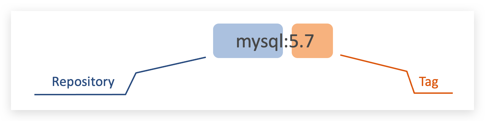
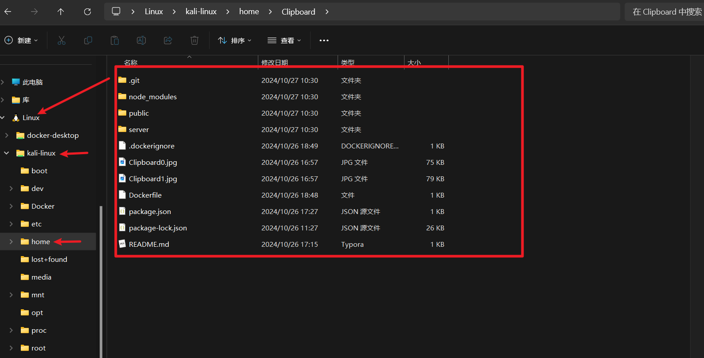
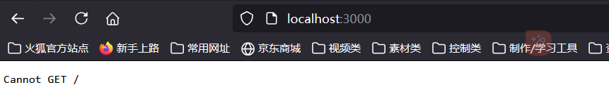
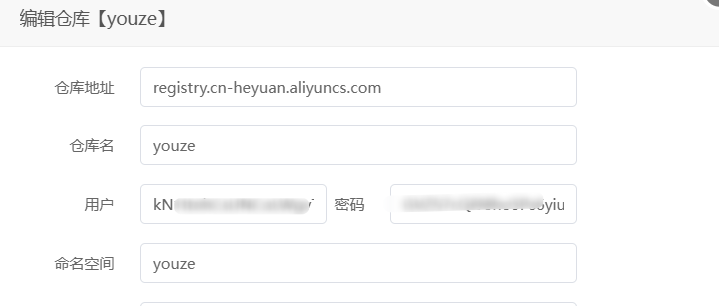

最常用命令集合

```php
sudo mkdir -p /etc/docker


sudo tee /etc/docker/daemon.json <<EOF
{
    "registry-mirrors": [
        "https://hub.uuuadc.top",
        "https://docker.anyhub.us.kg",
        "https://dockerhub.jobcher.com",
        "https://dockerhub.icu",
        "https://docker.ckyl.me",
        "https://docker.awsl9527.cn"
    ]
}

{
  "registry-mirrors": ["https://dockerproxy.cn/"]
}


EOF
sudo systemctl daemon-reload
sudo systemctl restart docker

docker-compose build
docker-compose up -d
docker ps

docker exec -it c198926967ae /bin/bach
```

## Docker镜像

镜像的名称组成：

* 镜名称一般分两部分组成：repository:tag。
* 在没有指定tag时，默认是latest，代表最新版本的镜像

如图：

​​

## Docker Dockerfile

Dockerfile 是一个文本文件，包含了构建 Docker 镜像<span data-type="text" style="color: var(--b3-font-color9);">的所有指令</span>。

Dockerfile 是一个用来构建镜像的文本文件，文本内容包含了一条条<span data-type="text" style="color: var(--b3-font-color9);">构建镜像所需的指令</span>和说明。

通过定义一系列命令和参数，<span data-type="text" style="color: var(--b3-font-color9);">Dockerfile 指导 Docker 构建一个自定义的镜像。</span>

​​

## Docker命令

|命令|作用|
| --------------------------------| --------------------------------|
|||
|systemctl start docker|启动docker|
|systemctl stop docker|关闭docker|
|systemctl restart docker|重启dkcker|
|systemctl enable dkcker|开机自启|
|systemctl status docker|查看docker运行状态|
|docker version|查看docker版本|
|docker --help|docker帮助信息|
|docker images|查看镜像|
|docker pull 镜像名|拉取最新版本的镜像|
|docker pull 镜像名:tag|拉取镜像，指定版本\|<br />|
|docker search [options] TERM<br />|从Docker Hub查找/搜索镜像|
|docker ps|显示正在运行的容器|
|docker ps -a|显示所有容器，包括停止了的容器|
|docker puse 容器名/ID|暂停运行着的容器|
|docker uppuse name|让容器从暂停恢复|
|docker stop name|停止容器，回收内存|
|docker start name|让一个停止的容器再次运行|
|\|docker restart name|重启容器|
|||
|||

​​​​

## Docker-Compose

Docker-Compose 项目是Docker官方的开源项目，<span data-type="text" style="color: var(--b3-font-color9);">负责实现对Docker容器集群的快速编排。</span>

通过 Docker-Compose ，<span data-type="text" style="color: var(--b3-font-color9);">不需要使用shell脚本来启动容器</span>，而使用`.yaml`​​ 文件来配置应用程序需要的所有服务，然后使用一个命令，根据 .yaml 的文件配置创建并启动所有服务。

Compose允许用户通过一个docker-compose.yml模板文件（YAML 格式）来<span data-type="text" style="color: var(--b3-font-color9);">定义一组相关联的应用容器为一个项目（project）。</span>

Compose模板文件默认路径是当前目录下的docker-compose.yml，可以使用.yml或.yaml作为文件扩展名。

Docker-Compose标准模板文件应该包含<span data-type="text" style="color: var(--b3-font-color9);">version、services、networks</span> 三大部分，最关键的是services和networks两个部分。

## Docker-Compose命令

|命令|作用|
| -------------------------------------------| ----------------------------------------------------------------------------|
|<span data-type="text" style="color: var(--b3-font-color9);">docker-compose --help</span>|获得一个命令的帮助|
|<span data-type="text" style="color: var(--b3-font-color9);">docker-compose up -d nginx</span>|构建启动nignx容器|
|docker-compose exec nginx bash|登录到nginx容器中|
|docker-compose down|此命令将会停止up命令所启动的容器，并移除网络|
|<span data-type="text" style="color: var(--b3-font-color9);">docker-compose ps</span>|列出项目中目前的所有容器|
|<span data-type="text" style="color: var(--b3-font-color9);">docker-compose restart nginx</span>|重新启动nginx容器|
|docker-compose build nginx|构建镜像|
|docker-compose build --no-cache nginx|不带缓存的构建|
|docker-compose top|查看各个服务容器内运行的进程|
|docker-compose logs -f nginx|查看nginx的实时日志|
|docker-compose images|列出Compose文件包含的镜像|
|docker-compose config|验证文件配置，当配置正确时，不输出任何内容，当文件配置错误，输出错误信息。|
|docker-compose pause nginx|暂停nignx容器|
|docker-compose unpause nginx|恢复ningx容器|
|docker-compose rm nginx|删除容器（删除前必须关闭容器，执行stop）|
|docker-compose stop nginx|停止nignx容器|
|docker-compose start nginx|启动nignx容器|
|docker-compose restart nginx|重启项目中的nignx容器|
|<span data-type="text" style="color: var(--b3-font-color9);">docker-compose pull</span>|拉取服务依赖的镜像。<br />|
‍

## Docker镜像构建

以clipboad项目为例

我们在阿里云服务器使用dockers和麻烦，因为基础镜像要从docker官方仓库获取，但是阿里云访问困难，不能获取基础镜像。

报错为：

```bash
podman build -t clipboard .
STEP 1/7: FROM node:18
✔ registry.fedoraproject.org/node:18
Trying to pull registry.fedoraproject.org/node:18...
Error: error creating build container: initializing source docker://registry.fedoraproject.org/node:18: reading manifest 18 in registry.fedoraproject.org/node: manifest unknown: manifest unknown

```

所以选择在本地构建，wsl里面。

1. 先将要构建的项目放进去，写好Dockerfile

    ```bash
    # 使用官方Node.js镜像作为基础镜像
    FROM node:18.16.0

    # 设置工作目录
    WORKDIR /app

    # 复制package.json和package-lock.json到工作目录
    COPY package*.json ./

    # 安装项目依赖
    RUN npm install

    # 复制项目的所有文件到工作目录
    COPY . .

    # 暴露应用程序运行的端口
    EXPOSE 3000

    # 启动应用程序
    CMD ["node", "server/server.js"]
    ```
2. 放进去的方法是在文件资源管理器那里直接拷贝。

    ​​
3. 完了之后就可以用本机挂的clash访问了，我测试过要两个都打开才可以成功。

    ​​
4. 到Dockerfile所在目录   docker build -t clipboard .     注意有一个点

    ```bash
    ┌──(root㉿youze)-[/home/Clipboard]
    └─# docker build -t clipboard .
    [+] Building 24.9s (11/11) FINISHED                                                                      docker:default
     => [internal] load build definition from Dockerfile                                                               0.0s
     => => transferring dockerfile: 429B                                                                               0.0s
     => [internal] load metadata for docker.io/library/node:18                                                         7.2s
     => [auth] library/node:pull token for registry-1.docker.io                                                        0.0s
     => [internal] load .dockerignore                                                                                  0.0s
     => => transferring context: 113B                                                                                  0.0s
     => [1/5] FROM docker.io/library/node:18@sha256:ddd173cd94537e155b378342056e0968e8299eb3da9dd5d412d3b7f796ac38c0  10.2s
     => => resolve docker.io/library/node:18@sha256:ddd173cd94537e155b378342056e0968e8299eb3da9dd5d412d3b7f796ac38c0   0.0s
     => => sha256:f110c757afc5699d6587a989cc741d88e170d259506ecd3b6d9d0169c2dd1a47 1.25MB / 1.25MB                     4.0s
     => => sha256:ddd173cd94537e155b378342056e0968e8299eb3da9dd5d412d3b7f796ac38c0 6.41kB / 6.41kB                     0.0s
     => => sha256:59ee42d02ee5edca29b89e9d18b5bedd9400da38e1dcc0da4f22eaf19d24983b 3.32kB / 3.32kB                     1.0s
     => => sha256:eb173c1dbe92b367644a53adf5c004908921fa91460c054f2746046e481603fb 45.64MB / 45.64MB                   7.6s
     => => sha256:915f67036af49bad671aa4cbb853988d97fb89b24e170dc131cc8f0b5726780f 2.49kB / 2.49kB                     0.0s
     => => sha256:416ebe3d6a254ab6cebfa09550ffafd16a52ce55dc03c2315461c486025c3cc0 6.70kB / 6.70kB                     0.0s
     => => extracting sha256:59ee42d02ee5edca29b89e9d18b5bedd9400da38e1dcc0da4f22eaf19d24983b                          0.0s
     => => sha256:e3d8693bad2fd07287529dd2f1bc71d431ed97f061cc8440707f144165fa8afc 444B / 444B                         2.8s
     => => extracting sha256:eb173c1dbe92b367644a53adf5c004908921fa91460c054f2746046e481603fb                          2.2s
     => => extracting sha256:f110c757afc5699d6587a989cc741d88e170d259506ecd3b6d9d0169c2dd1a47                          0.0s
     => => extracting sha256:e3d8693bad2fd07287529dd2f1bc71d431ed97f061cc8440707f144165fa8afc                          0.0s
     => [internal] load build context                                                                                  0.2s
     => => transferring context: 6.03MB                                                                                0.2s
     => [2/5] WORKDIR /app                                                                                             0.6s
     => [3/5] COPY package*.json ./                                                                                    0.0s
     => [4/5] RUN npm install                                                                                          6.4s
     => [5/5] COPY . .                                                                                                 0.1s
     => exporting to image                                                                                             0.1s
     => => exporting layers                                                                                            0.1s
     => => writing image sha256:ad0ae7950bc6f6c4c632d56a257be82d763b6c8469b5c3ccff490b8ae3b73f66                       0.0s
     => => naming to docker.io/library/clipboard  
    ```

6. 构建完在windows docker里面就可以看到了

    ​​
7. 完了之后使用命令启动，，因为控制台启动好像没有端口

    ```bash
    ┌──(root㉿youze)-[/home/Clipboard]
    └─# docker run -p 3000:3000 clipboard
    Server is running on port 3000
    ```

​​

8. 访问，这里Clipboard.html在public文件夹里，但是直接根目录就可以访问，，当初应该改为index.html的。

    ​​

    ```bash
    http://localhost:3000/Clipboard.html
    ```

9. ​​

‍

‍

## Docker推送镜像到阿里云仓库

1. 访问阿里云查看相关信息
2. 在本地登录阿里云Docker Registry

    ```bash
    ┌──(root㉿youze)-[~]
    └─# docker login --username=youze27 registry.cn-heyuan.aliyuncs.com
    Password:
    Login Succeeded
    ```
3. 查看要推送的镜像ID

    ```bash
    ┌──(root㉿youze)-[~]
    └─# docker images
    REPOSITORY   TAG       IMAGE ID       CREATED          SIZE
    clipboard    latest    ad0ae7950bc6   47 minutes ago   1.1GB
    ```
4. 打上标签，注意修改镜像ID和  版本号，不能带有[]

    ```bash
    ┌──(root㉿youze)-[~]
    └─#  docker tag ad0ae7950bc6 registry.cn-heyuan.aliyuncs.com/youze/youze:[1.0.0]
    Error parsing reference: "registry.cn-heyuan.aliyuncs.com/youze/youze:[1.0.0]" is not a valid repository/tag: invalid reference format

    ┌──(root㉿youze)-[~]
    └─# docker tag ad0ae7950bc6 registry.cn-heyuan.aliyuncs.com/youze/youze:1.0.0

    ```

5. 推送

    ```bash
    ┌──(root㉿youze)-[~]
    └─# docker push registry.cn-heyuan.aliyuncs.com/youze/youze:1.0.0
    The push refers to repository [registry.cn-heyuan.aliyuncs.com/youze/youze]
    908dfbf7808b: Pushed
    fe050d22cd0b: Pushed
    b2f41cb5f314: Pushed
    d53eb13d755d: Pushed
    afb48ce6bd97: Pushed
    9a605894dac7: Pushed
    65b08847bb33: Pushed
    72949a6dc267: Pushed
    d23b5e6144a7: Pushed
    e5ee1bd83fe3: Pushed
    43da071b5e0c: Pushed
    ef5f5ddeb0a6: Pushed
    1.0.0: digest: sha256:9091d3a1adad223f80a0f760fbb1c8ff08e969b72f48b8f176621355ed230f9f size: 2840
    ```

6. 阿里云镜像仓库查看

    ​​
7. 在宝塔拉取镜像，先到阿里云镜像仓库查看相关信息，然后在宝塔添加镜像仓库

    ​​

    拉取

    ​​
8. 将镜像文件打包为.tar

    ```bash
    docekr images 
    docker save 镜像名字:版本号 > /root/打包名字.tar
    docker save -o /root/打包名字.tar 镜像名字:版本号
    ```

    ```bash
    ┌──(root㉿youze)-[/home]
    └─# docker save -o clipboard.tar clipboard:latest

    ┌──(root㉿youze)-[/home]
    └─# ls
    Clipboard  clipboard.tar
    ```

‍
