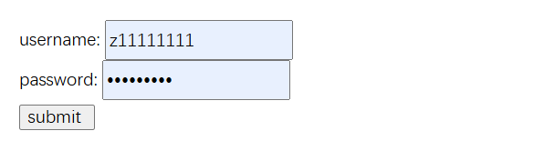

# 基本概念

* 在 服务器上运行的 脚本语言
* 后缀名为` .php`​
* 脚本可以在文档中任何位置
* 脚本以`<?php开头，以 ?>`​结尾
* 语句以分号` ;`​结尾
* 最后一行语句的结尾没有分号
* 单行注释以`//`​或`#`​开头
* 多行注释以`/* */`​包围

# 变量规则

* 变量以`$`​开头后跟变量名称
* 变量可以是`数字字母下划线`​组成
* 变量名称不能以数字开头
* PHP变量对大小写部分敏感
* 不用声明，自动识别数据类型
* 变量作用域有 `全局(global)、局部(local)、静态(static)`​三种

```php
  
    <?php
    $txt = "Hello world!";
    echo $txt . " <br>";  
    Echo "Hello world! .  <br>";
    $x = 5;
    $y = 10.5;
    var_dump($x + $y);
    ?>
  
	//Hello world!
	//Hello world! . 
	//float(15.5)

  
```

# 作用域

* 全局变量：函数外声明，函数外使用
* 局部变量：函数内声明，函数内使用

```php
  
    function myTest()
    {
        $y = 10; //局部变量
        echo "函数内的局部变量y为：" . $y;
    }
    myTest();
 
    $x = 5; //全局变量
    echo "函数外的x变量为：" . $x;
  
  //函数内的局部变量y为：10函数外的x变量为：5  
```

# Global关键字

* Global关键字用于在函数内访问全局变量，但不能修改

```php
  
    $x = 5;
    $y = 10;
    function myTest1()
    {
        global $x, $y;
        $y = $x + $y;
    }
    myTest1();
    echo $y; // 输出 15


	//15
```

# static关键字

* 一般函数执行完会删除所有变量
* static声明的变量会一直保持函数最后一次执行的值
* 该变量任然是局部变量

```php
  
    function myTest2()
    function myTest2()
    {
        static $x = 0;  //声明静态变量
        $x++;  //自增静态变量
        echo "函数内的静态变量x为：" . $x; 
    }
    myTest2();
    myTest2();
    myTest2();


	//函数内的静态变量x为：1函数内的静态变量x为：2函数内的静态变量x为：3
```

# echo & print

* echo 输出 `一个以上`​字符串
* print 只能输出 一个字符串并返回值1
* echo/print有无括弧均可使用
* ​`字符串中可以包含HTML标记`​
* 单引号的输出不会识别变量，双引号会
* var\_dump()用于输出变量类型和值
* print\_r()用于输出数组类型和值
* gettype()用于获取变量类型

```php
  
    echo "Hello world! <br>";  //输出一个字符串
    echo "zhang", "you", "ze", "<br>";   //输出多个字符串

    $txt1 = "Learn PHP";
    $txt2 = array("VOAO", "HAHA", "LALA");

    echo  "echo out put $txt1 <br>";  //输出一个字符串
    print  $txt2[1];  //输出数组元素
    echo "<br>echo out put {$txt2[2]} <br>"; //输出数组元素
    print "print out put {$txt2[2]} <br>";
    print "<span>输出标签</span>"
  
  
	//Hello world! 
	//zhangyouze
	//echo out put Learn PHP 
	//HAHA
	//echo out put LALA 
	//print out put LALA 
	//输出标签
```

# 整数

* 正负均可
* 可表示十进制、十六进制、八进制
* var\_dump用于返回变量类型和值

```php
  
    $x = 5985;
    var_dump($x); //输出整型类型和值
    echo "<br>";

    $x = -345;
    var_dump($x); //输出小数类型和值
    echo "<br>";

    $x = 0x1A;
    var_dump($x); //输出十六进制类型和值
    echo "<br>";

    $x = 0123;
    var_dump($x); //输出八进制类型和值

	//int(5985)
	//int(-345)
	//int(26)
	//int(83)
```

# 浮点数

```php
  
    $x = 3.1415926;
    var_dump($x); //输出浮点型类型和值
    echo "<br>";

    $x = 1.2e3;
    var_dump($x);
    echo "<br>";

    $x = 7E-10;
    var_dump($x);
    echo "<br>";
  

	//float(3.1415926)
	//float(1200)
	//float(7.0E-10)

```

# 逻辑

```php
  
        $x = true;
        var_dump($x); //输出布尔类型和值
        echo "<br>";

        $x = false; //注意大小写
        var_dump($x);
        echo "<br>";
  
	    //bool(true)
	    //bool(false)

```

# 标准函数

* --------变量函数库-------
* empty() 检查变量是否为空
* gettype() 获取变量类型
* is\_array() 检查变量是否为数组
* is\_bool() 检查变量是否为布尔值
* isset() 检查变量是否已定义
* unset() 删除变量
* var\_dump() 输出变量类型和值
* --------字符串函数库--------
* strlen() 返回字符串长度
* substr() 截取字符串

  **substr** ( string `$string`​ , int `$start`​ [, int `$length`​ ] )
* strstr() 截取字符串
* explode() 将字符串转换为数组
* trim() 去除字符串两端的空白
* md5() 计算字符串的MD5值

```php
  
    $cars = array("Volvo", "BMW", "Toyota");
    $isempty = '';
    echo "isempty:".empty($isempty); 
    echo gettype($cars);
    echo is_array($cars);
    var_dump($cars); //输出数组类型和值
    $x = array("name" => "John", "age" => 30, "city" => "New York");
    var_dump($x); //输出关联数组类型和值
  
	/* 
    isempty:1
	array
	1
	array(3) {
	  [0]=>
	  string(5) "Volvo"
	  [1]=>
	  string(3) "BMW"
	  [2]=>
	  string(6) "Toyota"
	}

	array(3) {
	  ["name"]=>
	  string(4) "John"
	  ["age"]=>
	  int(30)
	  ["city"]=>
	  string(8) "New York"
	}
```

# NULL

```php

        $x = null;
        var_dump($x); //输出NULL类型和值
        echo "<br>";
  
		//NULL

```

# 字符串函数

* strlen() 返回字符串长度
* strpos() 返回子字符串在字符串中第一次出现的位置
* strtolower() 转换字符串为小写
* strtoupper() 转换字符串为大写
* substr() 返回子字符串
* str\_replace() 替换字符串
* str\_repeat() 重复字符串
* str\_split() 将字符串转换为数组★
* explode() 将字符串转换为数组★
* implode() 将数组转换为字符串★

```php
  
    $str = "Hello world!";
    echo "字符串长度：" . strlen($str);
    echo "<br>子字符串在字符串中第一次出现的位置：" . strpos($str, "ll");

	//字符串长度：12
	//子字符串在字符串中第一次出现的位置：2
```

# 常量

* 常量是单个值的标识符，不能被修改
* 常量以大写字母或下划线开头没有\$符号
* 常量不能使用空格、关键字、保留字、特殊符号
* 常量贯穿整个脚本，在任何地方都可以使用
* 使用define()定义，括号内包括常量名称、值、是否大小写敏感

```php
  
        define("PI", 3.1415926);
        echo "圆周率：" . PI;
        define("GREETING", "<br>Hello world!", true);
        echo GREETING;
  
		/*
		圆周率:3.1415926
		Deprecated:  define(): Declaration of case-insensitive constants is deprecated in /www/wwwroot/youze.xn--6qq986b3xl/php_note.php on line 465
		Hello world!
```

# 运算符

* 算术运算符：+ - \* / %
* 赋值运算符：\= +\= -\= \*\= /\= %\=
* 比较运算符：\=\=、!\=、 \=\=\=、 !\=\=、 \>、 \<、\>\= 、 \<\=\< /li\>
* 逻辑运算符：&&/and、 ||/or、xor、!
* 位运算符：& | \^ \~ \<\<\>\>
* 字符串运算符：. .\=
* 数组运算符：[] \=&
* 条件运算符：?:
* 递增/递减运算符：++ --

```php

       $a = "Hello";
        $a.= " world!";
        echo $a;
        $b = $a . " and PHP";
        echo $b;  
        $count =75;
        print ($count>=60? "及格" : "不及格");  //条件运算符
  
		//Hello world!Hello world! and PHP及格
```

# if...else...elseif

```php

    $a = 2;
    if ($a == 1) {
        echo "北京";
    } elseif ($a == 2) {
        echo "上海";
    } else {
        echo "广州";
    }
  
	//上海
```

# switch

```php

    // $a = 3;
    switch ($b) {
        case 1:
            echo "北京";
            break;
        case 2:
            echo "上海";
            break;
        case 3:
            echo "深圳";
            break;
        default:
            echo "广州";
            break;
    }

    //广州
```

# do...while

```php

    $i = 3;
    do {
        echo $i++;
    } while ($i < 5);

	//34
```

# for

```php

    for ($i = 0; $i < 5; $i++) {
        print $i;
    }

	//01234
```

# foreach

```php

    $fruits = array("apple", "banana", "orange");
    foreach ($fruits as $fruit) {  //输出数组元素 注意语法格式
        echo $fruit . "<br>";
    }

/*
	apple
	banana
	orange
	pear
	grape
```

# 函数

* PHP有超过1000个内置函数，可以满足各种需求
* PHP也可自建函数，语法类似python
* 函数对大小写不敏感

```php
//例1  默认值
   
    //函数体  形参min  默认值40
    function setHeight($min=40){
        echo "最小高度为：". $min . 'cm' . "<br>";
    }
    // 调用函数
    setHeight(50);
    setHeight(); //调用时不传参，使用默认值40
    setHeight(100);

/*
	最小高度为：50cm
	最小高度为：40cm
	最小高度为：100cm
```

```php
//例2  返回值

    function sum($x, $y){
        $z = $x + $y;
        return $z;
    }
    echo '10 + 20 = '. sum(10, 20) . '<br>'; //输出30
    echo '34 + 56 = '. sum(34, 56); //输出80 
/*
	10 + 20 = 30
	34 + 56 = 90
```

# 数组

* 能在一个单独变量中存储多个值
* 索引数组：索引数组的每个元素都有一个 数字索引
* 关联数组：关联数组的每个元素都有一个 键值对，字典形式
* 数组的元素可以是任何类型，包括数组
* 数组的大小是固定的，不能动态增加或删除元素

```php
//例1  数组定义、遍历
   
    $cars = array("Volvo", "BMW", "Toyota", "Honda", "Ford", "Chevrolet");
        array_pop($cars); //删除数组末尾元素
        array_push($cars, "Tesla"); //在数组末尾添加元素
        echo $cars[6]; //输出数组元素
        echo "/I like" . $cars[0] . " and " . $cars[1] . " cars." . "<br>"; //输出数组元素
        echo count($cars); //输出数组元素个数

        for( $i=0; $i<count($cars); $i++ ){ //遍历数组元素
            echo  $cars[$i] . '、'; //输出数组元素
        }
   
/*
		/I like Volvo and BMW cars.
		6Volvo、BMW、Toyota、Honda、Ford、Tesla、
```

```php
//例2  关联数组定义、遍历 ★★★★
   
    $person = array("name" => "John", "age" => 30, "city" => "New York");    //定义关联数组
        echo "My name is " . $person["name"] . " and I am " . $person["age"] . " years old." . "<br>"; //输出关联数组元素         

        foreach($person as $key => $value){ //遍历关联数组元素
            echo $key . " : " . $value . "<br>"; //输出关联数组元素
        }
   
/*
		My name is John and I am 30 years old.
		name : John
		age : 30
		city : New York
```

# 数组排序

* sort() - 以升序对数组排序
* rsort() - 以降序对数组排序
* ksort() - 根据 键，以升序对关联数组进行排序
* krsort() - 根据 键，以 降序对关联数组进行排序
* asort() - 根据 值，以升序对关联数组进行排序
* arsort() - 根据 值，以 降序 对关联数组进行排序

# 超全局变量

* 在一个脚本的全局作用域都可以使用
* \$GLOBALS[''] 引用全局作用域中可用的全部变量
* \$\_SERVER[''] 保存关于报头、路径和脚本位置的信息。
* \$\_REQUEST[''] 用于收集 HTML 表单提交的数据。
* \$\_POST[''] 用于收集提交 method\="post" 的 HTML 表单后的表单数据。
* \$\_GET[''] 收集 URL 中的发送的数据。

```php
//例1：$GLOBALS[''] 引用全局作用域中可用的全部变量
  
		    $a = 10;
		$b = 20;
		function add(){
		    $GLOBALS['c'] = $GLOBALS['a'] + $GLOBALS['b'];
		}
		add();
		echo $c; //输出30
  
//30

//例2：$_SERVER[''] 保存关于报头、路径和脚本位置的信息。


	echo $_SERVER['PHP_SELF']; //输出当前脚本的路径  /php_note.php
	echo $_SERVER['DOCUMENT_ROOT']; //输出服务器的文档根目录  D:/phpstudy_pro/WWW
	echo $_SERVER['SCRIPT_FILENAME']; //输出当前脚本的绝对路径  D:/phpstudy_pro/WWW/php_note.php
	echo $_SERVER['HTTP_HOST']; //输出当前域名  localhost
	echo $_SERVER['SERVER_ADDR']; //输出服务器IP地址  ::1
	echo $_SERVER['SERVER_SOFTWARE']; //输出服务器环境信息  Apache/2.4.39 (Win64) OpenSSL/1.1.1b mod_fcgid/2.3.9a mod_log_rotate/1.02
	echo $_SERVER['SCRIPT_NAME']; //输出当前脚本的名称 /php_note.php
	echo $_SERVER['REQUEST_URI']; //输出当前页面的完整URL  /php_note.php
	echo $_SERVER['HTTP_USER_AGENT']; //输出用户使用的浏览器类型 Mozilla/5.0 (Windows NT 10.0; Win64; x64) AppleWebKit/537.36 (KHTML, like Gecko) Chrome/128.0.0.0 Safari/537.36 Edg/128.0.0.0
	echo $_SERVER['SERVER_PROTOCOL']; //输出请求页面时使用的协议 HTTP/1.1

/*
	/php_note.php
	/www/wwwroot/youze.xn--6qq986b3xl/
	/www/wwwroot/youze.xn--6qq986b3xl/php_note.php
	www.youze.xn--6qq986b3xl
	172.24.248.63
	Apache
	/php_note.php
	/php_note.php
	Mozilla/5.0 (Windows NT 10.0; Win64; x64) AppleWebKit/537.36 (KHTML, like Gecko) Chrome/128.0.0.0 Safari/537.36 Edg/128.0.0.0
	HTTP/2.0
*/

	//例3 $_REQUEST[''] 用于收集 HTML 表单提交的数据。
	//当用户点击提交按钮来提交数据后，表单数据会发送到 <form> 标签的 action 属性中指定的文件。


	<form action="php_note.php">
	    Name:<input type="text" name="fname"><br>
	    <input type="submit">
	</form>
	    <?php
	$name = $_POST['fname'];
	echo $name;
	?>
```

​​

```php
	//例3：$_POST[''] 用于收集提交 method="post" 的 HTML 表单后的表单数据。
	//点击a后，参数 "name" 和 "age" 被发送到 "php_note.php"，然后能够通过$_GET 在 "php_note.php" 中访问这些值。


	<a href="php_note.php?name=Youze&age=18">测试 $GET 通过链接传值</a>
	<?php
	echo "Name: " . $_GET['name'] . " age: " . $_GET['age'];
	?>

	//测试 $GET 通过链接传值
    //Name: Youze age: 18
```

# 日期和时间

* date(format,timestamp)函数把时间戳格式化为更易读的日期和时间。

```php
	  
	echo "今天是 " . date("Y/m/d") ;
	echo "今天是 " . date("Y-m-d-l") ;
	echo "今天是 " . date("l");  //英文字母l
	echo "现在时间是 " . date("h:i:sa");
	// h - 带有首位零的 12 小时小时格式
	// i - 带有首位零的分钟
	// s - 带有首位零的秒（00 -59）
	// a - 小写的午前和午后（am 或 pm）
	// mktime(hour,minute,second,month,day,year)
	// 通过 PHP mktime() 创建日期

	$d=mktime(9, 12, 31, 6, 10, 2015);
	echo "创建日期是 " . date("Y-m-d h:i:sa", $d);
	$d=strtotime("tomorrow");
	echo date("Y-m-d h:i:sa", $d) ;
	$d=strtotime("next Saturday");
	echo date("Y-m-d h:i:sa", $d) ;
	$d=strtotime("+3 Months");
	echo date("Y-m-d h:i:sa", $d);
	  
/*
	今天是 2024/08/14
	今天是 2024-08-14-Wednesday
	今天是 Wednesday
	现在时间是 02:27:49pm
	创建日期是 2015-06-10 09:12:31am
	2024-08-15 12:00:00am
	2024-08-17 12:00:00am
	2024-11-14 02:27:49pm
	*/
```

面向对象

* 类名创建方法: class 类名{}
* 实例化: \$变量名 \= new 类名(参数); (参数)可以实例化时候赋值也可以后面赋值
* 访问对象属性: 实例名称-\>属性名
* 访问对象属性赋值: 实例名称-\>属性名 \= 值
* 访问对象成员方法: 实例名称-\>方法名() 实例化时候赋值这里就不用传参

```php
  

    class max_and_swap
    {
        public $number_1; //注意:旧版本PHP使用var 新版本PHP建议使用public;
        public $number_2;
        public function __construct($number_1 = null, $number_2 = null)
        { //构造函数
            $this->number_1 = $number_1;
            $this->number_2 = $number_2;
        }
        function max()  //求两个数的最大值
        {
            return ($this->number_1 > $this->number_2) ? $this->number_1 : $this->number_2;
        }
        function swap() //交换两个数的值
        {
            $temp = $this->number_1;
            $this->number_1 = $this->number_2;
            $this->number_2 = $temp;
        }
    }

    $max_and_swap_one = new max_and_swap(10, 20); // 实例化对象
    $max_number = $max_and_swap_one->max();    // 调用对象方法max()
    echo "最大值为:" . $max_number;

    $max_and_swap_one->swap(); // 调用对象方法swap()
    echo "number_1: " .  $max_and_swap_one->number_1;
    echo "number_2: " .  $max_and_swap_one->number_2;
  
      
	//最大值为:20
	//number_1: 20
	//number_2: 10  
```

# 魔术变量

* \_\_LINE\_\_ - 返回当前行号
* \_\_FILE\_\_ - 返回当前文件名
* \_\_DIR\_\_ - 返回当前文件所在目录
* \_\_FUNCTION\_\_ - 返回当前函数名
* \_\_CLASS\_\_ - 返回当前类名
* \_\_METHOD\_\_ - 返回当前方法名
* \_\_NAMESPACE\_\_ - 返回当前命名空间名
* \_TRAIT\_\_ - 返回当前Trait名

```php
  
        class test_class
        {
            function test_function()
            {
                echo "当前行号:" . __LINE__;
                echo "当前文件名:" . __FILE__;
                echo "当前文件所在目录:" . __DIR__;
                echo "当前函数名:" . __FUNCTION__;
                echo "当前类名:" . __CLASS__;
                echo "当前方法名:" . __METHOD__;
                echo "当前命名空间名:" . __NAMESPACE__;
                echo "当前Trait名:" . __TRAIT__;
            }
        }
        $test_object = new test_class;
        $test_object->test_function();
     /*
		当前行号:1024
		当前文件名:/www/wwwroot/youze.xn--6qq986b3xl/php_note.php
		当前文件所在目录:/www/wwwroot/youze.xn--6qq986b3xl
		当前函数名:test_function
		当前类名:test_class
		当前方法名:test_class::test_function
		当前命名空间名:
		当前Trait名:  
```

# include和require

* 将 PHP 文件的内容插入另一个 PHP 文件
* require 会生成致命错误（E\_COMPILE\_ERROR）并停止脚本
* include 只生成警告（E\_WARNING），并且脚本会继续
* 省去重复工作,可以为所有页面创建标准页头、页脚或者菜单文件

```php
  
        <?php    // 页头文件 footer.php
        $color = '银色的';
        $car = '奔驰轿车';
        echo "<p>Copyright  20020-" . date("Y") . " Youze.comlt/p>"
        ?>

        <?php   // 主页文件 php_note.php
        include 'footer.php';  // 包含页脚文件  require引用方法相同
        echo "我有一辆" . $color . $car .".";
        ?>
  
		//Copyright  20020-2024 Youze.com
        //我有一辆银色的奔驰轿车. 
  
```

# 文件打开/读取/关闭/创建/覆盖

* fopen() -打开文件/创建文件都用该函数
* fread() - 从文件指针中读取数据
* fread() 的第一个参数包含待读取文件的文件名， 第二个参数规定待读取的最大字节数。
* fclose() - 关闭文件指针
* fgets() - 从文件指针中读取一行数据,
* feof() - 检查文件指针是否到达文件结尾
* fwrite() - 向文件写入数据
* Overwrite - 如果文件存在，则覆盖文件
* file\_exists() - 检查文件或目录是否存在
* is\_file() - 检查是否为文件
* is\_dir() - 检查是否为目录
* filesize() - 返回文件大小
* file\_get\_contents() - 读取整个文件内容
* fopen() 函数提供比 readfile() 函数更多的选项。
* copy() - 复制文件
* delete() - 删除文件
* rename() - 重命名文件
* mkdir() - 创建目录
* rmdir() - 删除目录

```php
  
    $crate_file = fopen("cratefile.txt", "w") or die("Unable to create file!");  //创建文件
    $txt = "my name is Youze";
    fwrite($crate_file, $txt);
    fclose($crate_file);
    //目录下产生文件cratefile.txt 内容为my name is Youze

    //2.覆盖文件内容
    $over_file = fopen("overwrite.txt", "w") or die("Unable to create file!");  //创建文件
    $txt = "my name is libaibai";
    fwrite($over_file, $txt);
    fclose($over_file);
    //文件被打开之前的内容被覆盖为my name is libaibai

    //3.读取文件内容方法1
    echo readfile("cratefile.txt");  //读取整个文件内容  和大小

    //3.读取文件内容方法2
    $myfile = fopen("overwrite.txt", "r") or die("Unable to open file!");  //打开文件
    echo fread($myfile,filesize("overwrite.txt"));  //打开文件，读取最大字节数为整个文件大小
    echo '文件大小为：'.filesize("overwrite.txt");  //获取文件大小
    fclose($myfile);

    //4.逐行读取文件内容
   $file = fopen("read_line.txt", "r") or exit("无法打开文件!");
   // 读取文件每一行，直到文件结尾
    while(!feof($file))
    {
        echo fgets($file);
    }
    fclose($file); 

    //5.copy文件
    copy("overwrite.txt", "copy_file.txt");  //复制文件
      /*
	my name is Youze16
	my name is libaibai
	文件大小为：19
	我是逐行读取的文件第一行
	我是逐行读取的文件第二行
	我是逐行读取的文件第三行
	我是逐行读取的文件第四行文件结尾  
```

# 文件目录

* getcwd() - 返回当前工作目录
* chdir() - 改变当前工作目录
* mkdir() - 创建目录
* rmdir() - 删除目录
* opendir() - 打开目录句柄
* closedir() - 关闭目录句柄
* readdir() - 读取目录条目

```php
      
            echo "当前工作目录: ".getcwd();
            //创建目录
            mkdir("test_dir");
            //删除目录
            rmdir("test_dir");
      
         //当前工作目录: /www/wwwroot/youze.xn--6qq986b3xl  
```

# 文件上传

​​

```php
        
       <form action="upload_file.php" method="post" enctype="multipart/form-data">
            <input type="file" id="file" name="file">
            <input type="submit" value="上传" name="submit">
        </form>

        //upload_file.php文件内容
            echo "Upload: " . $_FILES["file"]["name"] ;
            echo "Type: " . $_FILES["file"]["type"] ;
            echo "Size: " . ($_FILES["file"]["size"] / 1024) . " Kb;
            echo "Stored in: " . $_FILES["file"]["tmp_name"];
        
    
```

# 表单及正则表达式

```php
  
 <form action="form_receive.php" onsubmit="return checkForm(this)" method="post">
             <label for="username">username:</label>
             <input type="text" id="name" name="username" required><br>
             <label for="password">password:</label>
             <input type="password" id="password" name="password"><br>
             <input type="submit" value="submit ">
         </form>
         <script>
            function checkForm(obj) {
                var name = obj.username.value;
                var password = obj.password.value;
                // 正则表达式验证用户名和密码
                var name_check = /^[0-9]{6,16}/;
                var password_check = /^[a-zA-Z0-9_]{6,16}/;
                if (!name_check.test(name)) {
                    alert("用户名必须为6-16位数字");
                    return false;
                }
                if (!password_check.test(password)) {
                    alert("密码必须为6-16位数字或字母或下划线");
                    return false;
                }
                return true;   
            }
         </script>


            //文件form_receive.php
        
            $name = $_POST['username'];
            $pass = $_POST['password'];
            echo "Username: $name";
            echo "Password: $pass ";
  
  
```

​​

‍
