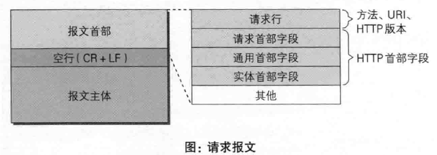
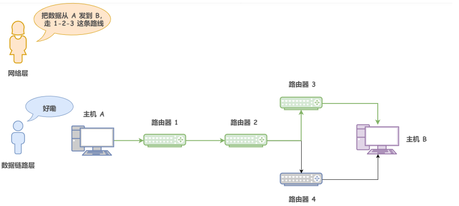
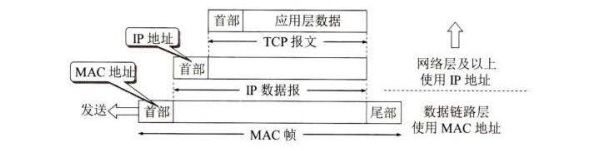

## HTTP请求体详解

### 组成部分


```mindmap
- 报文首部
  - 请求行
     - 请求方法
     - URL
     - HTTP版本
  - HTTP字段
     - 【请求】首部字段
     - 【通用】首部字段
     - 【实体】首部字段
- 空行
- 报文空主体
```

​​

### GET、POST、PUT、OPYION的区别？

GET方法是在URL里传参有缓存、不安全，且有长度4096限制。

POST方法是在请求体里传参，无缓存、无长度限制、相对安全。

### **请求首部字段**

**首部字段名                  说明**  
<span data-type="text" style="color: var(--b3-font-color11);">Accept                         用户代理可处理的媒体类型</span>

<span data-type="text" style="color: var(--b3-font-color11);">Accept-Encoding         优先的内容编码</span>

<span data-type="text" style="color: var(--b3-font-color11);">Host                              请求资源所在服务器</span>

<span data-type="text" style="color: var(--b3-font-color11);">User-Agent                   HTTP 客户端程序的信息</span>

<span data-type="text" style="color: var(--b3-font-color11);">content-type                 内容类型  </span>  具体见常见 MIME 类型列表

```python
Content-Type: text/html; charset=utf-8
Content-Type: multipart/form-data; boundary=something
```

<span data-type="text" style="background-color: var(--b3-font-background8); color: var(--b3-font-color8);">x-forwarded-for             用于标识通过代理服务器连接到 web 服务器的客户端的原始 IP 地址的标头。</span> ★可伪造

```python
X-Forwarded-For: <client>, <proxy1>, <proxy2>
X-Forwarded-For: 203.0.113.195
X-Forwarded-For: 203.0.113.195,2001:db8:85a3:8d3:1319:8a2e:370:7348,150.172.238.178
```

<span data-type="text" style="background-color: var(--b3-font-background11);">HTTP_CLIENT_IP                    是代理服务器发送的HTTP头。</span>  ★可伪造

## 数据传输流程

1. 解析URL

    ​`协议`​://`域名`​:`端口`​/`目录名`​/`文件名`​？`参数`​#`锚`​

    确定请求的`主机名`​和文件名
2. 封装报文

    ​`请求行`​ `请求头`​ `请求体`​

    发送端的应用层的浏览器将HTTP数据发送给传输层，传输层加上TCP首部并将数据传给网络层，网络层将数据加上IP首部后将数据发送给数据链路层，数据链路层将数据加上以太网首部。
3. DNS解析

    域名为方便人的记忆而产生，如要传输数据，计算机需要知道对方的ip地址。

    ​​

    1. 搜索<span data-type="text" style="background-color: var(--b3-font-background11);">浏览器的</span>DNS缓存映射表；
    2. 搜索<span data-type="text" style="background-color: var(--b3-font-background11);">操作系统的</span>DNS缓存表；
    3. 操作系统<span data-type="text" style="background-color: var(--b3-card-error-background); color: var(--b3-card-error-color);">递归查询</span><span data-type="text" style="background-color: var(--b3-font-background11);">本地域名服务器</span>；
    4. 本地域名服务器<span data-type="text" style="background-color: var(--b3-card-error-background); color: var(--b3-card-error-color);">迭代查询</span>根域名服务器防止根压力大；
    5. 本地域名服务器访问根域名服务器返回顶级域名服务器地址；
    6. 本地域名服务器请求顶级域名服务器并返回权限域名服务器地址；
    7. 本地域名服务器访问权限域名服务器得到IP地址返回给操作系统；
    8. 操作系统返回给浏览器，两者都将映射存入缓存；

4. 建立连接

    TCP通过三次握手和浏览器建立可靠的连接。

    ​​
5. 发送请求

    TCP 三次握手完成后，浏览器与目标服务器之间就建立了一个可靠的虚拟通道，于是浏览器就可以发送自己的 HTTP 请求了。
6. 传输数据
7. 断开连接

    ​​
8. 浏览器渲染数据

## 数据传输原理

​​

1. 应用层

    在该传输过程中，应用层的HTTP协议主要职责是生成针对WEB服务器的请求报文。
2. 传输层

    建立连接，通过TCP协议，将数据报分片，通过拥塞控制、流量控制、滑动窗口等确保数据可靠的到达目的地，目的地对数据排序重组，确保数据准确。
3. 网络层

    网络层指定了从哪个IP 发送到哪个IP 。网络层做出指引的过程，其称为`路由控制`​。MAC地址成为物理地址是固化在网卡的ROM中的，而IP地址是网络层以上使用的，是一种逻辑地址。ARP 是借助 ARP 请求与 ARP 响应两种类型的包确定 MAC 地址的。

    1. 主机 A 为了获得主机 B 的 MAC 地址，它会先去查询自己的 ARP 高速缓存中有没有主机 B 的相关记录；
    2. 如果没有，主机 A 就会携带自己的 IP 地址 和 MAC 地址 以及 目标主机的 IP 地址通过<span data-type="text" style="background-color: var(--b3-card-error-background); color: var(--b3-card-error-color);">广播</span>的方式发送 ARP 请求包，表明自己想要获得主机 B 的 MAC 地址。
    3. 由于广播被同链路上的所有主机发现，如果有主机查找自己的ARP缓存表有和B主机IP匹配的MAC地址，就<span data-type="text" style="background-color: var(--b3-card-error-background); color: var(--b3-card-error-color);">单播</span>该MAC地址放入请求包返回给A主机。
    4. 主机 A 在收到发过来的 ARP 响应包后，向其 ARP 高速缓存中写入主机 B 的 IP 地址到 MAC 地址的映射，缓存超过<span data-type="text" style="background-color: var(--b3-card-error-background); color: var(--b3-card-error-color);">TTL</span>将被清空。

    ​​
4. 数据链路层

    网络层的数据到达数据链路层就在首部添加MAC地址封装成MAC帧，所以数据链路层则是根据 MAC 地址进行传输的，随着数据的传输，源 MAC 地址和目的 MAC 地址会不断的发生变化。

    ​​

    ‍

‍
