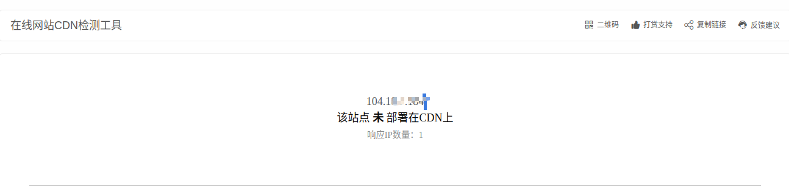
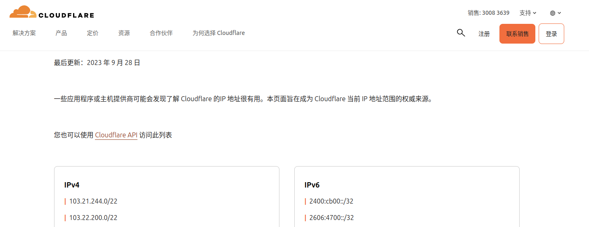
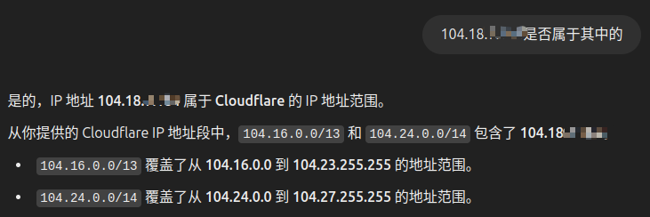

## 加密算法

```mindmap
- 算法
  - 可逆算法
     - 对称加密算法
       - DES 
       - AES
     - 非对称加密算法
       - RSA
  - 不可逆算法
     - MD5
     - SHA
        - SHA-1
        - SHA-2
          - SHA-224
          - SHA-256
          - SHA-384
          - SHA-512
        - SHA-3

```

## MD5

Message-Digest Algorithm 5（信息摘要算法）MD5算法的输出长度为128

特点：计算速度快，长度固定，不安全。

## SHA  密码散列

SHA-1系列存在缺陷，已经不再被推荐使用

SHA-2算法之所以比MD5强，散列值长度更长，更强的碰撞抗性

## DES

（Data Encryption Standard）算法是一种对称加密算法

使用56位密钥对数据进行加密，加密过程中使用了置换、替换、异或等运算，具有较高的安全性。

## AES

（Advanced Encryption Standard）即高级加密标准，是一种对称加密算法，密钥长度为128位、192位或256位，公钥加密，私钥解密

## RSA

算法是是目前应用最广泛的非对称加密算法，由Ron Rivest、Adi Shamir和Leonard Adleman三人在1978年发明，RSA算法的优点是安全性高，公钥可以公开，私钥必须保密

## Django

Django 是一个用于构建 Web 应用程序的高级 Python Web 框架。

Django 提供了一套强大的工具和约定，使得开发者能够快速构建功能齐全且易于维护的网站。

## 什么是 Cloudflare？

Cloudflare 的主要任务是保护和加速网站的运行。 **它被组织为 CDN（内容分发网络）** ，在云中创建网页的副本并将其放置在服务器和网络访问者（包括机器人和垃圾邮件发送者）之间。这有双重效用：

* 访问时网站及其内容显示得更快。
* 该网站有额外的安全层或过滤器。

该 **安全过滤器** 它在发生攻击（病毒、黑客攻击等）时特别有效。不仅因为它在发生感染或入侵时自动采取行动，而且还允许网络管理员 **[阻止 IP](https://tecnobits.com/zh-CN/%E5%A6%82%E4%BD%95%E5%B1%8F%E8%94%BD%E5%8F%A6%E4%B8%80%E5%8F%B0%E7%94%B5%E8%84%91%E7%9A%84IP/)** **甚至某些国家的访问。**

​​

## 浏览器跨域的问题

浏览器跨域是指由于浏览器的同源策略限制，不同源的文档或脚本不能相互交互的问题。 同源策略是一种安全机制，它要求协议、域名和端口都相同才能认为是同源。这是为了防止恶意网站读取或操作其他网站的数据。 跨域资源共享（CORS）是一种解决跨域问题的技术，它允许浏览器向不同源的服务器发送HTTP请求。

## SiteKey

SiteKey 是一个基于 Web 的安全系统，它在最终用户和网站之间提供一种类型的相互身份验证。其主要目的是阻止网络钓鱼。

## API

全称是应用程序编程接口（Application Programming Interface）定义多个软件中介之间的交互，以及可以进行的调用（call）或请求（request）的种类，如何进行调用或发出请求，应使用的数据格式，应遵循的惯例等

## API 面临的安全问题

1、未经授权的访问

2、SQL 注入和其他注入攻击

3、跨站点请求伪造（CSRF） 攻击者通过在受信任网站上伪造请求，使用户在不知情的情况下执行恶意操作

4、拒绝服务攻击（DoS）

## 解决 API 安全问题的方案

为了保护 API 免受恶意攻击和滥用，开发者可以采取以下几个方面的措施：

1. **认证和授权**：使用 OAuth2.0 或其他身份验证和授权协议，对请求进行身份验证和授权，确保只有授权用户才能访问受保护的资源。
2. **加密和传输安全**：使用 SSL/TLS 或其他加密协议，以确保请求和响应数据在传输过程中得到保护。对于敏感信息，可以使用对称加密或非对称加密进行加密处理。
3. **输入验证和防止注入攻击**：对输入数据进行验证和过滤，例如使用正则表达式或其他方法过滤掉非法字符或语句，防止 SQL 注入、XSS 等攻击。
4. **防止拒绝服务攻击**：对请求进行限制和过滤，例如限制每个用户的请求频率、限制请求的数据量和频率等，以防止恶意攻击者对 API 进行过度使用和占用资源。
5. **日志记录和监控**：对 API 的请求和响应进行日志记录和监控，及时发现异常情况和恶意攻击，并采取相应的措施进行处理。

## 什么是 AppImage？

多年来，我们为基于 Debian/Ubuntu 的 Linux 发行版提供DEB 包，为基于 Fedora /SUSE 的 Linux 发行版提供 RPM 。

AppImage是一种通用的软件包格式。通过将软件打包在 AppImage 中，开发人员只需提供一个文件即可“统管所有”。最终用户可以在大多数现代 Linux 发行版中使用它。

AppImage 并没有真正安装软件。它是一个压缩映像，包含运行所需软件所需的所有依赖项和库。所有必要的运行时依赖和资源都被包含在单个文件中，用户只需下载并赋予执行权限，即可直接运行应用程序。

* 发行版无关：可以在各种不同的 Linux 发行版上运行
* ‍

* 无需安装和编译软件：点击播放
* 无需root权限：不触及系统文件
* 便携性：可以在任何地方运行，包括活动磁盘
* 应用程序处于只读模式
* 只需删除 AppImage 文件即可删除软件

## AppImageLauncher

是一个开源的工具，可以帮助用户轻松地管理AppImage文件。你可以从其GitHub页面获取最新的发布版：[AppImageLauncher Releases](https://github.com/TheAssassin/AppImageLauncher/releases)。

## sqlmapapi

开启服务端：

使用通过sqlmapapi -s            sqlmapapi.py -s -H "0.0.0.0" 

```
ubuntu@ubuntu-cmp:~$ sqlmapapi -s
[14:34:04] [INFO] Running REST-JSON API server at '127.0.0.1:8775'..
[14:34:04] [INFO] Admin (secret) token: c13c3d2ee4fbac26c6f3a5c59cd7ad64
[14:34:04] [DEBUG] IPC database: '/tmp/sqlmapipc-_920f0un'
[14:34:04] [DEBUG] REST-JSON API server connected to IPC database
[14:34:04] [DEBUG] Using adapter 'wsgiref' to run bottle

```

## **OpenResty**

是一个基于 Nginx 的高性能 Web 应用服务器，它整合了 Nginx 和多个第三方模块，用于开发动态 Web 应用程序、API 服务器和 Web 服务。版本 **1.19.9.1** 是 OpenResty 的一个具体版本，基于 Nginx 1.19.x 构建，包含多个增强和改进。

**集成 Nginx 与 Lua**：OpenResty 的最大特点是它将 Nginx 与 **Lua** 脚本语言紧密集成，允许开发者使用 Lua 编写动态 Web 应用程序。OpenResty 基于 Nginx，继承了 Nginx 的高性能特点。Nginx 本身是一个事件驱动的服务器，能够处理成千上万的并发请求，适合高流量和高并发场景。

在 **Maven**（一个构建自动化工具）中，有一些核心概念和配置项可以帮助你管理项目的生命周期、插件、依赖项、仓库等。下面我会详细解释 **Maven 生存期**、**插件**、**运行配置**、**依赖项** 和 **仓库**。

## whois

（读作“Who is”，非缩写）是用来查询[域名](https://baike.baidu.com/item/%E5%9F%9F%E5%90%8D/86062?fromModule=lemma_inlink)的IP以及[所有者](https://baike.baidu.com/item/%E6%89%80%E6%9C%89%E8%80%85/2193463?fromModule=lemma_inlink)等信息的[传输协议](https://baike.baidu.com/item/%E4%BC%A0%E8%BE%93%E5%8D%8F%E8%AE%AE/8048821?fromModule=lemma_inlink)。简单说，whois就是一个用来查询[域名](https://baike.baidu.com/item/%E5%9F%9F%E5%90%8D/86062?fromModule=lemma_inlink)是否已经被注册，以及注册域名的详细信息的数据库（如域名所有人、[域名注册](https://baike.baidu.com/item/%E5%9F%9F%E5%90%8D%E6%B3%A8%E5%86%8C/0?fromModule=lemma_inlink)商）。通过whois来实现对[域名](https://baike.baidu.com/item/%E5%9F%9F%E5%90%8D/86062?fromModule=lemma_inlink)信息的查询。早期的whois查询多以命令列接口存在，但是现在出现了一些网页接口简化的线上查询工具，可以一次向不同的数据库查询。网页接口的查询工具仍然依赖whois协议向服务器发送查询请求，命令列接口的工具仍然被[系统管理员](https://baike.baidu.com/item/%E7%B3%BB%E7%BB%9F%E7%AE%A1%E7%90%86%E5%91%98/1503845?fromModule=lemma_inlink)广泛使用。whois通常使用[TCP](https://baike.baidu.com/item/TCP/33012?fromModule=lemma_inlink)协议43端口。每个[域名](https://baike.baidu.com/item/%E5%9F%9F%E5%90%8D/86062?fromModule=lemma_inlink)/IP的whois信息由对应的管理机构保存。

## SSL/TLS

SSL/TLS是一种密码通信框架，他是世界上使用最广泛的密码通信方法。SSL/TLS综合运用了密码学中的对称密码，消息认证码，公钥密码，数字签名，伪随机数生成器等

SSL(Secure Socket Layer)安全套接层，是1994年Netscape公司所提出的安全保密协议，并与1995年发布了3.0版本。  
TLS(Transport Layer Security)传输层安全是IETF在SSL3.0基础上设计的协议，实际上相当于SSL的后续版本。

SSL/TLS是一个安全通信框架，上面可以承载**HTTP**协议或者SMTP/POP3协议等。

所以HPPTS是HTTP+SSL/TCP的简称

SSL：（Secure Socket Layer，安全套接字层），位于可靠的面向连接的网络层协议和应用层协议之间的一种协议层。SSL通过互相认证、使用数字签名确保完整性、使用加密确保私密性，以实现客户端和服务器之间的安全通讯。该协议由两层组成：SSL记录协议和SSL握手协议。

TLS：（Transport Layer Security，传输层安全协议），用于两个应用程序之间提供保密性和数据完整性。该协议由两层组成：TLS记录协议和TLS握手协议。

## SSL

 是指安全套接字层，简而言之，它是一项标准技术，可确保互联网连接安全，保护两个系统之间发送的任何敏感数据，防止网络犯罪分子读取和修改任何传输信息。

TLS（传输层安全）是更为安全的升级版 SSL。由于 SSL 这一术语更为常用，因此我们仍然将我们的安全证书称作 SSL。安全传输层协议（TLS）用于在两个通信应用程序之间提供保密性和数据完整性。该协议由两层组成： TLS 记录协议（TLS Record）和 TLS 握手协议（TLS Handshake）

SSL由从前的网景公司开发  
有1,2,3三个版本，但现在只使用版本3

TLS是SSL的标准化后的产物  
有1.0 1.1 1.2三个版本  
默认使用1.0

TLS1.0和SSL3.0几乎没有区别

## whois

* whois（读作“Who is”，非缩写）是用来查询域名的IP以及所有者等信息的**传输协议**。
* 简单说，whois就是一个用来查询域名是否已经被注册，以及注册域名的详细信息的**数据库**（如域名所有人、域名注册商）。
* 通过whois来实现对域名信息的查询。

## F5 Big IP

F5 BIG-IP产品系列包括多种不同的组件和功能模块，如链路控制器（Link Controller）、本地流量管理器（Local Traffic Manager，LTM）、广域流量管理器（Global Traffic Manager，GTM）和应用安全管理器（Application Security Manager，ASM）F5 BIG-IP内置了多种安全功能，如防火墙、入侵防御系统（IPS）、应用安全等。F5 BIG-IP提供了高可用性和故障切换功能，可以确保在设备或网络出现故障时，应用仍然能够持续运行并提供服务。这些组件可以单独使用，也可以组合在一起，以提供全面的应用交付解决方案。

## CakePHP

是一个基于PHP的免费且开源的Web应用程序框架，它运用了诸如ActiveRecord、Association Data Mapping、Front Controller和MVC（模型-视图-控制器）等著名设计模式。

## FreeBSD

是FreeBSD项目的发展成果[3]，是开放源代码的类Unix操作系统，基于BSD Unix的源代码派生发展而来。加州大学伯克利分校在1975年至1993年开发了BSD Unix操作系统。FreeBSD的许可证规定源代码开放，允许任何人自由使用，任何人都可以获得并使用它来满足各种需求，也可以修改它，然后再重发布：此功能专为个人和公司量身定制，可用于创作各种基于FreeBSD的商业和非商业产品。

FreeBSD广泛用于服务器、防火墙和路由器。  
FreeBSD支持各种X Window桌面，如Lumina和GNOME和KDE。  
除了支持现在流行的x86-64、x86指令集架构，FreeBSD还支持ARM、MIPS以及PowerPC架构，亦可用于嵌入式系统。

FreeBSD 14.0于2023年11月20日正式发布[51]

FreeBSD 不是 Linux，亦不是 UNIX，是类 UNIX

## GNU

[zh.wikipedia.org/wiki/GNU](https://zh.wikipedia.org/wiki/GNU)

是一个自由的操作系统，其内容软件完全以GPL方式发布。这个操作系统是GNU计划的主要目标，名称来自GNU's Not Unix!的递归缩写，因为GNU的设计类似Unix，但它不包含具著作权的Unix代码。GNU的创始人，理查德·马修·斯托曼，将GNU视为“达成社会目的技术方法”。  
作为操作系统，GNU的发展仍未完成，其中最大的问题是具有完备功能的内核尚未被开发成功。GNU的内核，称为Hurd，是自由软件基金会发展的重点，但是其发展尚未成熟。**在实际使用上，多半使用Linux内核、FreeBSD等替代方案，作为系统核心**，其中主要的操作系统是Linux的发行版。Linux操作系统包涵了Linux内核与其他自由软件项目中的GNU组件和软件，可以被称为GNU/Linux（见GNU/Linux命名争议）。

## 从响应头判断网站是否使用了cdn

```
HTTP/2 200 OK
Date: Thu, 19 Dec 2024 03:55:48 GMT
Content-Type: application/javascript
Last-Modified: Wed, 27 Nov 2024 07:41:35 GMT
Etag: W/"ac80f9c89f40db1:0"
Cf-Cache-Status: HIT
Expires: Fri, 27 Dec 2024 03:55:48 GMT
Cache-Control: public, max-age=691200
Vary: Accept-Encoding
Server: cloudflare
Cf-Ray: 8f44758e6e63fade-SJC
```

这个响应头可以看出使用了 CDN。具体从以下几个地方可以确认：

1. ​**​`Server: cloudflare`​**​：  
    这是最直接的标识，说明该内容是通过 Cloudflare 进行代理和分发的。Cloudflare 是一个常见的内容分发网络（CDN）服务提供商。因此，这表明请求的资源是通过 Cloudflare CDN 提供的。
2. ​**​`Cf-Cache-Status: HIT`​**​：  
    这个字段是 Cloudflare 特有的，它表示缓存的状态。`HIT`​ 表示请求的数据已经在 Cloudflare 的缓存中，直接从缓存中返回。这进一步证明了使用了 CDN，且该内容已经被缓存。
3. ​**​`Cf-Ray: 8f44758e6e63fade-SJC`​**​：  
    这是 Cloudflare 提供的唯一标识符，用于标记该请求的处理路径。`SJC`​ 是指处理请求的 Cloudflare 数据中心的地理位置（在这个例子中是圣何塞，California）。这个字段也支持确认 CDN 的使用。

## 如何判断一个ip地址是否是cdn服务器的地址而非真实ip

可以使用在线cdn检测网站检测，例：https://uutool.cn/cdn-check/

​​

但是检测的网站可能不准确。可以找到对应的cdn服务商提供的cdn地址范围列表，查找该ip是否在其中。

​​

​​

所以并没有找到ip,还是cdn的，😓

‍

## Nginx

将文件权限改为只读

sudo chmod -R a-w html

-R 参数表示递归操作，即会将所有文件和子目录的权限都修改为只读。a-w 表示为所有用户（owner、group、others）移除写权限。  
a 代表 "所有用户"（所有者、组和其他）。  
-w 表示去除写权限。

### Nginx作为Web服务器

当Nginx配置为Web服务器时，它直接响应来自客户端的HTTP请求，提供静态文件（如HTML、CSS、JavaScript、图片等）或运行简单的动态内容服务（通过集成FastCGI、uWSGI等协议与后端服务配合）。在这个过程中，Nginx并不需要将请求转发给其他服务器，而是自己处理请求并生成响应。

### Nginx作为反向代理

反向代理则位于客户端和内部网络中的服务器之间。它接收来自客户端的请求，然后根据配置将这些请求转发给内部网络中的其他服务器（上游服务器）。这个过程对客户端是透明的，客户端并不知道请求实际上是被转发给了哪个服务器。反向代理通常用于负载均衡、隐藏后端服务器的真实IP地址、SSL/TLS终止和缓存静态内容等场景。
