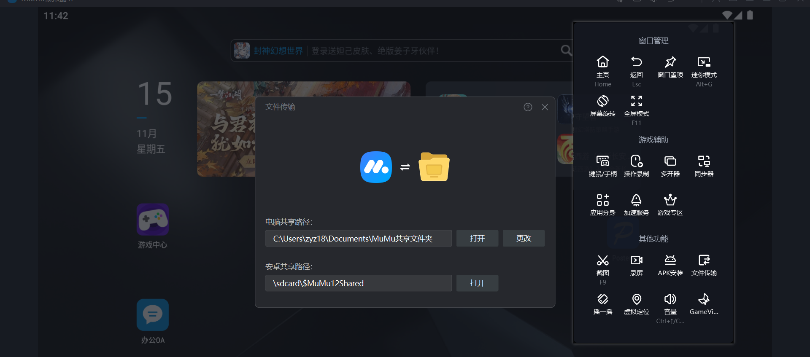
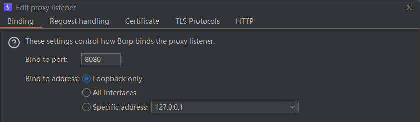
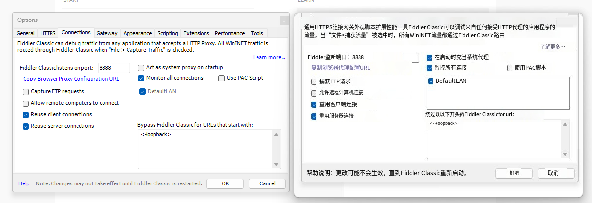
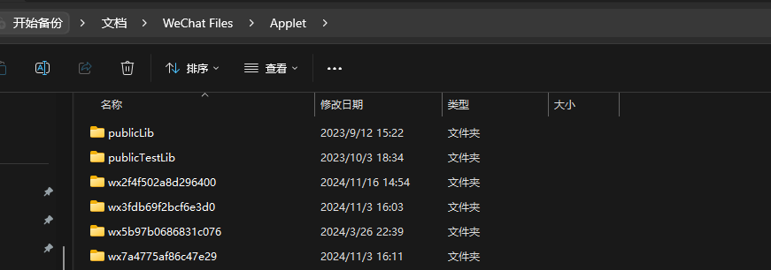
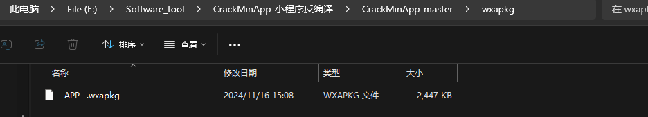
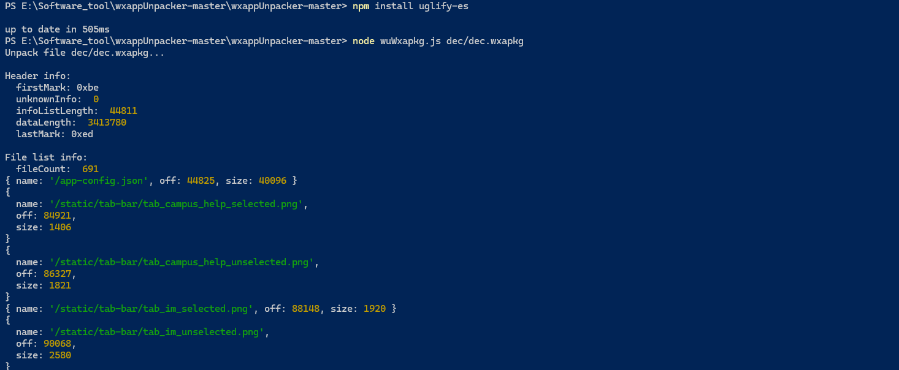

## 小程序代理及反编译

环境：

物理机：172.20.10.3

模拟器：172.20.10.4

模拟器设置代理


物理机即可接收到数据


## 移动端APP渗透通过Postern App 代理抓取流量

App拖到模拟器安装

1. 配置代理规则

   
2. 打开VPN

   
3. 设置代理地址

   



安装证书这里，mumu不能安装，设置里没有安装选项，点击也不能安装，下载夜神模拟器。

## 微信小程序通过proxfiler代理

使用proxfiler代理。




如果没有流量，打开一个从来没有打开过的小程序，因为会因为微信缓存，导致不发送请求。

## 微信小程序使用Fiddler Classic  代理。

如果上述配置抓取不了数据包，可以使用fiddler转发流量到Bp

下载地址:https://www.telerik.com/fiddler

路径:tools ->options ->HTTPS ->Actions ->Export root certificate to Desktop 导出证书到桌面并安装，选择受信任的根证书颁发机构，并勾选。


导入证书时选择受信任的根证书颁发机构。


根据下图进行勾选，其中actassystem proxy on startup为开启时自动开启全局代理，根据自己需要进行勾选，然后点击ok就可以。



给fiddler挂上bp的代理


## CrackMinApp反编译

  wechat-app-unpack （微信应用解包工具）：[github.com/leo9960/wechat-app-unpack](https://github.com/leo9960/wechat-app-unpack)

1. 下载   [ https://gitee.com/quzhantong/CrackMinApp](https://gitee.com/quzhantong/CrackMinApp)
2. 解压依赖node

   
3. 找到小程序包，文件夹名就是APPid

   C:\Users\zyz18\Documents\WeChat Files\Applet   微信小程序应用目录。

   

   C:\Users\zyz18\Documents\WeChat Files\wxid_7cy5sgdv00iv19\Applet   微信小程序用户缓存目录。

   

   首先我们找到对应微信id的小程序缓存目录，然后打开小程序加载，根据`<span data-type="text" style="color: var(--b3-font-color8);">`时间排序确定小程序的APPID。然后到微信小程序应用目录找到该小程序包。

   
4. 将小程序包拷贝到反编译工具目录

   
5. 小程序解密

   a.使用UnpackMiniApp.exe 工具解密，但是报错，

   

   b.使用pc_wxapkg_decrypt.exe 小工具解密，小程序id就是小程序包所在文件夹的名称。

   ```bash
   输入命令格式:pc_wxapkg_decrypt.exe -wxid 微信小程序id -in 要解密的wxapkg路径  
   ```

   
6. 选择小程序包执行反编译

   a。使用这个一键反编译工具，但找不到反编译后的包。

   
7. ## 使用  wxappUnpacker-master  进行反编译

   a.项目地址：[github.com/YangChengTeam/wxappUnpacker](https://github.com/YangChengTeam/wxappUnpacker)

   b.如果本地没有Node环境需要安装。并且配置环境变量。

   

   c. 安装  wxappUnpacker  运行所需要的依赖，其中 uglify-es  总是安装不成功，多尝试几次。

   Error: Cannot find module ‘uglify-es’
   解决方法：说明缺"uglify-es"模块,需要做的就是在".bat"的路径下打开powershell，然后输入命令npm install uglify-es.之后将会自动下载安装,如果提示不成功,再来一遍


   ```bash
   npm install esprima -g
   npm install css-tree -g
   npm install cssbeautify -g
   npm install vm2 -g
   npm install uglify-es -g

   ```

   d. 将解密过的  .wxapkg 文件放到项目目录新建文件夹下，方便操作。

   

   e. 一键运行命令，详细命令见github

   ```bash
   npm install 
   node wuWxapkg.js [-d] <path/to/.wxapkg>
   ```

   

   

‍
