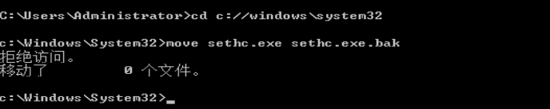
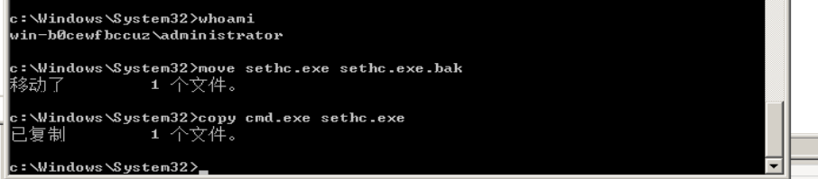
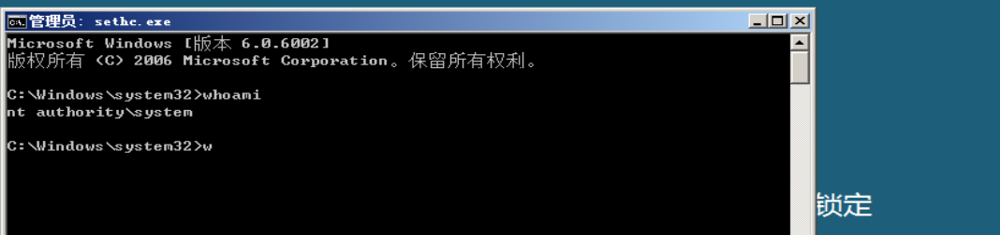
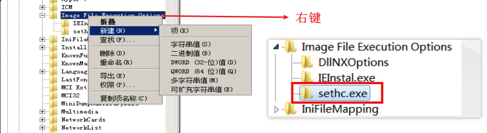
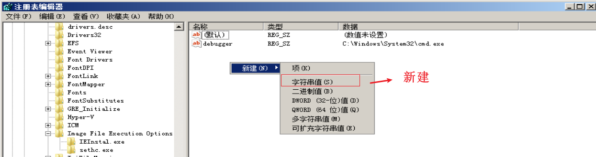
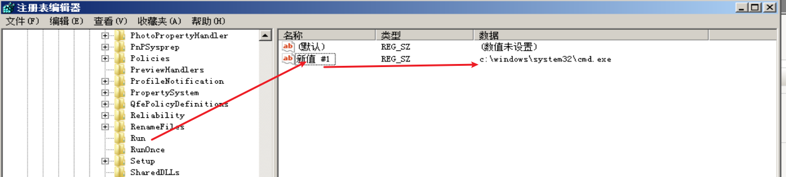
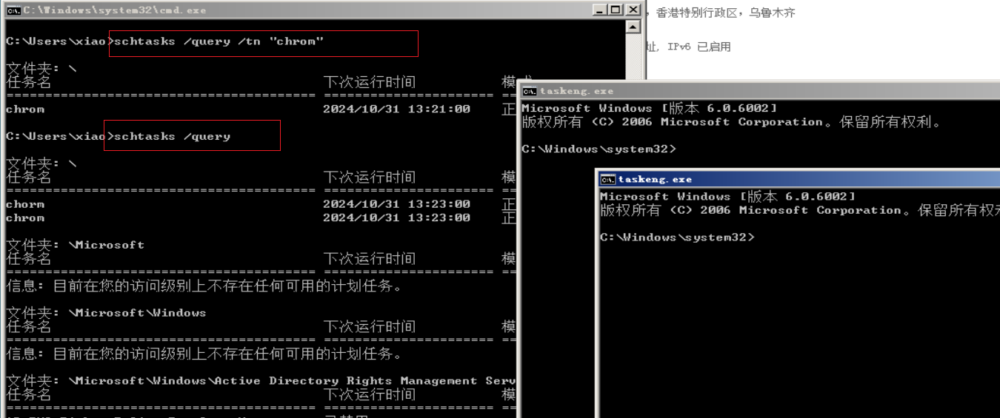
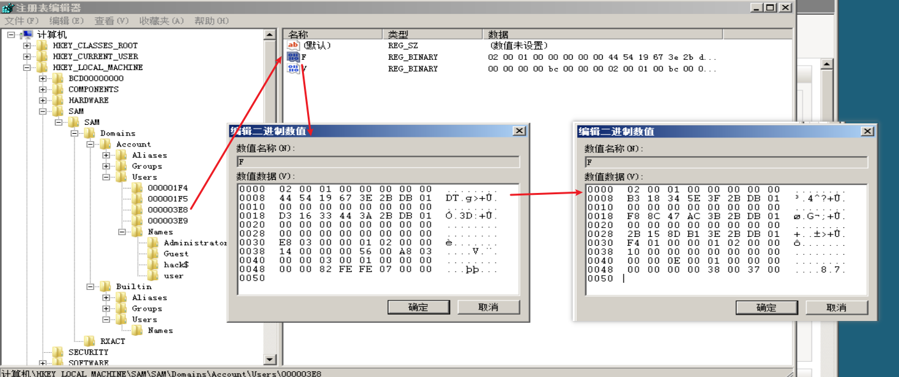
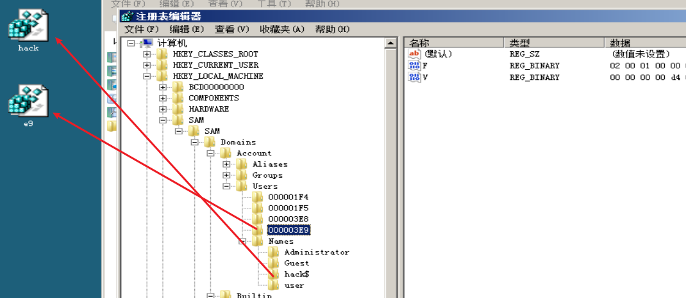
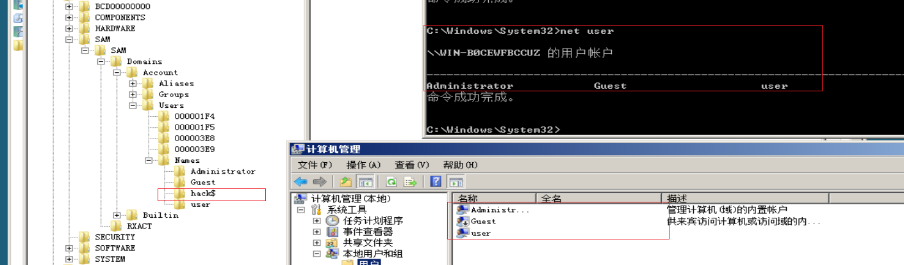

php 不死马权限维持、映像劫持技术、策 略组脚本维持、shift 后门、建立影子账 号、power shell 配置文件后门、Monitor 权限维持、利用安全描述符隐藏服务后门 进行权限维持、iis 后门、window 隐藏技 术、驱动级文件隐藏

## shift后门(shift backdoor)

绕过安全控制措施获取对程序或系统访问权限的方法。后门是一个留在目标主机上的软件，它可以使攻击者随时与目标主机进行连接 大多数情况下，后门是一个运行在目标主机上的<span data-type="text" style="color: var(--b3-font-color8);">隐藏进程</span>，可能允许一个<span data-type="text" style="color: var(--b3-font-color8);">普通的、未授权</span>的用户控制计算机 所以攻击者经常使用后门来控制服务器。

比较老的方式 在winodws中有一些辅助功能，能在用户未登录系统之前就通过组合键来启动 Windows的粘滞键 在Windows系统按5下shift后，Windows就运行了System32下的sethc.exe,启动粘滞键粘滞键的位置:C:\windows\system32\sethc.exe

### shift后门原理

把 cmd.exe 这个程序更名为 sethc.exe，并且把原来的sethc.exe替换掉 之后在登录界面连续按下5次shift键后，系统会以system权限运行cmd.exe 那么此时的 cmd.exe 就具有了管理权限，之后只要利用cmd增加一个管理员用户就可以登录进去，实现隐藏后门

### shift后门制作

用 cmd.exe 替换 windows\system32 目录下的粘滞键可执行文件sethc.exe

```python
cd c:\windows\system32 
move sethc.exe sethc.exe.bak 
copy cmd.exe sethc.exe
```

​​

拒绝访问将将权限目录下的所有文件及文件夹、子文件夹下的所有者更改为管理员组(administrators)

```python
takeown /f c:\windows\system32\*.*   /a /r /d y
cacls  c:\windows\system32\*.*  /T /E /G administrators:F
```

重新替换

​​

锁定界面5次shift后

​​

将其添加用户到管理员用户组

```python
net user xiao 123456 /add && net localgroup administrators xiao /add
```

​​

​​

### shift后门防御

* 在远程登录服务器时，连续按5次 shift 键，判断服务器是否被入侵
* 禁用该 sethc.exe 功能 或者在“控制面板”中关闭“连续按5次shift键时启用粘滞键选项
* 使用权限约束 sethc.exe，使任何人都不能访问它

## 映像劫持 IFEO(lmage File Execution Options)

### 映像劫持原理

在高版本的windows版本中<span data-type="text" style="color: var(--b3-font-color8);">替换的文件受到了系统的保护</span>，所以需要进行"映像劫持“ 可以理解为当打开a.exe程序实际打开的却是b.exe程序，那么a程序就是被b程序劫持了。是为一些在默认系统环境中运行时可能引发错误的 程序执行体提供特殊的环境设定。由于这个项主要是用来调试程序用的，对一般用户意义不大，默认是只有管理员和 local system有权读写修改.

### 制作映像劫持

1. 粘滞键的启动程序在C盘的Windows/system32目录下为sethc.exe
2. regdit
3. HKEY_LOCAL_MACHINE\ SOFTWARE \ Microsoft \ Windows NT \ CurrentVersion \ Image File ExecutionOption  新建项 sethc.exe

    ​​
4. 在新建的项中添加debugger键，键值设置为恶意程序的路径

    ​​
5. 这里用cmd路径代替。cmd路径：C:\Windows\system32\cmd.exe

    ​​
6. 锁定访问

    ​​

​​

## 启动项、计划任务

### 注册表自启动后门

通过修改注册表实现自动启动需要运行程序

最常见的在指定键值添加一个新的键值类型为 REG SZ,数据项中添写需要运行程序的路径即可以启动

1. 打开注册表路径：HKEY LOCAL MACHINE/SOFTWARE/Microsoft/Windows/CurrentVersion/Run
2. 添加一个键值类型为REG SZ
3. 在数据中填写需要运行程序的路径

    ​
4. 开机自动弹出

    ​​

### 计划任务后门

计划任务在 Windows7 及之前版本的操作系统中使用 <span data-type="text" style="color: var(--b3-font-color8);">at </span>命令调用，从 Windows8 等高版本的操作系统中使 用 <span data-type="text" style="color: var(--b3-font-color8);">schtasks </span>命令调用

at命令是只会打开一个后台进程，而schtasks命令是将定时的任务在前台执行

#### at命令的参数

```python
AT [\\computername] time [/INTERACTIVE] [ /EVERY:date[...]/NEXT:date....]] "command'
```

#### schtasks命令的参数

```python
schtasks /create /tn TaskName /tr TaskRun /sc schedule [/mo modifier] [/d day] [/m monthl,month.] /i ldieTime] [/st StartTime] [/sd StartDate] [/ed EndDate] [/s computer [/u [domain\juser /p password]] [/ru {[Domain\]User "System"} [/rp Password]] /?
```

#### 计划任务后门制作

计划任务后门分为管理员权限和普通权限两种，管理员权限的后门可以设置更多的计划任务，例如重启后运行等

创建计划后门的基本命令

```python
schtasks /create /tn "任务名称" /tr cmd.exe /sc minute /mo 1        #该命令表示每分钟执行一次cmd.exe
schtasks /query /tn "任务名称"                                  #查看某计划任务:将“任务名称”替换为您要查看的任务的实际名称。
schtasks /query                                             #查看所有计划任务：然后按Enter键。
```

​​

## 影子账户

在注册表中打开 HKEY LOCAL MACHINE/SAM/SAM/Domains/Account/Users/选项，点击Names菜单 注意:如果进入SAM后无法再看到里面的子选项，需要给予administrators完全控制权限，并重新进入注册表

1. 创建隐藏账户

    ​​
2. 打开注册表  给权限 <span data-type="text" style="color: var(--b3-font-color8);"> 给完权限查询打开</span>

    ```python
    HEKY_LOCAL_MACHINE\SAM\SAM\Domains\Account\User在SAM\SAM
    ```

    ​​
3. “Users”里包含的就是该帐户的权限的键值

    ​​
4. 把Administrator的F键值的内容替换掉hack的F键值（这样hack也有管理员权限了）

    ​​
5. 将隐藏用户的名字和权限注册表导出

    ​​
6. 删除账户

    ​​
7. 双击两个文件添加

    ​​
8. 影子用户创建完成，net user和计算机管理中都看不见zxk$用户，只有注册表中可以看见，且具有管理员权限

    ​​

‍

‍
