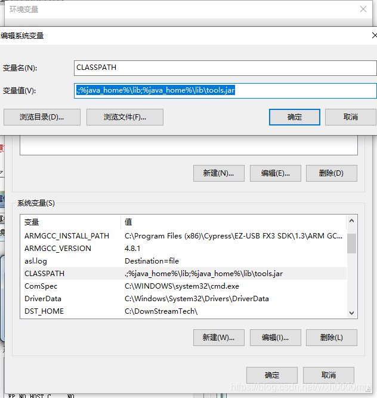
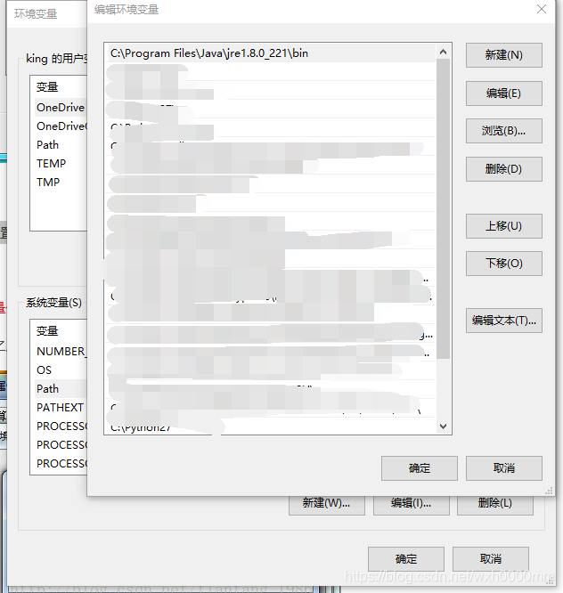
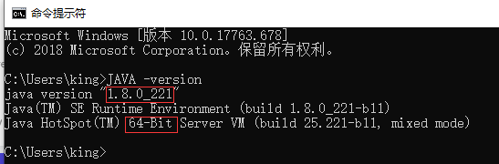

# java环境配置

### windows     Linux见： Linux centos7 java环境配置

JRE8安装目录为C:\Program Files\Java\jre1.8.0_221

​​

打开环境变量的步骤：

点击开始，右键选中我的电脑，点击属性-->高级系统设置-->高级-->环境变量-->系统变量。

1、设置JAVA_HOME

JAVA_HOME：C:\Program Files\Java\jre1.8.0_221（JRE安装路径）

​​

​​

2、设置CLASSPATH

CLASSPATH：.;%java_home%\lib;%java_home%\lib\tools.jar（注意前面的.）

​​

3、设置Path

Path: C:\Program Files\Java\jre1.8.0_221\bin

​​

我们可以验证一下

在CMD窗口输入：java -version

​​

可以正常显示版本号，这样就可以正确使用JRE了  

‍
