# upload-labs靶场实验

## Pass-1

上传合法文件，文件写入一句话木马。

​​

代理修改文件名，绕过前端检测。

​​

上传成功访问。

​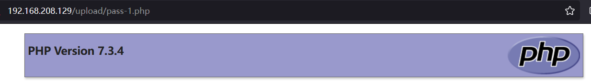​

或者直接删除检测的函数​​

​​

​​

清空文件上传

​​

## Pass-2

同上修改后缀

​​

访问成功

​​

## pass-3

AddType指令作用：在给定的文件扩展名与特定的内容类型之间建立映射语法：AddType MIME-type extension

改phpstudy下httpd.conf文件里的#AddType application/x-htpd-php.php.phtml  
AddType application/x-httpd-php .php .phtml .php5 php3

​​

​​

## pass-4

创建.htaccess文件写入如下内容、上传   注意文件名字要和上传的对应

```php
<FilesMatch "pass-4.png"> 
SetHandler application/x-httpd-php
</FilesMatch>
```

写入shell

```php
GIF89a
<?php phpinfo()?>
```

​​

​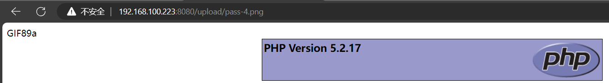​

## pass-5

windows对大小写不敏感所以直接大写文件后缀上传。

​​

​​

## pass-6

使用空格绕过

​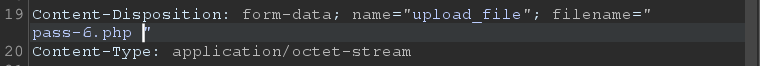​

​​

使用. . 绕过

​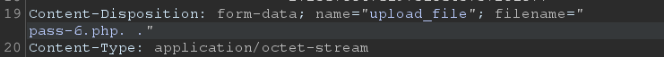​

​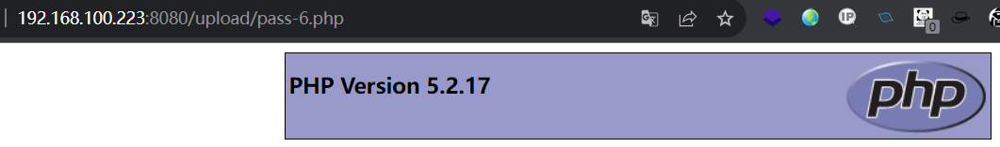​

## pass-7

​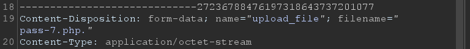​

​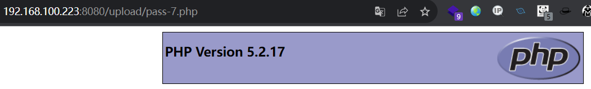​

## pass-8

​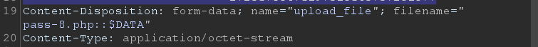​

​​

## pass-9

​​

​​

## pass-10

双写php但是要注意不能写phphpp这样会变成hpp

​​

​​

## 00截断

使用条件：

1. php < 5.3.4
2. gpc off

类型：GET、POST

## pass-11

GET类型截断：上传shell、抓包修改。为GET路径00截断。

​​

​​

## pass-12

POST类型00截断：上传phpshell，修改文件后缀为png，并为POST指定路径并截断。

​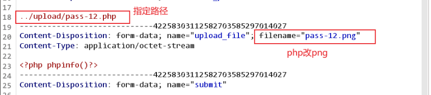​

16进制里00截断。

​​

上传成功显示

​​

访问

​​

## pass-17

上传写文件的png shell，上传，代理抓包，放入intruder，修改文件为.php的。

​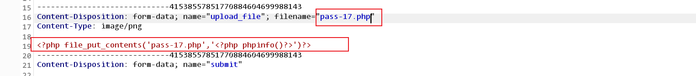​

代理抓取访问shell的GET请求，将其放入inturder，因为只有访问shell才会执行，使其生成另一个shell。

​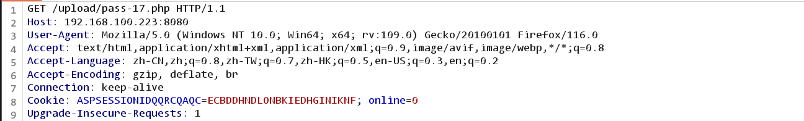​

设置payload集，批量攻击。

​​

设置资源池及并发请求延时。

​​

开始发送请求。

​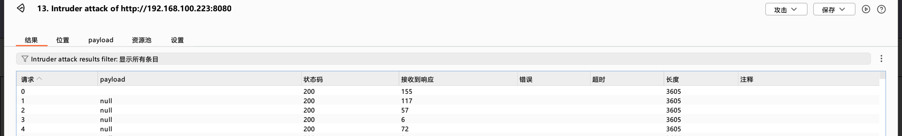​

访问请求出现200说明竞争到资源执行了脚本，已经生成另一个shell。

​​

访问。

​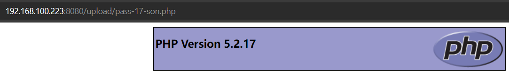​

## pass-19

上传shell，发现不能上传png的图片，所以添加一个png后缀，使用00截断。

​​

找到HEX截断位置，添加00截断。

​​

发送，上传成功。

​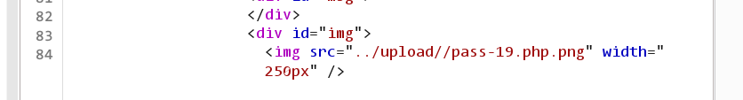​

访问。

​​

## apache漏洞解析

上传shell.png，修改后缀提示类型不支持。

​​

利用apache漏洞，添加后缀，有php后缀所以文件解析为了php。

​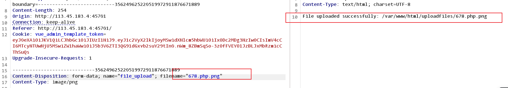​

访问成功，注意：文件名和路径需要写完整。

​​

## apache漏洞解析2

上传shell，代理抓包，在保存文件名位置将0da改为了0a0a。

​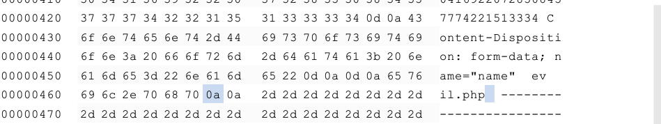​

上传后，在路径后面加上<span data-type="text" style="color: var(--b3-font-color8);">%0a </span>  访问。

​​

## 畸形解析漏洞

环境条件：iis 7.0/7.5/nginx 1.x

解析原理：出现该漏洞时，将文件名加上/.php会解析为php文件。

上传shell图片。

​​

直接访问图片不成功。

​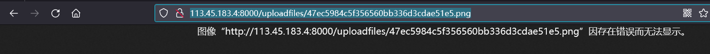​

加上/.访问成功。

​​

‍
