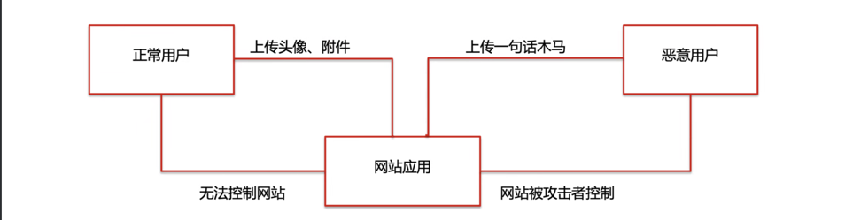
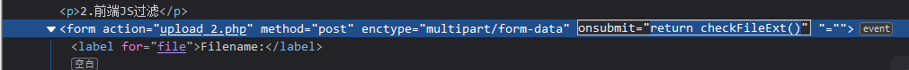
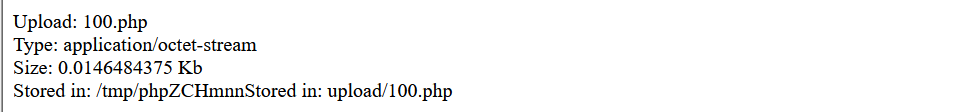
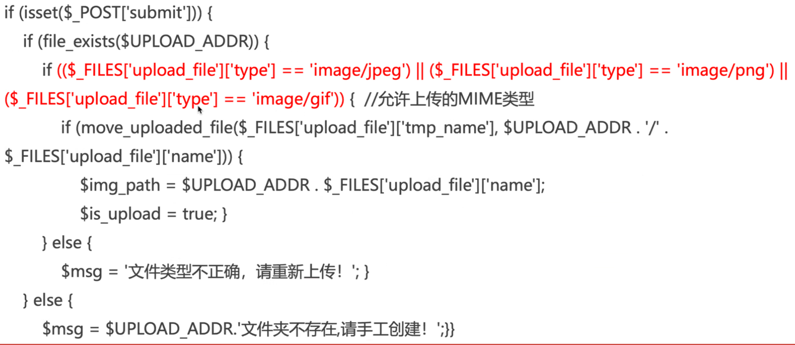
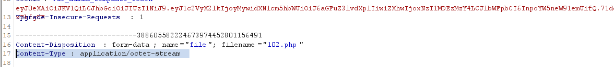
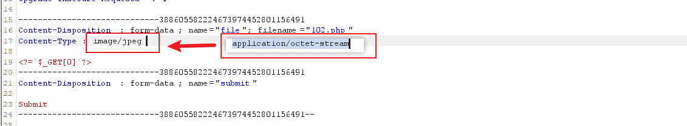
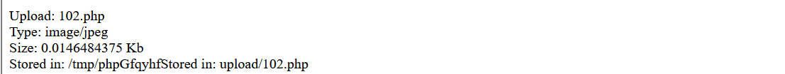
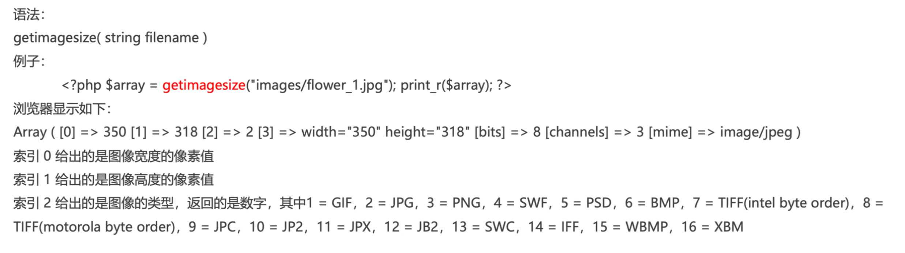
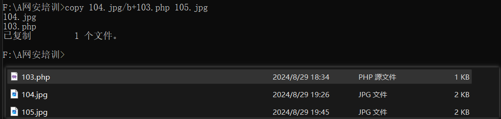
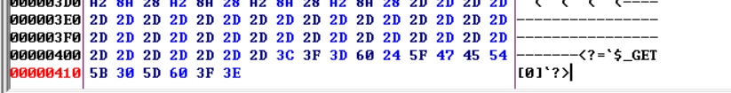

# 文件上传

## 什么是文件上传漏洞？

文件上传漏洞是指程序员在开发任意文件上传功能时，并未考虑文件格式后缀的合法性校验或者是只考虑在前端通过js进行  
后缀检验。这时攻击者可以上传一个与网站脚本语言相对应的恶意代码动态脚本，例如（jsp、asp、php、aspx文件后缀）到  
服务器上，从而攻击者访问这些恶意脚本对包含的恶意代码动态解析最终达到执行恶意代码的效果，进一步影响服务器安全。

​​

## 文件上传漏洞条件

* 网站开文件上传功能php.ini    file_upload=on
* web上传目录有可写以上权限
* 文件能被正常解析为动态脚本，php=>php
* 上传的文件至少得有读权限。
* Wb容器可以解析上传的脚本，无论脚本以什么样的形式存在
* 无视以上条件的情况就是服务器配置不当，开启了PUT方法。

  ​​

## 文件上传漏洞分类

* 文件任意上传                          ——没有任何校验
* 绕过js校验上传                       ——校验在前端
* MIME-type类型绕过上传        ——服务器端        [ 常见 MIME 类型列表](https://developer.mozilla.org/zh-CN/docs/Web/HTTP/Basics_of_HTTP/MIME_types/Common_types "1111")
* 文件头检测                             ——服务器端
* 绕过扩展名校验上传              ——服务器端
* 文件加载检测                         ——服务器端
* 结合解析漏洞上传                  ——中间件解析漏洞造成

​​

## 文件上传漏洞的危害

上传漏洞与SQL注入或XSS相比，其风险更大，如果Wb应用程序存在上传漏洞，攻击者上传的文件是Web脚本语言，服务器的Wb容器解释并执行了用户上传的脚本，导致代码执行。比如：如果上传的文件是病毒、木马文件，黑客用以诱骗用户或者管理员下载执行。如果上传的文件是钓鱼图片或为包含了脚本的图片，在某些版本的浏览器中会被作为脚本执行，被用于钓鱼和欺诈。攻击者甚至可以直接上传一个webshell到服务器上完全控制系统或致使系统瘫痪。

## 文件上传漏洞的防御

最理想的是能够过滤掉图片马中的恶意代码。

* 采用白名单策略，严格限制上传文件的<span data-type="text" style="color: var(--b3-font-color9);">后缀名</span>。
* 进行二次渲染，过滤掉图片马中的恶意代码。
* 上传文件重命名，尽量少的从客户端获取信息。
* 避免文件包含漏洞。
* 严格处理文件路径，防御00截断漏洞，避开空格、点、：$DATA等windows特性。
* 将文件上传到对象存储。
* 服务器及时更新Web容器，防止解析漏洞的产生。
* 服务器可写目录不给执行权限。

## 前端js文件上传校验

#### 经典文件上传代码

​​

## 前端js检测绕过方法

JS代码通常采用<span data-type="text" style="color: var(--b3-font-color8);">白名单策略</span>，检测文件<span data-type="text" style="color: var(--b3-font-color9);">后缀名</span>。配合表单事件使用。前端js脚本检测的安全防御是十分薄弱的。可以非  
常轻松的绕过。

* 方法一：因为js脚本的运行环境是浏览器，我们可以<span data-type="text" style="color: var(--b3-font-color7);">修改js代码</span>，甚至删除表单事件，禁用js
* 方法二：使恶意文件后缀名符合白名单策略，用<span data-type="text" style="color: var(--b3-font-color8);">Bup挂代理抓包</span>，然后修改文件后缀名即可。
* 所以：仅前检测文件上传是远远不够的，需要结合**后端服务器进行检测检测**。

1. 直接上传`.PHP`​文件提示文件名不合法，使用了前端校验。
2. 查看源码，前端有校验

    ​​
3. 方法一：直接将上图函数名 `return checkfileExt()`​ 删除。

    ​​
4. 方法二：使恶意文件后缀名符合白名单策略，用<span data-type="text" style="color: var(--b3-font-color8);">Bup挂代理抓包</span>，然后修改文件后缀名即可。即将php文件改为jpg后缀上传，抓包改回。

    ​​

    ​​

## MIME-TYPE检测

MIME-TYPE检测也称content-type检测，在服务器端如果上传文件的MlME-TYPE与白名单一致，则允许上传。

经典代码：

​​

### MIME概述

* MlME(Multipurpose Internet Mail Extensions)是描述消息内容类型的因特网标准。
* MME消息能包含文本、图像、音频、视频以及其他应用程序专用的数据，当具有该扩展名的文件被访问时，浏览器会自动使用指定的应用程序打开。
* 协议中，使用Content--Type字段表示文件的MlME类型

### MIME-TYPE检测绕过方法

由于服务器在检测Content-下ype类型的时候，取得的变量来自于用户，所以可以用<span data-type="text" style="background-color: var(--b3-font-background8);">Burp抓包</span>，修改字段使其合法，即可绕过  
限制上传任意文件。

1. 上传一个php文件，但是该文件的content-type类型不在白名单当中。

    ​​
2. 在Burp抓包修改字段值，改为符合要求的类型。从而绕过校验。

    ​​
3. 上传成功

    ​​

### [ 常见 MIME 类型列表](https://developer.mozilla.org/zh-CN/docs/Web/HTTP/Basics_of_HTTP/MIME_types/Common_types)

|扩展名|文档类型|MIME 类型|
| ---------------------------------------------------------------------------------------------------------------------------| -----------------------------------------------------| --------------------------------|
|​`.aac`​|AAC 音频|​`audio/aac`​|
|​`.abw`​|[AbiWord](https://zh.wikipedia.org/wiki/AbiWord) 文档|​`application/x-abiword`​|
|​`.apng`​|动态可移植网络图形（APNG）图像|​`image/apng`​|
|​`.arc`​|归档文件（嵌入多个文件）|​`application/x-freearc`​|
|​`.avif`​|AVIF 图像|​`image/avif`​|
|​`.avi`​|AVI：音频视频交织文件格式（Audio Video Interleave）|​`video/x-msvideo`​|
|​`.azw`​|Amazon Kindle 电子书格式|​`application/vnd.amazon.ebook`​|
|​`.bin`​​|任何二进制数据类型|​`application/octet-stream`​|
|​`.bmp`​|Windows OS/2 位图|​`image/bmp`​|
|​`.bz`​|BZip 归档|​`application/x-bzip`​|
|​`.bz2`​|BZip2 归档|​`application/x-bzip2`​|
|​`.cda`​|CD 音频|​`application/x-cdf`​|
|​`.csh`​|C-Shell 脚本|​`application/x-csh`​|
|​`.css`​|层叠样式表（CSS）|​`text/css`​|
|​`.csv`​|逗号分隔值（CSV）|​`text/csv`​|
|​`.doc`​​|Microsoft Word|​`application/msword`​|
|​`.docx`​​|Microsoft Word（OpenXML）|​`application/vnd.openxmlformats-officedocument.wordprocessingml.document`​|
|​`.eot`​|MS 嵌入式 OpenType 字体|​`application/vnd.ms-fontobject`​|
|​`.epub`​|电子出版（EPUB）|​`application/epub+zip`​|
|​`.gz`​|GZip 压缩归档|​`application/gzip`​|
|​`.gif`​​|图像互换格式（GIF）|​`image/gif`​|
|​`.htm`​​ `.html`​​|超文本标记语言（HTML）|​`text/html`​|
|​`.ico`​​|图标（Icon）格式|​`image/vnd.microsoft.icon`​|
|​`.ics`​|iCalendar 格式|​`text/calendar`​|
|​`.jar`​|Java 归档 （JAR）|​`application/java-archive`​|
|​`.jpeg`​​ `.jpg`​​|JPEG 图像|​`image/jpeg`​|
|​`.js`​|JavaScript （英语）|​`text/javascript`​（规范：HTML 和 RFC 9239）|
|​`.json`​|JSON 格式|​`application/json`​|
|​`.jsonld`​|JSON-LD 格式|​`application/ld+json`​|
|​`.mid`​,`.midi`​|音乐数字接口（MIDI）|​`audio/midi`​、`audio/x-midi`​|
|​`.mjs`​|JavaScript 模块|​`text/javascript`​|
|​`.mp3`​​|MP3 音频|​`audio/mpeg`​|
|​`.mp4`​​|MP4 视频|​`video/mp4`​|
|​`.mpeg`​|MPEG 视频|​`video/mpeg`​|
|​`.mpkg`​|Apple 安装包|​`application/vnd.apple.installer+xml`​|
|​`.odp`​|开放文档演示稿文档|​`application/vnd.oasis.opendocument.presentation`​|
|​`.ods`​|开放文档表格文档|​`application/vnd.oasis.opendocument.spreadsheet`​|
|​`.odt`​|开放文档文本文档|​`application/vnd.oasis.opendocument.text`​|
|​`.oga`​|OGG 音频|​`audio/ogg`​|
|​`.ogv`​|OGG 视频|​`video/ogg`​|
|​`.ogx`​|OGG 系列|​`application/ogg`​|
|​`.opus`​|Opus 音频|​`audio/opus`​|
|​`.otf`​|OpenType 字体|​`font/otf`​|
|​`.png`​​|便携式网络图形|​`image/png`​|
|​`.pdf`​​|Adobe [便携式文档格式](https://www.adobe.com/acrobat/about-adobe-pdf.html)（PDF）|​`application/pdf`​|
|​`.php`​|超文本预处理器（**Personal Home Page**）|​`application/x-httpd-php`​|
|​`.ppt`​|Microsoft PowerPoint|​`application/vnd.ms-powerpoint`​|
|​`.pptx`​|Microsoft PowerPoint（OpenXML）|​`application/vnd.openxmlformats-officedocument.presentationml.presentation`​|
|​`.rar`​|RAR 归档|​`application/vnd.rar`​|
|​`.rtf`​|富文本格式（RTF）|​`application/rtf`​|
|​`.sh`​|伯恩 shell 脚本|​`application/x-sh`​|
|​`.svg`​​|可缩放矢量图形（SVG）|​`image/svg+xml`​|
|​`.tar`​|磁带归档（TAR）|​`application/x-tar`​|
|​`.tif`​,`.tiff`​|标签图像文件格式（TIFF）|​`image/tiff`​|
|​`.ts`​|MPEG 传输流|​`video/mp2t`​|
|​`.ttf`​|TrueType 字体|​`font/ttf`​|
|​`.txt`​|文本（通常是 [ASCII](https://developer.mozilla.org/zh-CN/docs/Glossary/ASCII) 或 ISO 8859-n）|​`text/plain`​|
|​`.vsd`​|Microsoft Visio|​`application/vnd.visio`​|
|​`.wav`​|波形音频格式|​`audio/wav`​|
|​`.weba`​|WEBM 音频|​`audio/webm`​|
|​`.webm`​|WEBM 视频|​`video/webm`​|
|​`.webp`​|WEBP 图像|​`image/webp`​|
|​`.woff`​|Web 开放字体格式（WOFF）|​`font/woff`​|
|​`.woff2`​|Web 开放字体格式（WOFF）|​`font/woff2`​|
|​`.xhtml`​|XHTML 格式|​`application/xhtml+xml`​|
|​`.xls`​|Microsoft Excel|​`application/vnd.ms-excel`​|
|​`.xlsx`​|Microsoft Excel（OpenXML）|​`application/vnd.openxmlformats-officedocument.spreadsheetml.sheet`​|
|​`.xml`​|XML 格式|​`application/xmltext/xml.xmlapplication/atom+xmlapplication/xml`​|
|​`.xul`​|XUL 系列|​`application/vnd.mozilla.xul+xml`​|
|​`.zip`​|ZIP 归档|​`application/zip`​|
|​`.3gp`​|[3GPP](https://zh.wikipedia.org/wiki/3GP) 音视频容器|​`video/3gpp`​；如果不包含视频则为`audio/3gpp`​|
|​`.3g2`​|[3GPP2](https://zh.wikipedia.org/wiki/3GP) 音视频容器|​`video/3gpp2`​；如果不包含视频则为`audio/3gpp2`​|
|​`.7z`​​|[7-zip](https://zh.wikipedia.org/wiki/7-Zip) 归档|​`application/x-7z-compressed`​|

​​

## 文件头检测

* 文件头是位于文件开头的一段承担一定任务的数据，就是为了描述文件的一些重要属性，比如图片的长度、宽度、像素尺寸等，一般都在开头的部分。

  ​​

* 文件头检测是使用对于文件内容的验证机制，这种方法利用的是：每一个特定类型的文件都会有不太一样的开头或者标志  
  位，也就是我们常说的文件幻数
* 文件幻数，可以用来标记文件或者协议的格式，很多文件都有幻数标志来表明该文件的格式

### 相关函数

函数名：getimagesize()

说明：用于获取图像大小及相关信息，成功返回一个数组，失败则返回FALSE并产生一条错误信息；这个函数本意是<span data-type="text" style="color: var(--b3-font-color8);">检查图片的大小</span>，但是在检查之前，该函数会判断目标文件是否是一张图片。因此，可以用该函数来检测文件的内容。

​​

### 检测流程

读取图像——>检查文件头——>判断上传文件是否合法

### 文件头检测相关代码

​​

### 文件头检测的绕过方法

说明：

* 通过伪造合法的文件头可以绕过这种检测
* 通常检测函数根据文件的前10个字节，就可以判断出文件的类型，而图片的文件头一般都是固定的

方法：

* 在恶意脚本前加上文件头即可，如<span data-type="text" style="background-color: var(--b3-font-background8);">GIF89a</span>
* 制作图片马，可以通过命令行生成
* 使用010 editor等编辑工具打开一张图片，在图片中加上webshell脚本

步骤：  在恶意脚本前加上文件头即可，如<span data-type="text" style="background-color: var(--b3-font-background8);">GIF89a</span>

1. 上传一个php文件，会提示我们文件不合法。
2. 在上传文件时候开启抓包。
3. 添加GIF文件头，放行。

    ​​
4. 上传成功

    ​​

‍

## 黑白名单检测及绕过

```mindmap
- 后端绕过 
  - 黑名单检测绕过
    - .htaccess
    - 大小写绕过
    - 点绕过
    - 空格绕过
    - ::$$DATA绕过
    - 配合解析漏洞
    - 双写后缀绕过
  - 白名单检测绕过
    - MIME-TYPE检测绕过
    - %00截断绕过
    - 0x00截断绕过
    - 0x0a截断绕过
```

原因：文件上传模块避免上传可执行的脚本文件，防止上传脚本需要设置对应的验证方式分类

1. 基于白名单验证：当上传的文件后缀名是在白名单中有的后缀名，文件才能上传成功
2. 基于黑名单验证：当上传的文件后缀名是在黑名单中没有的后缀名，文件才能上传成功

经典代码

​​

$deny_ext数据就是一个黑名单，数组元素就是不允许上传的类型

## 绕过白名单检测

只能上传白名单数组内的后缀名文件。

## 绕过黑名单检测

* 文件名大小写绕过（较少） 用像AsP,pHp之类的文件名，如果黑名单上不存在的话就可以绕过黑名单检测

  过滤严格的话一般会用strtolower（）函数把后缀名全变为小写，此时就不能绕过黑名单了
* 特殊文件名绕过（只Windows系统下）

  上传不符合windows文件命名规则的文件名，会被windows系统<span data-type="text" style="text-shadow: 1px 1px var(--b3-theme-surface-lighter), 2px 2px var(--b3-theme-surface-lighter), 3px 3px var(--b3-theme-surface-lighter), 4px 4px var(--b3-theme-surface-lighter);">自动去掉不符合规则符号</span>后面的内容

  特殊文件名绕过有 ：

  test.asp.

  test.asp（空格 ）

  上传test.php:1jpg   服务器生成：test.php    但文件内容空

  上传shell.php::$DATA   服务器生成：shell.php   文件内容：写入的php代码
* 00截断绕过（了解就行）

  ​

## 中间件解析漏洞上传

### 什么是文件解析？

当服务器接收到一个<span data-type="text" style="color: var(--b3-font-color8);">HTTP请求</span>的时候，web容器(如lIS、Apache)首先会根据文件的<span data-type="text" style="color: var(--b3-font-color8);">后缀名</span>，决定如何处理这个请求。

当服务器获取到所请求的页面的后缀(如 <span data-type="text" style="color: var(--b3-font-color8);">.php</span>)后，接下来就会在服务器端寻找可以处理这类后缀名的应用程序，如果找不到则直接把这个文件返还给客户端

### 漏洞利用

由于中间件(如IS、Apache)<span data-type="text" style="color: var(--b3-font-color8);">本身的缺陷</span>，在对上传文件进行解析时会出现一些<span data-type="text" style="color: var(--b3-font-color8);">不可预料的错误从而导致被利用进行文件上传绕过</span>。

#### 常见的解析漏洞

* Apache解析漏洞

  1、多后缀   apache漏洞解析  
  存在的版本：Apache1.X和Apache2.X  
  解析规则：从<span data-type="text" style="color: var(--b3-font-color8);">右向左开始判断解析，如果后缀名为不可识别文件解析，就再往左判断</span>，如果都不认识，则会暴露其源码  
  举例：  
  可以上传一个test.php.aaa.bbb文件，绕过验证且服务器依然会将其解析为php  
  访问/test.php,aaa,bbb,由于Apache不认识aaa和bbb,会从右向左一直遍历到后缀。php为止

  2、配置问题导致漏洞  
  漏洞产生原因：  
  ①如果在 <span data-type="text" style="color: var(--b3-font-color8);"> Apache的conf</span>  里有这样一行配置`AddHandler php5-script.php`​  这时<span data-type="text" style="color: var(--b3-font-color8);">只要文件名里包含php</span>,即使  
  文件名是test2.php,jpg也会以php来执行。  
  ②如果在  Apache的conf  里有这样一行配置`AddType application/x-httpd-php .jpg`​,  将.jpg后缀文件用php解析执行。即使扩展名是jpg,一样能以php方式执行。  
  修复方案：  
  ①在apache配置文件中，禁止.php  这样的文件执行，配置文件里面加入

  ```php
  <Files-".(php. | php3.)">
      order Allow,Deny
      Deny from all
  </Files>
  ```

  ②用伪静态能解决这个问题，重写类似。php.*这类文件，打开apache的httpd.conf找到

  3、.htaccess文件解析   例：pass-4  
  .htaccess文件可以配置很多事情，如是否开启站点的图片缓存、自定义错误页面、自定义默认文档、等等。但我  
  们这里只关心。htaccess文件的一个作用一<span data-type="text" style="color: var(--b3-font-color8);">MIME类型修改</span>  
  如果Apache中。.如果.htaccess可被执行并可被上传，那么可以尝试在。htaccess中写入

  ```php
  <FilesMatch "1.jpg">SetHandler application/x-httpd-php </FilesMatch>
  //该语句会让Apache把shell.jpg文件当作php文件来解析
  ```

  另一种写法是：  
  ​`AddType application/x-httpd-php .xxx`​  
  如果写入，就成功地使该.htaccess文件所在目录及其子目录的文件被Apache<span data-type="text" style="color: var(--b3-font-color8);">当做php文件执行。</span>
* 1S6.0解析漏洞    

  1、目录解析  
  形式：/x.asp/x.jpg  
  原理：在网站下创建文件夹名字为 <span data-type="text" style="color: var(--b3-font-color8);"> .asp、.asa </span> 的文件夹，其<span data-type="text" style="color: var(--b3-font-color8);">目录内</span>的<span data-type="text" style="color: var(--b3-font-color8);">任何扩展名</span>的文件都被当作<span data-type="text" style="color: var(--b3-font-color8);">asp</span>文件来解析并执行。  
  因此只要攻击者只需通过该漏洞上传图片马，不用修改后缀名

  2、文件解析  
  形式：/x.asp;.jpg(利用特殊符号";"  
  原理：在iis6.0下，服务器默认不解析分号后面的内容，所以x.asp;.jpg被解析为asp脚本

  3、解析文件类型  
  形式：/test.asa、/test.cer、/test.cdx  
  原理：Iis6.0默认的可执行文件除了asp还包含这三种<span data-type="text" style="color: var(--b3-font-color8);">asa、cer、cdx,</span>会将这三种扩展名文件<span data-type="text" style="color: var(--b3-font-color8);">解析为asp</span>文件
* PHP CGI解析漏洞 (畸形解析漏洞)

  环境：IIS7.0/IIS7.5/Nginx1.x  
  利用条件：  
  1.Fast-CGl运行模式  
  2.php.ini里cgi.fix_pathinfo=1(<span data-type="text" style="color: var(--b3-font-color8);">默认为1</span>)  
  3.取消勾选php-cgi.exe程序的"Invoke handler only if request is mapped to“  
  形试：<span data-type="text" style="color: var(--b3-font-color8);">如果在一个文件路径/x.jpg后面加上/xx.php会将/x.jpg/x.php解析为php文件。</span>
* Nginx解析漏洞

## 图片马

就是在图片中隐藏一句话木马。利用.htaccess等**解析图片为PHP或者asp文件**。达到执行图片内代码目的.

制作方法：

* cmd中` copy 1.jpg/b+2.php 3.jpg`​

  * /b   与`copy`​命令一起使用，二进制模式复制文件
  * /a是ascii方式打开
  * 追加2.php
  * 保存为3.php

  ​​
* 使用16进制打开工具

  ​​
* linux中 ` cat 1.jpg 1.php > shell.php`​

注意：

* 单纯的图片马并不能直接和蚁剑连接，
* 因为该文件依然是以image格式进行解析，
* 只有利用**文件包含漏洞**，才能成功利用该木马
* 所谓文件包含漏洞，是指在代码中引入其他文件作为php文件执行时，未对文件进行严格过滤，导致用户指定任意文件，都作为php文件解析执行。

## SQL漏洞利用技巧

[实战 | 对自己学校内网的渗透测试](https://mp.weixin.qq.com/s?__biz=MzAxMjE3ODU3MQ==&amp;mid=2650599106&amp;idx=3&amp;sn=8386f178d05cc38f8d6382318a888839)

利用一：目录扫描发现Web Api Help接口文档泄露。可以根据文档找到漏洞。

利用二：使用远程下载命令，原理是把木马挂在自己HTTP服务器服务器，使用Sqlmap远程让目标下载执行。

利用三：有了马就要执行文件，可以选择提权或将文件放到有执行权限的目录里。

利用四：shell反弹，使用巨龙拉冬插件的“本地提权”下的“System2Admin”功能。伪造的system权限，反弹一个管理员权限的会话回来。不太懂。

利用五：管理员权限获取hash密码。并解码。登录、远程连接、增添影子账户。。。

利用六：使用该服务器继续寻找其他系统地址和有用信息。

‍
