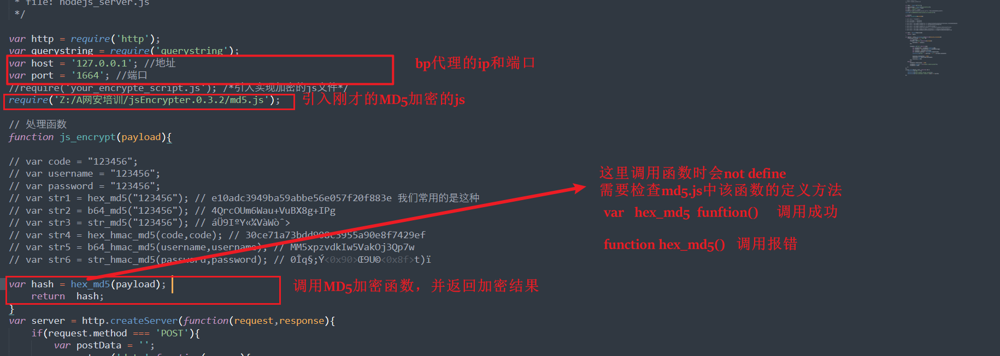
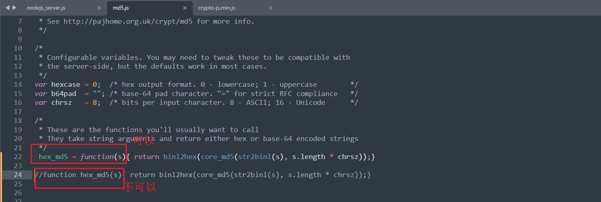
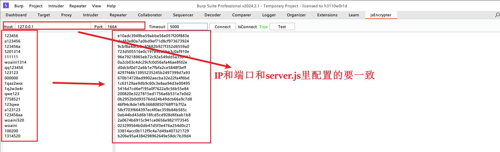

## 身份认证安全

绕过方法

1. 暴力破解
2. 撞库
3. cookie伪造、session

修复方法

1. 增加验证码
2. 限制登录频率
3. 二次验证
4. 使用session会话认证避免cookie仿冒。
5. 每次登录重新生成swssion
6. session闲置超时退出。

## 任意密码找回

密码找回的方法

* 用户凭证暴力破解

  * 原理：凭证只有验证码且时间次数限制条件弱
  * 方法：抓包-爆破
* 返回凭证

  * 原理：校验凭证如验证码从的响应包url/请求体里由服务端返回到客户端
  * 方法：抓包-检查-解码
* 邮箱弱token

  * 原理：邮箱里修改密码的链接容易被伪造如（?id=MD5(uid+时间戳)）
  * 方法：一个已知账号和一个未知账号同时点击找回密码爆破构造出找回密码URL
* 用户凭证有效性

  * 原理1：修改他人密码时抓包将他人手机号替换为自己手机号获取验证码
  * 原理2：修改自己密码时通过了用户校验输入新密码提交后抓包将用户id改为他人的
  * 原理3：访问自己的重置密码邮箱链接输入新密码提交后抓包将用户id改为他人
* 重新绑定手机和邮箱

  * 原理：给已知账号绑定手机，抓包将用户id改为他人，实现自己手机绑定他人id，并通过手机号改密。
* 服务器验证

  * 原理1：使用邮箱找回密码，通过链接至修改密码页面，修改密码提交抓包修改为他人id。
  * 原理2：密保问题和新密码在同一个界面，抓包删除密保问题提交。
* 跳过验证

  * 原理：修改密码页面抓包，修改USERNAMECOOKIE为其他用户，修改密码后提交。
  * 原理2：修改step步骤参数，直接跳到修改密码，抓包修改cookie/uid，修改密码后提交。
* 本地验证

  * 原理1：在本地验证服务器的返回信息，确定是否执行密码重置，其返回信息是可控/可获得的内容。
  * 原理2：发生短信等验证信息的动作在本地执行，可以通过修改request包进行控制
* Token生成可控

  * 原理1：修改密码时抓发送验证码的包，将接收验证码的邮箱改为自己的。邮箱点击链接修改密码。
  * 原理2：提交验证码时抓包，修改UID，此时用户返回他人token，用已知账号抓改密包，替换其中的token发送。
* 注册覆盖

  * 原理：注册相同用户名，数据库原账号内容被覆盖，相当于改密。未做用户名已存在校验。
* Session覆盖

  * 原理：同一浏览器，输入自己的账户进行邮箱密码找回，进入邮箱查看链接，接着输入他人账户，进行密码找回，返回刚刚自己的邮箱点击链接，由于session覆盖导致了，这个链接成为了修改他人密码的链接，成功修改他人密码

## 验证码突破

* ### 暴力破解

  #### 条件

  1.没有时间限制

  2.没有次数限制

  3.长度复杂度低

  #### 方法

  使用验证码爆破工具、burpsuit枚举
* ### 时间次数限制

  #### 检测

  重复提交携带验证码的数据包看是否会提示，若是前端校验直接改。
* ### 回显测试

  1.代码审计，检查代码中是否存在验证码。

  2.在cookie中查看是否存在验证码。

  3.在响应包中查看是否存在验证码。
* ### 验证码绕过

  1.登录时抓包删除验证码看后端是否校验。前端校验直接抓包爆破。

  2.登录时抓包删除cookie，看是否可以登录。

  3.滑动验证码滑动一次抓包爆破。

  4.同一个验证码的请求包次数没有限制，使用同一验证码进行多次爆破。

  5.验证码是png，验证码请求链接放入PKAV识别爆破。

  6.计算型验证码，计算一次后抓包爆破。

  7.固定验证码，比如资源池就几十张验证码图片，做成字典bp枚举。

## API接口调用安全

### 接口概念

应用程序编程接口(Application Programming Interface），是一些预先定义的函数，提供应用程序与开发人员基于某软件或硬件得以访问一组例程的能力，而又无需访问源码，或理解内部工作机制的细节。

### 分类

1. 重放攻击：即恶意多次调用某个接口，如验证码API：造成短信轰炸，注册API：产生大量空壳账号。评论API：网络水军控制舆论。订单API：生成大量订单，占用库存量造成损失。

    修复方法：限时限量、使用验证码、一次性token。
2. 内容编辑：获取短信验证码，抓包，可以修改短信内容。  
    修复方法：从客户端处获取手机号、邮箱等账号信息，要与Session中的凭证进行核验，通过后才允许进行操作。
3. 接口调用遍历或越权：当API接收参数来返回不同的数据时，如果权限校验不严会非授权访问或越权。

    修复方法：ID校验、session校验、token校验。

### 测试方法

1. 找接口：使用URLFinder、JSFinder、API接口文档、手工获取
2. 使用Burpsuite发送POST and GET请求，测试前删除增删改接口。

## 业务授权安全

发生位置：

1. 修改、重置、找回其他账号密码。
2. 查看修改其他用户未公开信息。

水平越权:

概念：相同权限不同用户相互访问

例1：A可修改/查看B信息

例2：抓包修改url?uid=xxx批量遍历用户信息

垂直越权:

概念：低权限访问高权限或反之

例：员工修改管理员资料

检测方法：

1. 修改key值看是否能遍历他人信息，如：uid、id、username、number...
2. 如果有验证参数尝试构造验证参数。

修复方法：

1. 验证用户身份
2. 二次验证、cookie、session、token

## 数据篡改

业务一致性篡改：手机号、邮箱、用户名、订单ID、商品编号、

业务数据安全：金额（0元购）、数量（商品数量负数）、本地JS参数、

## jsEncrypter使用

 -- 参考文章： [blog.csdn.net/qq_44159028/article/details/121780172](https://blog.csdn.net/qq_44159028/article/details/121780172)

1. github下载jsEncrypter解压。

    ​​
2. 在bp里导入jsEncrypter插件

    ​
3. MD5加密需要从外部导入加密的js代码。所以先去网上copy/下载一个MD5加密的js放入改目录备用。

    ​​
4. 修改nodejs_server.js   里的配置

    ​​

    ​​
5. 去目录下启动js服务

    ​​
6. 在BP里配置测试

    ​​

    ​​

​​

‍
