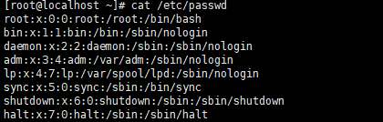
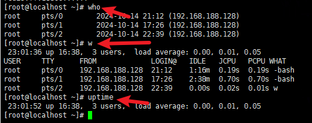
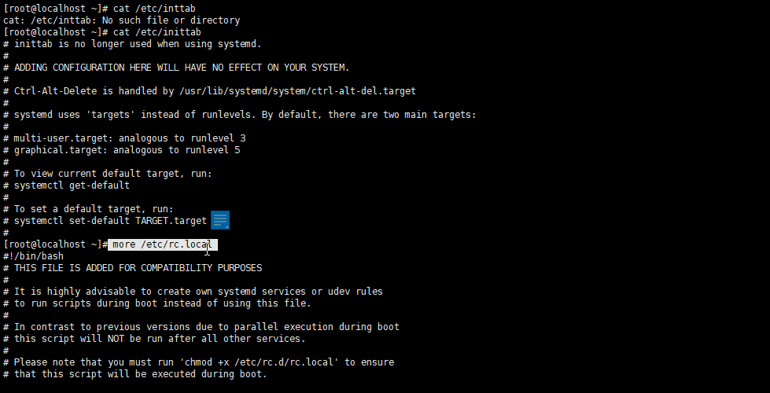
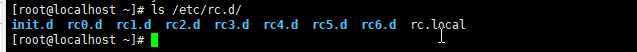
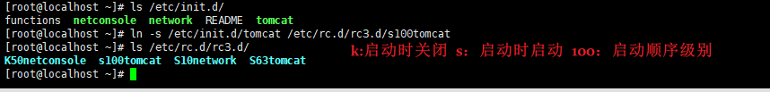
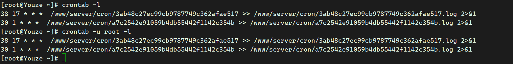
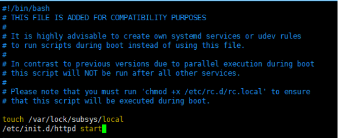
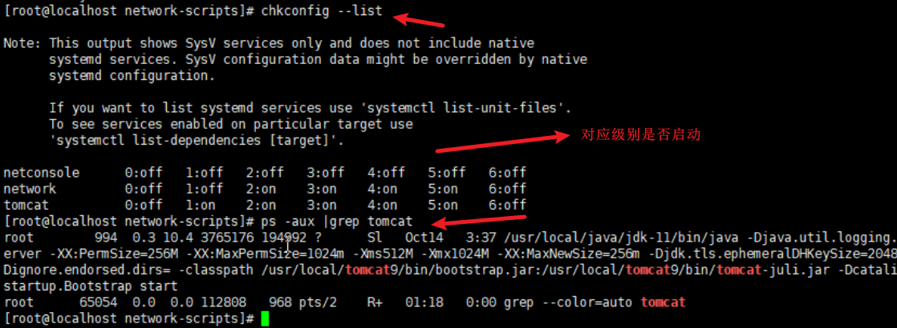
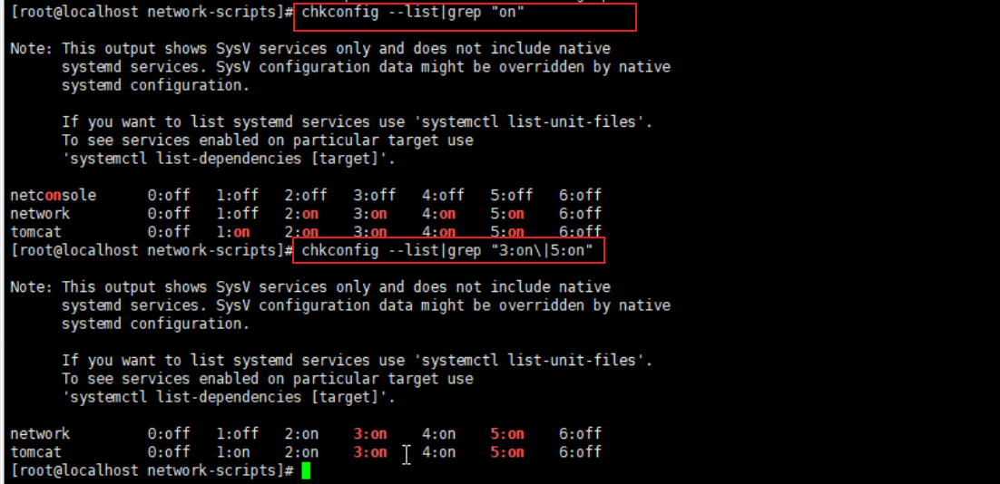

# Linux入侵排查

安全排查步骤

攻击类型定位——>时间范围——>文件分析——>进程分析——>系统分析——>日志分析——>关联分析——>逻辑推理——>事件总结

# 账号安全

## 用户信息文件

### passwd

​​

用户名：密码：用户ID：用户说明：用户家目录：登录的shell

### shadow

​​

用户名：加密后密码：密码最后修改日期：两次密码修改间隔：密码有效期：密码到期警告天数：密码过期宽限天数：账号失效的时间：

​​

who：查看当前登录用户  pts：远程登录  tty：本地登录

w：查看系统信息记录用户登录的时间和交互方式

uptime：查看登录时长，用户数量，系统负载

## 入侵排查

是否存在特权账户

```bash
[root@localhost ~]# awk -F: '$3==0{print $1}' /etc/passwd
root
admin
shell

注意：关注root之外的用户
```

是否有远程登录用户

```bash
[root@localhost ~]# awk '/\$1|\$6/{print $1}' /etc/shadow
root:$6$S7sCR5uDCeyyYRBT$a.hs9YfByC51sS0::0:99999:7:::
#关注的是密码字段的存储方式中指定的是否有$6（远程登录）
```

哪些用户可以访问sudo权限

```bash
[root@localhost ~]# more /etc/sudoers |grep -v "^#\|^$" |grep "ALL=(ALL)"
root	ALL=(ALL) 	ALL
%wheel	ALL=(ALL)	ALL

#正常情况来说，不能设置wheel组
```

禁用或删除账号

发现存在可疑账户，先禁用，核查后再选择是否删除。

```bash
usermod -L username	#禁用账号username,在用户前添加！
userdel username	#仅删除用户
userdel -r username	#删除用户及其家目录
```

​​

# 历史命令

## root用户命令历史

```bash
history  #查看历史记录    存放/root/.bash_history
```

## history配置记录条数

法1

```bash
[root@localhost ~]# sed -i 's/^HISTSIZE=1000/HISTSIZE=10000/g' /etc/profile
[root@localhost ~]# cat /etc/profile |grep HISTSIZE
HISTSIZE=10000
```

法2：将以下内容加入/etc/profile最后

```bash
USER_IP=`who -u am i 2>/dev/null | awk '{print $NF}' | sed -e 's/[()]//g'`
if [ "$USER_IP" = "" ]
then
USER_IP=`hostname`
fi
export HISTTIMEFORMAT="%F %T $USER_IP `whoami` "
shopt -s histappend
export PROMPT_COMMAND="history -a"
```

## 入侵排查

历史记录导出  .bash_history

```bash
1、进入用户目录
cat .bash_history >> history.txt 
```

# 异常端口

查看异常端口->分析IP和PID追溯文件源头

```bash
netstat -antlp	#查看进程ID和端口状态
ls -l /proc/<PID>/exe	#定位其运行的文件路径
判断文件路径是否是软链或bash文件
根据获取的路径查看，如下图ls -al /user/bin/ |grep mongod
```

​​

# 查看进程

```bash
ps -aux
netstat -antlp  #获取进程PID
ps -aux | grep 1259  # 1259为netstat查看到的PID  和使用的启动命令（最后一列）

```

​​

# 开机启动项

## 运行级别

```bash
┌──(root㉿kali)-[/home/kali]
└─# runlevel               
N 5


[root@localhost ~]# runlevel 	#centos
N 3
```

|运行级别|定义|
| ----------| -----------------------------------|
|0|关机|
|1|单用户模式，相当于windows安全模式|
|2|不完全的命令模式，没有NFS服务|
|3|完全的命令行模式|
|4|系统保留|
|5|图形化|
|6|重启|

```bash
默认配置级别的文件	/etc/inittab


[root@localhost ~]# cat /etc/inittab
# inittab is no longer used when using systemd.
#
# ADDING CONFIGURATION HERE WILL HAVE NO EFFECT ON YOUR SYSTEM.
#
# Ctrl-Alt-Delete is handled by /usr/lib/systemd/system/ctrl-alt-del.target
#
# systemd uses 'targets' instead of runlevels. By default, there are two main targets:
#
# multi-user.target: analogous to runlevel 3
# graphical.target: analogous to runlevel 5
#
# To view current default target, run:
# systemctl get-default
#
# To set a default target, run:
# systemctl set-default TARGET.target
```

​​

## 开启自启动配置文件

​​

```bash
默认位置：/etc/rc.d	#0-6共计7个级别的启动文件，完全命令行默认在rc3.d文件内
创建自启动文件方式：
ln -s /etc/init.d/tomcat /etc/rc.d/rc3.d/s100tomcat	#创建软链自启动tomcat
s：自启动
K：代表启动加载时会关闭
```

​​

## 入侵排查

```bash
more /etc/rc.local
ls -al /etc/rc.d/rc[0,1,2,3,4,5,6].d

#需要关注恶意的启动脚本或敏感路径
```

​​

# 计划任务/定时启动

## 查看方式

```bash
crontab -l	#查看当前用户的计划任务
crontab -u username -l #查看指定的username用户的计划任务
```

​​

## 创建计划任务

### 语法

```bash
crontab [-u <用户名称>][配置文件] 或 crontab { -l | -r | -e }
-u   #<用户名称> 是指设定指定<用户名称>的定时任务，这个前提是你必须要有其权限(比如说是 root)才能够指定他人的时程表。如果不使用 -u user 的话，就是表示设定自己的定时任务。
-l 　#列出该用户的定时任务设置。
-r 　#删除该用户的定时任务设置。
-e 　#编辑该用户的定时任务设置。
```

### 命令时间格式

​​

```bash
*     * 　  *　  *　  *　　command
分　  时　  日　  月　 周　  命令
第1列表示分钟1～59 每分钟用*或者 */1表示
第2列表示小时1～23（0表示0点）
第3列表示日期1～31
第4列表示月份1～12
第5列标识号星期0～6（0表示星期天）
第6列要运行的命令
```

### 例子

```bash
crontab -e -u root	#给root用户创建
* * * * * echo "hello" >> /tmp/1.txt	#每分钟将hello输出在/tmp/1.txt
[root@localhost cron]# crontab -l -u root
* * * * * echo "hello" >> /tmp/1.txt
[root@localhost cron]# cat /tmp/1.txt 
hello
hello
```

```bash

30 21 * * * /usr/local/etc/rc.d/lighttpd restart  #每晚的21:30 重启apache
45 4 1,10,22 * * /usr/local/etc/rc.d/lighttpd restart  #每月1、10、22日的4 : 45重启apache
10 1 * * 6,0 /usr/local/etc/rc.d/lighttpd restart  #每周六、周日的1 : 10重启apache
0,30 18-23 * * * /usr/local/etc/rc.d/lighttpd restart  #每天18 : 00至23 : 00之间每隔30分钟重启apache
0 23 * * 6 /usr/local/etc/rc.d/lighttpd restart  #每星期六的11 : 00 pm重启apache
* 23-7/1 * * * /usr/local/etc/rc.d/lighttpd restart  #晚上11点到早上7点之间，每隔一小时重启apache
* */1 * * * /usr/local/etc/rc.d/lighttpd restart  #每一小时重启apache
0 11 4 * mon-wed /usr/local/etc/rc.d/lighttpd restart  #每月的4号与每周一到周三的11点重启apache
0 4 1 jan * /usr/local/etc/rc.d/lighttpd restart  #一月一号的4点重启apache
 
*/30 * * * * /usr/sbin/ntpdate cn.pool.ntp.org  #每半小时同步一下时间
0 */2 * * * /sbin/service httpd restart  #每两个小时重启一次apache 
50 7 * * * /sbin/service sshd start  #每天7：50开启ssh服务 
50 22 * * * /sbin/service sshd stop  #每天22：50关闭ssh服务 
0 0 1,15 * * fsck /home  #每月1号和15号检查/home 磁盘 
1 * * * * /home/bruce/backup  #每小时的第一分执行 /home/bruce/backup这个文件 
00 03 * * 1-5 find /home "*.xxx" -mtime +4 -exec rm {} \;  #每周一至周五3点钟，在目录/home中，查找文件名为*.xxx的文件，并删除4天前的文件。
30 6 */10 * * ls  #每月的1、11、21、31日是的6：30执行一次ls命令

```

### 具体方法

```bash
crontab -e #编辑cron任务模式
i #默认文字编辑器为vim，按i字母键即可添加cron任务
30 3 * * * /usr/local/etc/rc.d/lighttpd restart #将命令代码放入，此命令意义为每天的03:30 重启apache
ESC #按ESC键退出编辑模式
:wq #键入:wq保存
service crond restart #重启crontab服务
```

1. ```bash
    crontab -e
    crontab -e -u root  #给某用户创建
    ```

    文件内写入以下内容

    ​​

    [计划任务在线计算https://tool.lu/crontab](https://tool.lu/crontab)
2. ​​

## 删除计划任务（谨慎使用）

```bash
[root@localhost cron]# crontab -r -u root	#会删除所有计划任务，谨慎使用
[root@localhost cron]# crontab -l
no crontab for root
[root@localhost cron]# 
```

## 入侵排查

重点关注以下目录是否存在可疑项目

```bash
[root@localhost cron]# ls /var/spool/cron/	#关注用户的计划任务
[root@localhost cron]# more /etc/crontab	#命令内写入的计划任务
SHELL=/bin/bash
PATH=/sbin:/bin:/usr/sbin:/usr/bin
MAILTO=root
[root@localhost cron]# ls -al /etc/cron.d/	#计划任务目录
total 16
drwxr-xr-x.  2 root root   21 Jun 12  2021 .
drwxr-xr-x. 77 root root 8192 Oct 14 23:32 ..
-rw-r--r--.  1 root root  128 Aug  9  2019 0hourly
[root@localhost cron]# ls -al /etc/cron.daily/		#每天的计划任务列表目录
total 20
drwxr-xr-x.  2 root root   42 Jun 12  2021 .
drwxr-xr-x. 77 root root 8192 Oct 14 23:32 ..
-rwx------.  1 root root  219 Apr  1  2020 logrotate
-rwxr-xr-x.  1 root root  618 Oct 30  2018 man-db.cron
[root@localhost cron]# ls -al /etc/cron.hourly/		#每个小时的计划任务列表目录
total 16
drwxr-xr-x.  2 root root   22 Jun 10  2014 .
drwxr-xr-x. 77 root root 8192 Oct 14 23:32 ..
-rwxr-xr-x.  1 root root  392 Aug  9  2019 0anacron
[root@localhost cron]# ls -al /etc/cron.monthly/	#每个月
total 12
drwxr-xr-x.  2 root root    6 Jun 10  2014 .
drwxr-xr-x. 77 root root 8192 Oct 14 23:32 ..
[root@localhost cron]# ls -al /etc/cron.weekly/	#每周
total 12
drwxr-xr-x.  2 root root    6 Jun 10  2014 .
drwxr-xr-x. 77 root root 8192 Oct 14 23:32 ..
[root@localhost cron]# ls -al /etc/anacrontab 	#计划任务列表
-rw-------. 1 root root 541 Aug  9  2019 /etc/anacrontab		#计划任务列表
[root@localhost cron]# ls -al /etc/spool/anacron/ 
ls: cannot access /etc/spool/anacron/: No such file or directory
[root@localhost cron]# 
```

# 检查服务

## 服务自启动

### 网卡配置文件

```bash
[root@localhost network-scripts]# pwd
/etc/sysconfig/network-scripts/ifcfg-eth0		#eth0网卡配置


[root@localhost network-scripts]# more ./ifcfg-eth0 
TYPE=Ethernet
PROXY_METHOD=none
BROWSER_ONLY=no
BOOTPROTO=static		#或者是dhcp
DEFROUTE=yes
IPV4_FAILURE_FATAL=no
IPV6INIT=yes
IPV6_AUTOCONF=yes
IPV6_DEFROUTE=yes
IPV6_FAILURE_FATAL=no
IPV6_ADDR_GEN_MODE=stable-privacy
NAME=eth0
UUID=bc62cee8-5ab3-43fc-aa8e-381dac793a3b
DEVICE=eth0
ONBOOT=yes
IPADDR=172.16.12.2
NETMASK=255.255.255.0
GETWAY=172.16.12.1
DNS1=114.114.114.114
DNS2=8.8.8.8
PREFIX=24
```

### DNS配置文件

```bash
[root@localhost network-scripts]# more /etc/resolv.conf 
#Generated by NetworkManager
nameserver 114.114.114.114
```

## 修改自启动

法1：

```bash
[root@localhost network-scripts]# chkconfig --level 2345 httpd.service on	#指定级别，默认2345
Note: Forwarding request to 'systemctl enable httpd.service'.

chkconfig  httpd on#其他写法，不指定级别
```

法2：

```bash
vim /etc/rc.d/rc.local
添加服务启动：
```

​​

法3：

```bash
ntsysv   #命令用于设置系统的各种服务。需要安装
```

## 入侵排查

​​

​​

1、查看安装了哪些服务：chkconfig --list|grep "3:on|5:on"

```bash
[root@localhost network-scripts]# chkconfig --list	#查看所有服务，不管是否启动

Note: This output shows SysV services only and does not include native
      systemd services. SysV configuration data might be overridden by native
      systemd configuration.

      If you want to list systemd services use 'systemctl list-unit-files'.
      To see services enabled on particular target use
      'systemctl list-dependencies [target]'.

netconsole     	0:off	1:off	2:off	3:off	4:off	5:off	6:off
network        	0:off	1:off	2:on	3:on	4:on	5:on	6:off
tomcat         	0:off	1:on	2:on	3:on	4:on	5:on	6:off

[root@localhost network-scripts]# chkconfig --list|grep "3:on\|5:on"	#查看命令行和图形化两个级别下启动的终端里的自启动服务

Note: This output shows SysV services only and does not include native
      systemd services. SysV configuration data might be overridden by native
      systemd configuration.

      If you want to list systemd services use 'systemctl list-unit-files'.
      To see services enabled on particular target use
      'systemctl list-dependencies [target]'.

network        	0:off	1:off	2:on	3:on	4:on	5:on	6:off
tomcat         	0:off	1:on	2:on	3:on	4:on	5:on	6:off
[root@localhost network-scripts]# chkconfig --list|grep "3:启动\|5:启动"	#或者中文标识的

```

配合

```bash
ps -aux | grep tomcat #去查看tomcat启动服务的命令和路径文件（查看是否恶意文件）

[root@localhost network-scripts]# ps -aux |grep tomcat
root        994  0.3 10.4 3765176 194992 ?      Sl   Oct14   3:37 /usr/local/java/jdk-11/bin/java -Djava.util.logging.config.file=/usr/local/tomcat9/conf/logging.properties -Djava.util.logging.manager=org.apache.juli.ClassLoaderLogManager -server -XX:PermSize=256M -XX:MaxPermSize=1024m -Xms512M -Xmx1024M -XX:MaxNewSize=256m -Djdk.tls.ephemeralDHKeySize=2048 -Djava.protocol.handler.pkgs=org.apache.catalina.webresources -Dorg.apache.catalina.security.SecurityListener.UMASK=0027 -Dignore.endorsed.dirs= -classpath /usr/local/tomcat9/bin/bootstrap.jar:/usr/local/tomcat9/bin/tomcat-juli.jar -Dcatalina.base=/usr/local/tomcat9 -Dcatalina.home=/usr/local/tomcat9 -Djava.io.tmpdir=/usr/local/tomcat9/temp org.apache.catalina.startup.Bootstrap start
root      65054  0.0  0.0 112808   968 pts/2    R+   01:18   0:00 grep --color=auto tomcat

```

2、查看服务安装位置文件中的启动文件是否存在/etc/rc.d/init.d/

```bash
[root@localhost network-scripts]# cd /etc/rc.d/init.d/
[root@localhost init.d]# ls
functions  netconsole  network  README  tomcat
[root@localhost init.d]# 

```

# 异常启动的文件

1、敏感目录：/tmp     ..  （隐藏文件夹）

2、webshell    ---web目录  关注文件时间

```
atime       最后一次访问时间
ctime       最后一次改变文件的时间（目录、权限、属性）
mtime       最后一次修改的时间
```

查看以上3种时间的方法：stat filename

```
[root@localhost tmp]# stat 1.txt 
  File: ‘1.txt’
  Size: 198         Blocks: 8          IO Block: 4096   regular file
Device: fd00h/64768d    Inode: 2645950     Links: 1
Access: (0644/-rw-r--r--)  Uid: (    0/    root)   Gid: (    0/    root)
Access: 2024-10-15 01:00:07.825891237 +0800
Modify: 2024-10-15 01:00:01.298891539 +0800
Change: 2024-10-15 01:00:01.298891539 +0800
 Birth: -
```

查看前一天访问的文件方法：

```
 find /tmp -iname "*" -atime 1 -type f
```

# 日志文件

默认存放路径：/var/log/

日志设置的配置文件：/etc/rsyslog.conf

详细部分见《linux日志审计部分》

案例：PPT内最后三个

# 常用工具

## rootkit查杀

rootkit是特殊恶意文件，功能是隐藏自身或者进程，文件，网络链接。。。。rootkit一般和木马后门联合使用

两种类型：

1、文件级别的

修改重要文件，隐藏在文件内。如：ipconfig  find  ls pa  login等

2、内核级别的

修改系统的内核，主要依附在系统内核上，不对系统文件进行修改。

### chkrookit

下载：[https://www.chkrootkit.org/download/](https://www.chkrootkit.org/download/)

下载命令：wget ftp://ftp.chkrootkit.org/pub/seg/pac/chkrootkit.tar.gz

tar -zxvf chkrootkit.tar.gz

```
cd chkrootkit-0.58b/
[root@localhost chkrootkit-0.58b]# ls
ACKNOWLEDGMENTS  check_wtmpx.c  chkdirs.c  chklastlog.c  chkproc.c  chkrootkit  chkrootkit.lsm  chkutmp.c  chkwtmp.c  COPYRIGHT  ifpromisc.c  Makefile  README  README.chklastlog  README.chkwtmp  strings.c
[root@localhost chkrootkit-0.58b]# ./chkrootkit 
```

### rkhunter

下载地址：

[https://sourceforge.net/projects/rkhunter/files/rkhunter/1.4.6/](https://sourceforge.net/projects/rkhunter/files/rkhunter/1.4.6/)

```
wget https://sourceforge.net/projects/rkhunter/files/rkhunter/1.4.6/rkhunter-1.4.6.tar.gz
tar -zxvf <名称>
Cd 目录
./rkhunter-1.4.6
./installer.sh --install
使用：
rkhunter -c
```

## 病毒查杀

### clamav

安装方法1：在线安装

```
yum install -y clamav
```

检查安装成功：

```
[root@iZas03lubteipyZ ~]# clamscan
LibClamAV Error: cli_loaddbdir(): No supported database files found in /var/lib/clamav
ERROR: Can't open file or directory

----------- SCAN SUMMARY -----------
Known viruses: 0
Engine version: 0.103.11
Scanned directories: 0
Scanned files: 0
Infected files: 0
Data scanned: 0.00 MB
Data read: 0.00 MB (ratio 0.00:1)
Time: 0.004 sec (0 m 0 s)
Start Date: 2024:10:17 15:37:34
End Date:   2024:10:17 15:37:34
[root@iZas03lubteipyZ ~]# 
```

更新病毒库

```
[root@iZas03lubteipyZ ~]# freshclam
ClamAV update process started at Thu Oct 17 15:38:19 2024
WARNING: Your ClamAV installation is OUTDATED!
WARNING: Local version: 0.103.11 Recommended version: 0.103.12
DON'T PANIC! Read https://docs.clamav.net/manual/Installing.html
daily database available for download (remote version: 27429)
```

只扫描

```
clamscan -r /var --max-dir-recursion=5 -l /root/var_scan.log        #-r  指定路径    -l指定日志保存路径
```

扫描并查杀病毒

```
clamscan -r --remove /var   #最后指定扫描的目录
```

## webshell查杀

[https://www.shellpub.com/](https://www.shellpub.com/)

linux版本离线安装

命令替换检查  RPM check

linux系统自带的rpm检查校验rpm方式获取的安装包是否被替换和更改；如果正常，则不会有输出

```
[root@localhost ~]# rpm -Va > /var/log/rpm.log
[root@localhost ~]# more /var/log/rpm.log 
S.5....T.  c /etc/profile
S.5....T.  c /etc/redis.conf
.......T.  c /etc/rc.d/rc.local
.......T.  c /etc/ssh/sshd_config
.M.......    /etc/httpd
.M.......  c /etc/httpd/conf.modules.d/01-cgi.conf
SM5....T.  c /etc/httpd/conf/httpd.conf
.M.......  c /etc/httpd/conf.modules.d/00-ssl.conf
S.5....T.  c /etc/my.cnf
S.5....T.  c /etc/php.ini
```

检查结果查看，返回8位特征，每个位置的特征代表以下含义：

```
证内容中的8个信息的具体内容如下：
        S         文件大小是否改变
        M         文件的类型或文件的权限（rwx）是否被改变
        5         文件MD5校验是否改变（可以看成文件内容是否改变）
        D         设备中，从代码是否改变
        L         文件路径是否改变
        U         文件的属主（所有者）是否改变
        G         文件的属组是否改变
        T         文件的修改时间是否改变
```

如果被替换，可以还原：

```
rpm -qf /etc/httpd  #查他属于哪个软件包
mv /etc/httpd /tmp  #临时移除放置在tmp目录
rpm2cpio httpd-2.4.6-97.el7.centos.x86_64    |cpio -idv ./bin/httpd #提取rpm包中的命令httpd到/etc/httpd目录
cp ./bin/httpd /etc/    #用目前新提出的httpd命令到原始目录/etc   


或者：直接使用rpm重新安装
```

## 安全检查的脚本

### GScan

[GitHub - grayddq/GScan: 本程序旨在为安全应急响应人员对Linux主机排查时提供便利，实现主机侧Checklist的自动全面化检测，根据检测结果自动数据聚合，进行黑客攻击路径溯源。[https://github.com/grayddq/GScan](https://github.com/grayddq/GScan)

```
[1]+  Stopped                 python ./GScan.py
[root@localhost GScan-master]# python ./GScan.py  -h

  _______      _______.  ______      ___      .__   __. 
 /  _____|    /       | /      |    /   \     |  \ |  |    {version:v0.1}
|  |  __     |   (----`|  ,----'   /  ^  \    |   \|  | 
|  | |_ |     \   \    |  |       /  /_\  \   |  . `  |    {author:咚咚呛}
|  |__| | .----)   |   |  `----. /  _____  \  |  |\   | 
 \______| |_______/     \______|/__/     \__\ |__| \__|    http://grayddq.top
                                                        
  
Usage: GScan.py [options]

Options:
  -h, --help     show this help message and exit
  --version      当前程序版本

  Mode:
    GScan running mode options

    --overseas   境外模式，此参数将不进行境外ip的匹配
    --full       完全模式，此参数将启用完全扫描
    --debug      调试模式，进行程序的调试数据输出
    --dif        差异模式，比对上一次的结果，输出差异结果信息。
    --sug        排查建议，用于对异常点的手工排查建议
    --pro        处理方案，根据异常风险生成初步的处理方案

  Optimization:
    Optimization options

    --time=TIME  搜索指定时间内主机改动过的所有文件，demo: --time='2019-05-07
                 00:00:00~2019-05-07 23:00:00'
    --job        添加定时任务，用于定时执行程序（默认每天零点执行一次）
    --hour=HOUR  定时任务，每N小时执行一次
    --log        打包当前系统的所有安全日志（暂不支持）
```

### T0xst/linux

 linux安全检查]([https://github.com/T0xst/linux](https://github.com/T0xst/linux)

```
cd linux-mater
chmod 755 linuxcheck.sh
./linuxcheck.sh

扫描结果保存在：/tmp/linuxcheck_192.168.188.135_time
```

## webshell查杀

### 在线查杀

腾讯哈勃分析

卡巴斯基威胁情报门户

VirSCAN多引擎在线扫描

Virus Total在线病毒检测

Jotti的恶意软件扫描系统

微步在线云沙箱

360沙箱云

绿盟沙箱分析

Recorded Future Triage 云沙箱

Hybrid Analysis在线沙箱

河马在线查杀

### 离线的

#### D盾

[http://www.d99net.net](http://www.d99net.net)

#### 河马查杀

如果遇到免杀的脚本

1、检查md5校验

2、文件内容比较，notepad++做逐行比较

### beyong compare 文件对比工具

[https://www.beyondcomparepro.com/download](https://www.beyondcomparepro.com/download)

​​

## 勒索病毒

将文件给锁掉，让你添加他给他赚钱然后给你一个“密钥”。。。

防范方法：定期备份---中了病毒就恢复数据

### 在线检测勒索病毒：

1、360的：[安全卫士勒索病毒专题:文件恢复*安全卫士离线救灾版*文档卫士 (360.cn)]([https://lesuobingdu.360.cn/](https://lesuobingdu.360.cn/)

2、腾讯的离线检测：[腾讯电脑管家 (qq.com)]([https://guanjia.qq.com/pr/ls/](https://guanjia.qq.com/pr/ls/)

3、奇安信在线：[勒索病毒搜索 (qianxin.com)]([https://lesuobingdu.qianxin.com/](https://lesuobingdu.qianxin.com/)

4、深信服在线检测：[深信服EDR (sangfor.com.cn)]([https://edr.sangfor.com.cn/#/information/ransom_search](https://edr.sangfor.com.cn/#/information/ransom_search)

### 安全厂家提供的解密工具

【腾讯哈勃】勒索软件专杀工具 官网： [https://habo.qq.com/tool](https://habo.qq.com/tool)

【金山毒霸】勒索病毒免疫工具 官网： [http://www.duba.net/dbt/wannacry.html](http://www.duba.net/dbt/wannacry.html)

【火绒】安全工具下载 官网： [http://bbs.huorong.cn/forum-55-1.html](http://bbs.huorong.cn/forum-55-1.html)

【瑞星】解密工具下载 官网： [http://it.rising.com.cn/fanglesuo/index.html](http://it.rising.com.cn/fanglesuo/index.html)

【nomoreransom】勒索软件解密工具集 官网： [https://www.nomoreransom.org/zh/index.html](https://www.nomoreransom.org/zh/index.html)

【MalwareHunterTeam】勒索软件解密工具集 官网： [https://id-ransomware.malwarehunterteam.com](https://id-ransomware.malwarehunterteam.com)

【卡巴斯基】免费勒索解密器 官网： [https://noransom.kaspersky.com](https://noransom.kaspersky.com)

【Avast】免费勒索软件解密工具 官网： [https://www.avast.com/zh-cn/ransomware-decryption-tools](https://www.avast.com/zh-cn/ransomware-decryption-tools)

【Emsisoft】免费勒索软件解密工具 官网： [https://www.emsisoft.com/ransomware-decryption-tools/free-download](https://www.emsisoft.com/ransomware-decryption-tools/free-download)

【GitHub 项目】勒索病毒解密工具收集汇总 官网： [https://github.com/jiansiting/Decryption-Tools](https://github.com/jiansiting/Decryption-Tools)

‍
