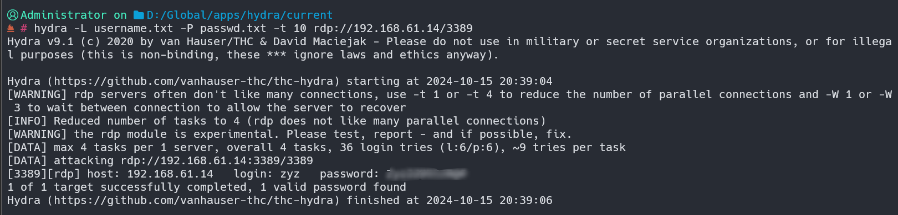
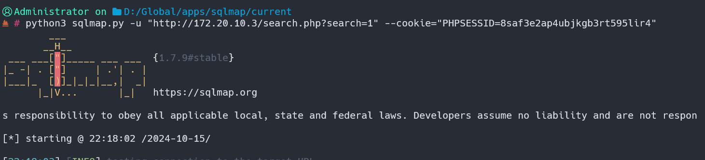
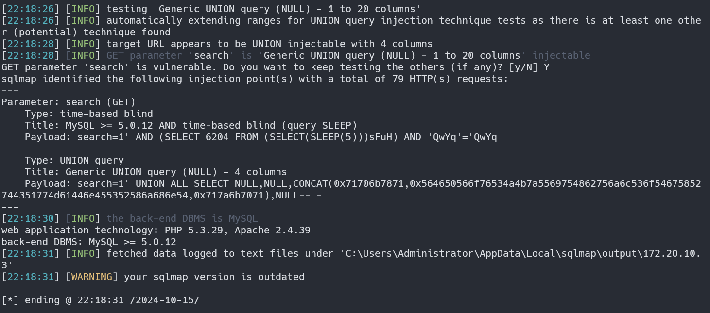
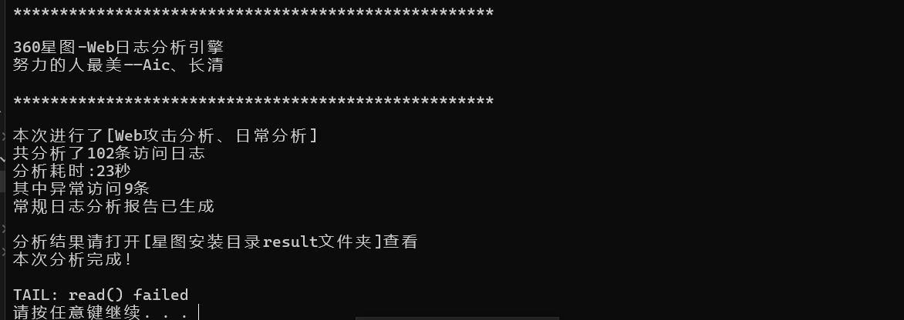

# RDP和360星图使用

### 通过hydra爆破windwos虚拟机的RDP服务，利用日志分析工具获取IP地址和时间以及用户名

1. 开启远程桌面​​

2. gpedit.msc->“计算机配置”-\>“Windows设置”-\>“安全设置”-\>“本地策略”-\>“审核策略”->"审核登录事件"->成功和失败

    ​​
3. 爆破

    ​​
4. 使用事件ID 4624（登录成功）和4625（登录失败）筛选RDP登录事件

    ​​

    ​​

    ‍

### 自建靶场，进行SQL注入工具，分析access.log日志中的攻击时间、IP、攻击成功与否和分析其攻击语句

1. sqlmap攻击相应网站

    ​​
2. 得到payload漏洞  ​
3. 取出日志分析，放到360星图分析，注意access.log后面的数字删除才可执行成功，原因未知

    ​​
4. 分析完成得到报告​​
5. 分析其ip、时间、攻击类型​​
6. 分析相应漏洞攻击

```python
default	远程代码执行漏洞攻击	172.20.10.2	/search.php?search=1%29%3BSELECT%20DBMS_PIPE.RECEIVE_MESSAGE%28CHR%2898%29%7C%7CCHR%2876%29%7C%7CCHR%2876%29%7C%7CCHR%28103%29%2C5%29%20FROM%20DUAL--	2024-10-15 22:18:08	200	1
#search=1);SELECT DBMS_PIPE.RECEIVE_MESSAGE(CHR(98)||CHR(76)||CHR(76)||CHR(103),5) FROM DUAL--  通过DBMS_PIPE包接收一个消息。使用了CHR函数来构造字符串构造的是"bLLg"
default	远程代码执行漏洞攻击	172.20.10.2	/search.php?search=1%27%29%3BSELECT%20PG_SLEEP%285%29--	2024-10-15 22:18:08	200	1
#search=1');SELECT PG_SLEEP(5)--	   使用PostgreSQL的PG_SLEEP函数，该函数会使数据库服务器暂停执行指定的秒数
default	远程代码执行漏洞攻击	172.20.10.2	/search.php?search=1%29%3BWAITFOR%20DELAY%20%270%3A0%3A5%27--	2024-10-15 22:18:08	200	1
#search=1);WAITFOR DELAY '0:0:5'--     SQL Server特有的语句，用于使数据库执行暂停5秒钟。0:0:5表示0小时0分钟5秒。
default	远程代码执行漏洞攻击	172.20.10.2	/search.php?search=1%27%29%3BWAITFOR%20DELAY%20%270%3A0%3A5%27--	2024-10-15 22:18:08	200	1
#search=1');WAITFOR DELAY '0:0:5'--   用于使服务器暂停执行5秒。
default	远程代码执行漏洞攻击	172.20.10.2	/search.php?search=1%27%29%3BSELECT%20DBMS_PIPE.RECEIVE_MESSAGE%28CHR%2898%29%7C%7CCHR%2876%29%7C%7CCHR%2876%29%7C%7CCHR%28103%29%2C5%29%20FROM%20DUAL--	2024-10-15 22:18:08	200	1
default	远程代码执行漏洞攻击	172.20.10.2	/search.php?search=1&amp;vXMF=7474%20AND%201%3D1%20UNION%20ALL%20SELECT%201%2CNULL%2C%27%3Cscript%3Ealert%28%22XSS%22%29%3C%2Fscript%3E%27%2Ctable_name%20FROM%20information_schema.tables%20WHERE%202%3E1--%2F%2A%2A%2F%3B%20EXEC%20xp_cmdshell%28%27cat%20..%2F..%2F..%2Fetc%2Fpasswd%27%29%23	2024-10-15 22:18:04	200	1
#search=1&amp;vXMF=7474 AND 1=1 UNION ALL SELECT 1,NULL,'<script>alert("XSS")</script>',table_name FROM information_schema.tables WHERE 2>1--/**/; EXEC xp_cmdshell('cat ../../../etc/passwd')#   SQL注入载入XSS跨站脚本攻击，页面加载载入JS  
#EXEC xp_cmdshell('cat ../../../etc/passwd') # 执行xp_cmdshell扩展存储过程，SQL Server执行操作系统命令读取/etc/passwd文件
default	远程代码执行漏洞攻击	172.20.10.2	/search.php?search=1%29%3BSELECT%20PG_SLEEP%285%29--	2024-10-15 22:18:07	200	1
#search=1);SELECT PG_SLEEP(5)--      PG_SLEEP(5) 是PostgreSQL中的一个函数，它会使数据库服务器暂停执行指定的秒数

```

​​

‍
