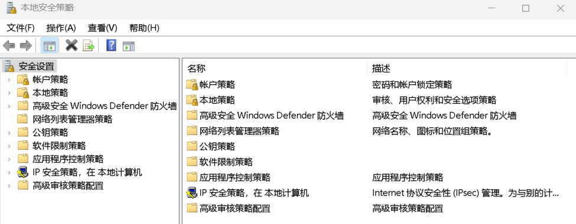
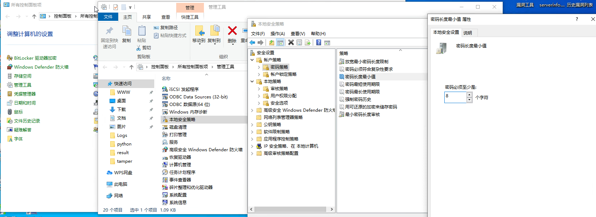
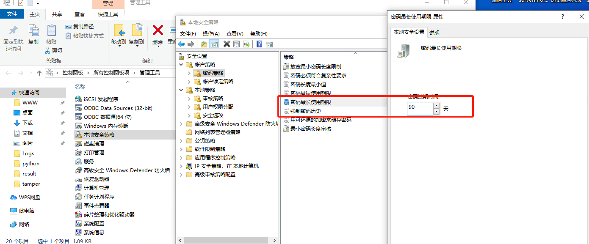
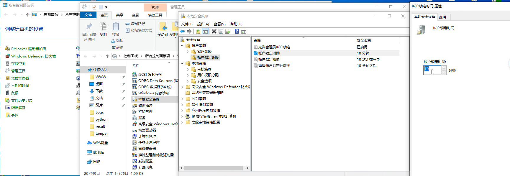
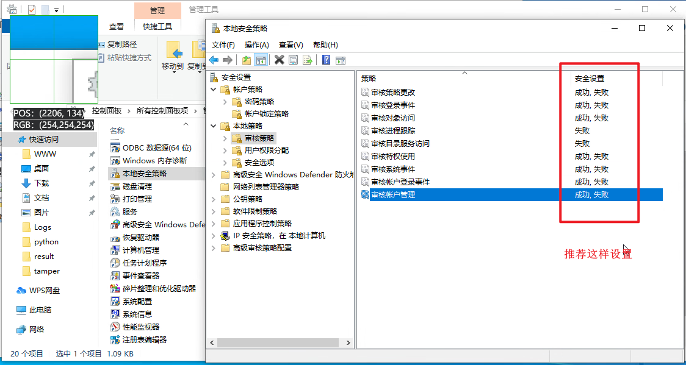
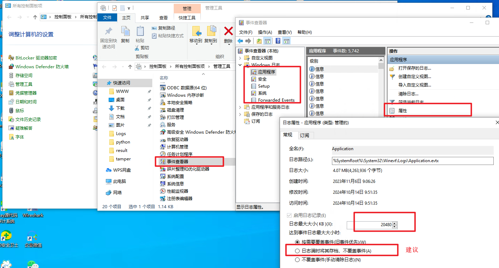
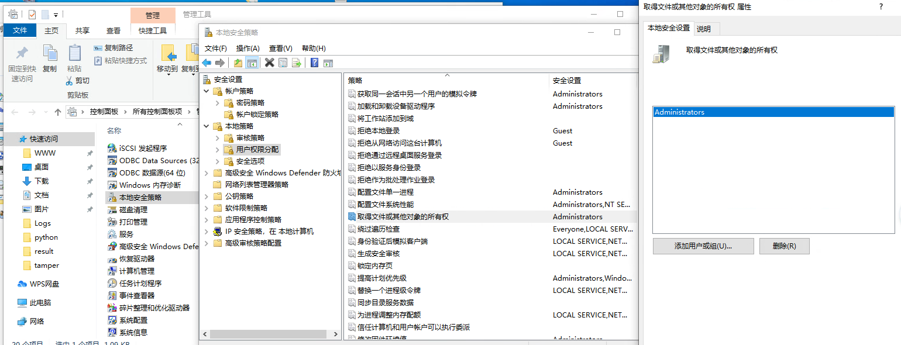
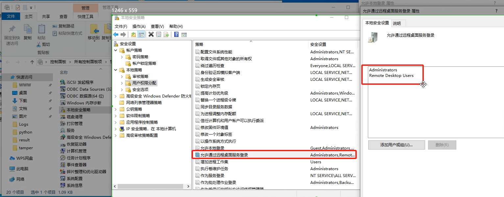
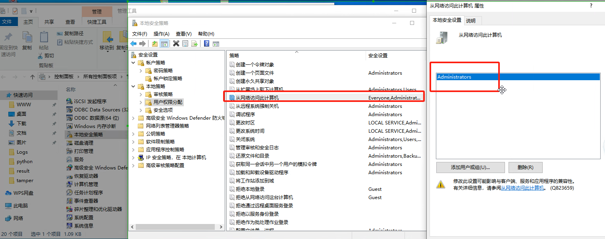
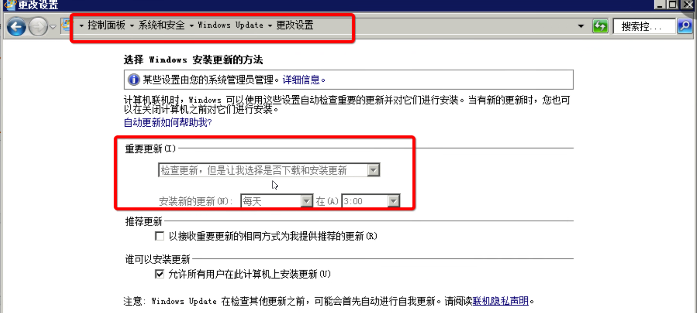

### 计算机管理

#### 本地用户和组

###### 禁用账户

禁用guest（来宾用户） 删除其他用户（先核查再删除）

​​

图标有向下箭头标识被禁用。

​​

###### 不显示最后登录名

​​

### 本地安全策略

​​

#### 账户策略

​​

##### 密码策略

###### 密码最小长度限制

​​

###### 密码复杂度要求

```linux
如果启用此策略，密码必须符合下列最低要求: 启用
不能包含用户的帐户名，不能包含用户姓名中超过两个连续字符的部分
至少有六个字符长
包含以下四类字符中的三类字符:
英文大写字母(A 到 Z)
英文小写字母(a 到 z)
10 个基本数字(0 到 9)
非字母字符(例如 !、$、#、%)
在更改或创建密码时执行复杂性要求
```

​​

###### 密码留存时间

​​

###### 强制密码历史

​​

##### 账户锁定策略

###### 账户锁定时间

```linux
锁定阈值：0-999分钟，0是永远不会锁定，建议设置10：登录失败10次后锁定账户
时间和计数器：0永久锁定，其余是时间
```

​​

###### 账户锁定阈值

```python
帐户锁定调值
此安全设置确定导致用户帐户被锁定的登录尝试失败的次数。在管
理员重置锁定帐户或帐户锁定时间期满之前，无法使用该锁定帐户
。可以将登录尝试失败次数设置为介于0和999之间的值。如果
将值设置为0，则永远不会锁定帐户。
在使用Ctrl+Alt+Dl或密码保护的屏幕保护程序锁定的工作站或
成员服务器上的密码尝试失败将计作登录尝试失败。
默认值：0
```

​​

#### 本地策略

​​

##### 审核策略

​​

日志记录设置

​​

##### 用户权限分配

###### 从远程系统强制关机

安全推荐配置：远程关机只能管理员组或禁用。

​​

###### 关闭系统

添加可以关闭系统的用户或组

​​

###### 取得文件或其他对象的使用权

默认admin 检查是否有新增用户

​​

​​

###### 允许本地登录

根据业务需要修改

​​

###### 允许通过远程桌面服务登录

根据业务修改

​​

###### 从网络访问计算机

​​

##### 安全选项

设置暂停会话前所需空闲时间数量

​​

#### 其他

1. 安装企业级防病毒软件 病毒库跟新、
2. 屏幕保护程序设置密码
3. 安全更新补丁（方法因系统而异）

    Windows 10 ：设置--安全更新--windows更新--高级选项--接收更新

    Windows other ↓ ：

    ​​
