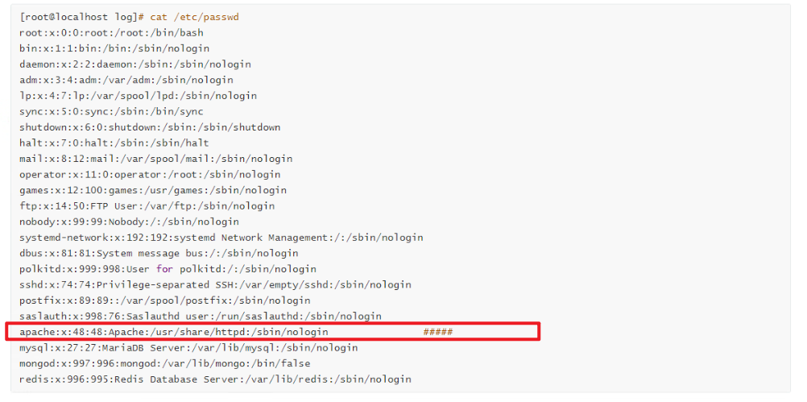
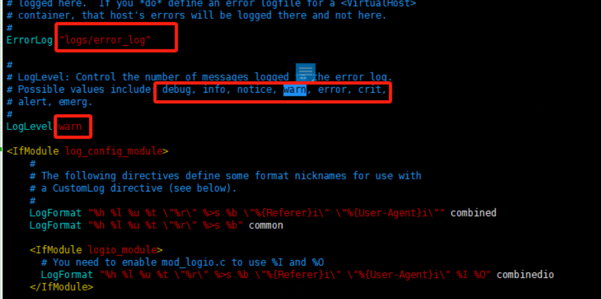
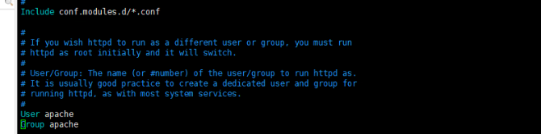
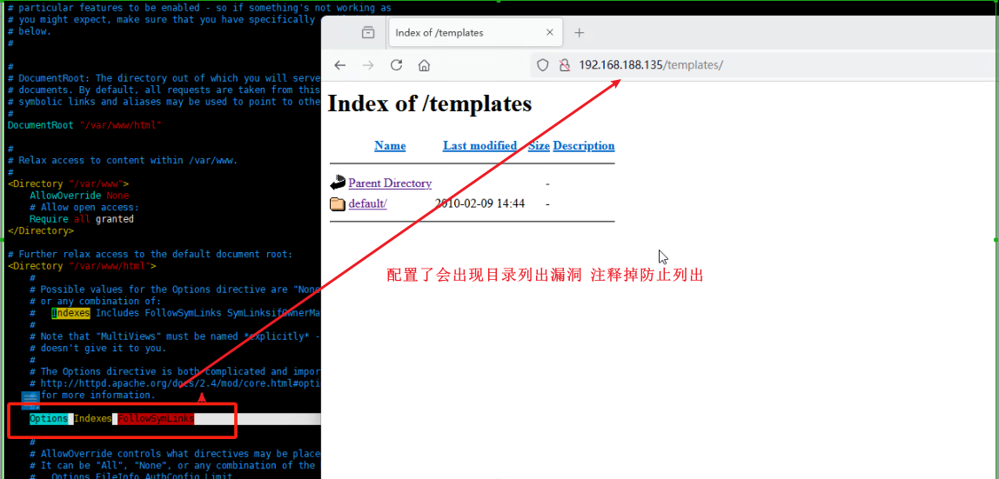
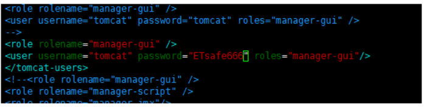
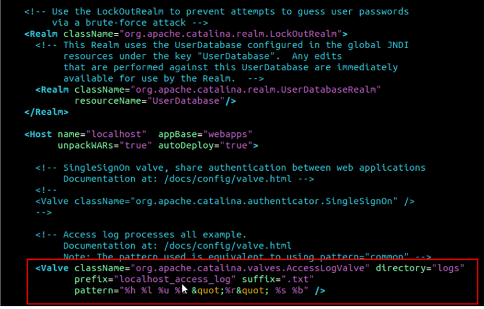
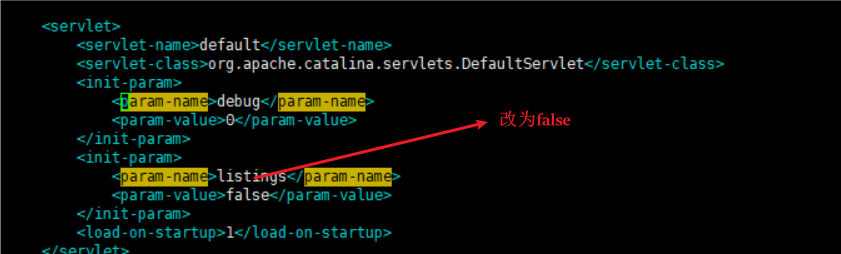
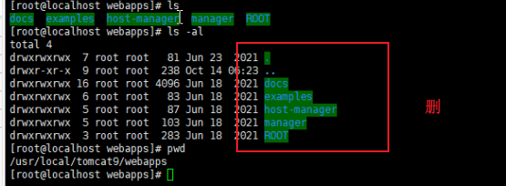
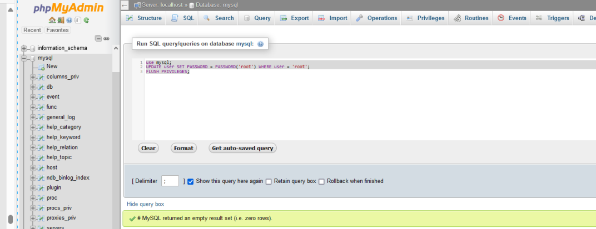

### apache  --httpd

配置文件路径:/etc/httpd/conf/httpd.conf

日志文件路径:/var/log/httpd

#### 查看是否有apache账号

​​

#### 限制目录及子目录权限

chmod -R 600 /etc/httpd/    (目录下文件全为600)

​​

单独配置文件设置权限

chmod 600 /etc/httpd/conf/httpd.conf

#### 日志配置

配置文件路径:/etc/httpd/conf/httpd.conf

日志文件路径:/var/log/httpd

​​

**注意：所有配置重启服务生效★** 

<span data-type="text" style="color: var(--b3-font-color10);">systemctl start httpd</span>

###### 错误日志配置路径和记录等级

​​

##### 使用apachel用户组和apachel用户

使用apachel用户组和apachel用户启动中间件防止越权

​​

##### 禁止显示Apache目录列表

Options Indexes FollowSymLinks   (未注释会列出)

​​

##### 拒绝服务-超时退出

```apache
Timeout 10 #客户端和服务端建立链接超时的时间间隔
keepAlive on #存活开启
keepAliveTimeout 300 #限制每一个用户生存时间5分钟...根据实际业务情况
```

​​

##### 隐藏中间件信息

```apache
ServerSignature Off
serverTokens Prod
TraceEnable Off
```

​​

​​

##### 禁用CGI

（注释掉即禁用）

​​

##### 禁用非法的HTTP服务

(设了白名单)

```apache
<Location />
<LimitExcept GET POST CONNECT OPTIONS>
Order allow,deny
Deny from all
</LimitExcept>
</Location> 
```

​​

## tomcat

配置文件：

/usr/local/tomcat9/conf/tomcat-users.xml

/usr/local/tomcat9/conf/server.xml

/usr/local/tomcat9/conf/web.xml

### 修改默认密码

```
<role rolename="manager-gui" />
<user username="tomcat" password="ETsafe666" roles="manager-gui"/>
</tomcat-users>
```

​​

### 开启日志

server.xml

关闭注释即可开启

​​

### 修改端口

server.xml

​MU

### 禁止目录列出

web.xml

​​

### 示例程序

删除路径：/usr/local/tomcat9/webapps下文件夹即可

​​

## PHP安全加固

配置文件名：/etc/php.ini

##### 安全模式

以下4项目配套使用

```
safe_mode = on  #开启安全模式
safe_mode_exec_dir= /var/www/html/  #设置安全模式下执行程序的目录
safe_mode_gid = off #关闭网站目录下的操作权限---再安全模式下不能增删改查
safe_mode_include_dir = /var/www/html/  #设置安全模式下包含了哪些文件的路径
```

##### 设置php脚本能访问的目录

```
open_basedir = /var/www/html/   #默认关闭的，需要手动打开并指定路径
```

##### 关闭危险函数

---命令执行漏洞修复方法之一

```
disable_functions = system,shell_exec,exec,popen,passthru,proc_open,phpinfo
```

##### PHP版本信息隐藏

默认为on

```
expose_php = Off
```

##### 关闭注册全局变量

```
register_globals = off      #
```

##### SQL注入防护

```
magic_quotes_gpc = on   #打开可防护SQL注入
```

##### 错误信息控制

```
display_errors = off #默认关闭，特殊情况打开了的，需要去检查
```

##### 错误日志记录

```
log_errors = on     #开启错误日志记录
log_errors_max_len = 1024   #最大错误日志记录条数，可以多设置，根据业务需求
error_log = /var/log/php/php_error.log  #指定错误日志保存的路径
```

# PHPmyadmin安全加固

配置文件名称：

config.sample.inc.php:  <span data-type="text" style="color: var(--b3-font-color10);"> /var/www/html/phpmyadmin/config.sample.inc.php</span>

config.inc.php:（注意，安装时有一个该文件产生，不是我们需要的配置文件）

##### 访问IP控制

```
cp /var/www/html/phpmyadmin/config.sample.inc.php /var/www/html/phpmyadmin/config.inc.php
[root@localhost log]# cd /var/www/html/phpmyadmin/
[root@localhost phpmyadmin]# ls
browse_foreigners.php   db_export.php            DCO                  LICENSE                 RELEASE-DATE-4.4.10     server_status_advisor.php    tbl_change.php             tbl_replace.php              user_password.php
server_status.php       tbl_create.php           tbl_select.php        view_create.php
[root@localhost phpmyadmin]# vim ./config.inc.php 


$ip_prefilx = "192.168.188.128";
if (substr($_SERVER['REMOTE_ADDR'],0,STRLEN($_SERVER['REMOTE_ADDR'])) != $ip_prefilx )
{
        die('Access denid')
}
#添加以上代码
```

##### 修改口令策略

通过phpmyadmin管理数据库

```
use mysql;
UPDATE user SET PASSWORD = PASSWORD('root') WHERE user = 'root';
FLUSH PRIVILEGES;
```

​​
