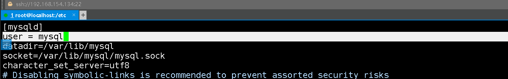

## **MySql安全加固**

### 账号安全

#### 配置文件

/etc/my.cnf配置文件默认路径，在文件mysqld下添加：

vim /etc/my.cnf

```
user = mysql		#指定数据库以mysql用户运行
```

​​

#### 创建普通用户

创建一个名称为etsafe的账号，密码为123456，可以通过任意主机登录管理数据库

%表示我们用户可以通过任意主机登录，如果时localhost则是能使用本机登录

要更改root用户只能localhost访问，一定要先设置一个普通用户可 以通过%方式登录

```apache
MariaDB [(none)]> grant all on *.* to etsafe@'%' identified by '123456';
Query OK, 0 rows affected (0.00 sec)

MariaDB [(none)]> flush privileges;	#刷新权限
Query OK, 0 rows affected (0.00 sec)

MariaDB [(none)]> 
```

#### 删除普通用户

```python
[root@localhost httpd]# mysql -h192.168.188.135 -uetsafe -p	   #普通用户登录
Enter password: 
Welcome to the MariaDB monitor.  Commands end with ; or \g.
Your MariaDB connection id is 35

MariaDB [(none)]> exit		#登录成功后退出了的操作
Bye
[root@localhost httpd]# mysql -uroot -p	#切换到root用户
Enter password: 
Welcome to the MariaDB monitor.  Commands end with ; or \g.
Your MariaDB connection id is 36
Server version: 5.5.68-MariaDB MariaDB Server

MariaDB [(none)]> drop user etsafe;		#删除普通用户
Query OK, 0 rows affected (0.00 sec)

MariaDB [(none)]> exit		#退出超级用户
Bye
[root@localhost httpd]# mysql -h192.168.188.135 -uetsafe -p	#普通用户登录则失效了
Enter password: 
ERROR 1045 (28000): Access denied for user 'etsafe'@'192.168.188.135' (using password: YES)
[root@localhost httpd]# 
```

### 口令安全

登录root/root用户，更改root用户的密码为ETsafe666

mysql -uroot -p     

```python
use mysql;
update user set password=password('ETsafe666') where user = 'root';
```

```python
[root@localhost httpd]# mysql -uroot -p			#登录数据库，输入root\root
Enter password: 
Welcome to the MariaDB monitor.  Commands end with ; or \g.


MariaDB [(none)]> use mysql;	#进入mysql数据库
MariaDB [mysql]> update user set password=password('ETsafe666') where user = 'root';	#更改密码
Query OK, 4 rows affected (0.00 sec)
Rows matched: 4  Changed: 4  Warnings: 0

MariaDB [mysql]> flush privileges;	#刷新权限
Query OK, 0 rows affected (0.00 sec)

MariaDB [mysql]> exit	#退出
Bye
[root@localhost httpd]# mysql -uroot -p		#旧密码失效
Enter password: 
ERROR 1045 (28000): Access denied for user 'root'@'localhost' (using password: YES)
[root@localhost httpd]# mysql -uroot -p		#使用新密码登录成功
Enter password: 
Welcome to the MariaDB monitor.  Commands end with ; or \g.
Your MariaDB connection id is 43
Server version: 5.5.68-MariaDB MariaDB Server

```

### 用户权限管理

登录mysql数据库的root账号，创建拥有所有权限的etsafe@‘%’用户密码为123456，再使用root用户进行权限管理，使用revoke回收部分危险权限，然后刷新新的权限

```python
show grants for etsafe@'%';	#查看用户有哪些权限
revoke insert,update,alter,delete,create,drop,shutdown on *.* from etsafe@'%';	#回收其部分危险权限
flush privileges;
```

```python
[root@localhost httpd]# mysql -uroot -p       #1.登录数据库
Enter password: 
Welcome to the MariaDB monitor.  Commands end with ; or \g.
Your MariaDB connection id is 43
Server version: 5.5.68-MariaDB MariaDB Server

MariaDB [(none)]> grant all on *.* to etsafe@'%' identified by '123456';   #2.创建拥有所有权限的etsafe@‘%’用户密码为123456
Query OK, 0 rows affected (0.00 sec)

MariaDB [(none)]> flush privileges;    #命令用于重新加载授权表，使对mysql数据库下的user表所做的更改生效。
Query OK, 0 rows affected (0.00 sec)

MariaDB [(none)]> show grants for etsafe@'%';   #命令用于显示指定用户的权限。 
+----------------------------------------------------------------------------------------------------------------+
| Grants for etsafe@%                                                                                            |
+----------------------------------------------------------------------------------------------------------------+
| GRANT ALL PRIVILEGES ON *.* TO 'etsafe'@'%' IDENTIFIED BY PASSWORD '*6BB4837EB74329105EE4568DDA7DC67ED2CA2AD9' |
+----------------------------------------------------------------------------------------------------------------+
1 row in set (0.00 sec)

MariaDB [(none)]> revoke insert,update,alter,delete,create,drop,shutdown on *.* from etsafe@'%';
# 撤销etsafe@'%'用户的INSERT, UPDATE, ALTER, DELETE, CREATE, DROP, SHUTDOWN权限 
Query OK, 0 rows affected (0.00 sec)

MariaDB [(none)]> flush privileges;  #命令用于重新加载授权表，使对mysql数据库下的user表所做的更改生效。
Query OK, 0 rows affected (0.00 sec)

MariaDB [(none)]> show grants for etsafe@'%';       #命令用于显示指定用户的权限。 
+----------------------------------------------------------------------------------------------------------------------------------------------------------------------------------------------------------------------------------------------------------------------------------------------------------------------------------------------------------------------+
| Grants for etsafe@%                                                                                                                                                                                                                                                                                                                                                  |
+----------------------------------------------------------------------------------------------------------------------------------------------------------------------------------------------------------------------------------------------------------------------------------------------------------------------------------------------------------------------+
| GRANT SELECT, RELOAD, PROCESS, FILE, REFERENCES, INDEX, SHOW DATABASES, SUPER, CREATE TEMPORARY TABLES, LOCK TABLES, EXECUTE, REPLICATION SLAVE, REPLICATION CLIENT, CREATE VIEW, SHOW VIEW, CREATE ROUTINE, ALTER ROUTINE, CREATE USER, EVENT, TRIGGER, CREATE TABLESPACE ON *.* TO 'etsafe'@'%' IDENTIFIED BY PASSWORD '*6BB4837EB74329105EE4568DDA7DC67ED2CA2AD9' |
+----------------------------------------------------------------------------------------------------------------------------------------------------------------------------------------------------------------------------------------------------------------------------------------------------------------------------------------------------------------------+
1 row in set (0.00 sec)

MariaDB [(none)]> 

```

### 允许本地连接

etsafe123@'%'    #%不限制登录IP

etsafe123@'localhost'   #localhost只能本机登录

```python
MariaDB [(none)]> grant all on *.* to etsafe123@'localhost'  identified by '123456';
#在数据库管理系统中，GRANT ALL ON *.* TO 语句用于给用户授予对所有数据库和表的所有权限。这里的 ALL 表示所有权限，*.* 表示所有数据库和表，而 TO 后面则跟着要被授予权限的用户名和主机名。
Query OK, 0 rows affected (0.00 sec)

MariaDB [(none)]> flush privileges;
Query OK, 0 rows affected (0.00 sec)

MariaDB [(none)]> grant all on *.* to etsafe123@'%'  identified by '123456';
Query OK, 0 rows affected (0.00 sec)

MariaDB [(none)]> flush privileges;
Query OK, 0 rows affected (0.00 sec)

MariaDB [(none)]> grant all on *.* to etsafe123@'%'  identified by '123456';

```

### mysql日志配置

/etc/my.cnf配置文件默认路径，在文件mysqld下添加：

```python
log=/var/log/mariadb/mariadb-log.log	#查询日志
log-slow-queries=/var/log/mariadb/slow.log	#慢日志
log-bin=/var/log/mariadb/bin.log	#二进制
```

### 链接数量设置

编辑配置文件/etc/my.cnf

```python
max\_connections \= 1000  
```

### 禁止远程链接

编辑配置文件/etc/my.cnf

```python
skip-networking
```

## Redis安全加固

配置文件：cat /etc/redis.conf

#### bind  指定ip

设置允许访问的iP地址，0.0.0.0表示所有都可以访问

cat /etc/redis.conf | gerap bind

<span data-type="text" style="color: var(--b3-font-color10);">vim /etc/redis.conf</span>

```vim
[root@localhost ]# cat /etc/redis.conf |grep bind

# By default, if no "bind" configuration directive is specified, Redis listens
# the "bind" configuration directive, followed by one or more IP addresses.
# bind 192.168.1.100 10.0.0.1
# bind 127.0.0.1 ::1
# internet, binding to all the interfaces is dangerous and will expose the
# following bind directive, that will force Redis to listen only into
bind 0.0.0.0		#配置127.0.0.1  192.168.188.100
# 1) The server is not binding explicitly to a set of addresses using the
#    "bind" directive.
# are explicitly listed using the "bind" directive.

[root@localhost ]# netstat -ntlp |grep 6379
tcp        0      0 0.0.0.0:6379            0.0.0.0:*               LISTEN      909/redis-server 0. 
[root@localhost phpmyadmin]# 
```

#### port  指定端口

```vim
port 6375
```

#### portected-mode 保护模式

开启保护模式

```linux
protected-mode = yes
```

#### requirepass  指定密码

```linux
requirepass <密码>
```

​​

重启服务后就需要输入密码了

#### rename-command   禁用危险函数

禁用之后，用户即使登录成功后，也无法再rdis数据库命令中使用我们已经禁用的函数：

```vim

#更多可以禁用的函数：FLUSHDB, FLUSHALL, KEYS,PEXPIRE, DEL, CONFIG, SHUTDOWN, BGREWRITEAOF, BGSAVE, SAVE, SPOP, SREM, RENAME,DEBUG, EVAL
```

​​

## Mongodb安全加固

配置文件：vim /etc/mongod.conf

### 监听端口

默认27017

```json
# mongod.conf

# for documentation of all options, see:
#   http://docs.mongodb.org/manual/reference/configuration-options/

# where to write logging data.
systemLog:
  destination: file
  logAppend: true
  path: /var/log/mongodb/mongod.log

# Where and how to store data.
storage:
  dbPath: /var/lib/mongo
  journal:
    enabled: true
#  engine:
#  wiredTiger:

# how the process runs
processManagement:
  fork: true  # fork and run in background
  pidFilePath: /var/run/mongodb/mongod.pid  # location of pidfile
  timeZoneInfo: /usr/share/zoneinfo

# network interfaces
net:
  port: 27030
  bindIp: 0.0.0.0  # Enter 0.0.0.0,:: to bind to all IPv4 and IPv6 addresses or, alternatively, use the net.bindIpAll setting.

#security:
#operationProfiling:
#replication:
#sharding:
## Enterprise-Only Options
#auditLog:         
```

### 设置密码

并开启授权-----对未授权访问进行修复

```json
#[root@localhost ]#mongo	#登录默认端口27017    mongo IP:PORT
[root@localhost ]#mongod -f /etc/mongod.conf --auth	#认证模式启动进行以下操作。
MongoDB shell version v4.4.6
connecting to: mongodb://127.0.0.1:27017/?compressors=disabled&gssapiServiceName=mongodb
Implicit session: session { "id" : UUID("8cb1eb24-1955-43ab-821d-d67b3a44246c") }
MongoDB server version: 4.2.14
WARNING: shell and server versions do not match

> use admin		#选中admin数据库（默认存在）
switched to db admin
> db.createUser({user:"admin",pwd:"ETsafe666",roles:["root"]})	
#为admin数据库创建一个角色权限为root的账户admin并设置密码ETsafe666
Successfully added user: { "user" : "admin", "roles" : [ "root" ] }
> db.getUsers()
[
	{
		"_id" : "admin.admin",
		"userId" : UUID("afa27eed-8b1b-48e0-989c-395f3ca40ce4"),
		"user" : "admin",
		"db" : "admin",
		"roles" : [
			{
				"role" : "root",
				"db" : "admin"
			}
		],
		"mechanisms" : [
			"SCRAM-SHA-1",
			"SCRAM-SHA-256"
		]
	}
]
> 
```

​​

### 设置认证登录

```
]
> db.auth('admin','ETsafe666')	#设置认证登录
1		#成功返回1
> db.getUsers()
[
	{
		"_id" : "admin.admin",
		"userId" : UUID("afa27eed-8b1b-48e0-989c-395f3ca40ce4"),
		"user" : "admin",
		"db" : "admin",
		"roles" : [
			{
				"role" : "root",
				"db" : "admin"
			}
		],
		"mechanisms" : [
			"SCRAM-SHA-1",
			"SCRAM-SHA-256"
		]
	}
]
> 

```

### 禁用http和rest端口

```
nohttpinterface = false  #重启服务后，会关闭下图所示的web服务，多余的
```

​​

在Linux系统上，可以使用`systemctl`​命令或`service`​命令来管理MongoDB服务。

1. 使用systemctl命令：

    * 查看MongoDB服务状态：`sudo systemctl status mongod`​
    * 停止MongoDB服务：`sudo systemctl stop mongod`​
    * 启动MongoDB服务：`sudo systemctl start mongod`​
    * 重启MongoDB服务：`sudo systemctl restart mongod`​
2. 使用service命令（适用于旧版本的Linux系统）：

    * 停止MongoDB服务：`sudo service mongod stop`​
    * 启动MongoDB服务：`sudo service mongod start`​
    * 重启MongoDB服务：`sudo service mongod restart`​

​​

### 日志审计

配置审计功能记录用户对数据库的相关操作

默认开启：

```
systemLog:
  destination: file
  logAppend: true
  path: /var/log/mongodb/mongod.log
```

‍
